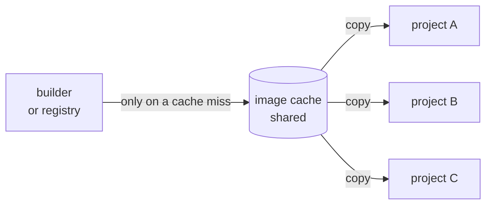
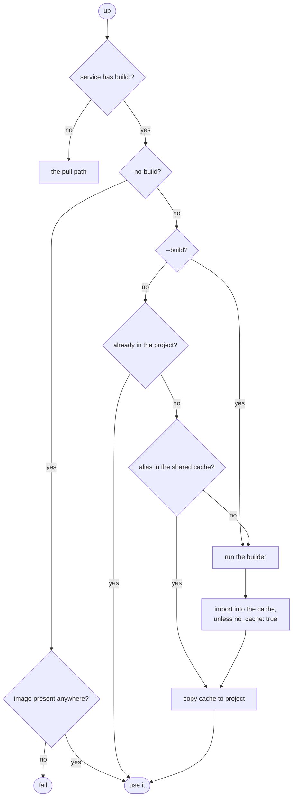

# Builds

incus-compose supports building local service images from Compose `build:`
definitions and importing the result into the Incus project.

> Build support requires `podman` or `docker` on the machine running
> incus-compose.

incus-compose does not implement a builder itself and does not use the Buildah
Go library. It shells out to a local container builder, then imports the built
rootfs into Incus as an image.

Builder selection:

1. `INCUS_COMPOSE_BUILDER`, when set
2. `buildah`, when found in `PATH`
3. `podman`, when found in `PATH`
4. `docker`, when found in `PATH`

Examples:

```bash
INCUS_COMPOSE_BUILDER=podman incus-compose build
INCUS_COMPOSE_BUILDER=docker incus-compose up --build
```

If no builder is found, build-configured services fail with an error.

## Basic usage

Build all services that define `build:`:

```bash
incus-compose build
```

Build selected services:

```bash
incus-compose build web worker
```

Start services, building missing build-configured images as needed:

```bash
incus-compose up
```

Force rebuild before starting:

```bash
incus-compose up --build
```

Require built images to already exist:

```bash
incus-compose up --no-build
```

## Compose examples

Short syntax:

```yaml
services:
  web:
    build: .
```

Object syntax with an explicit image name:

```yaml
services:
  web:
    image: localhost/web:latest
    build:
      context: .
      dockerfile: Containerfile
```

When `image:` is omitted, incus-compose uses a local image name based on the
project and service:

```text
localhost/<project>-<service>
```

## Supported build options

| Option              | Support                                                                                                                        |
| ------------------- | ------------------------------------------------------------------------------------------------------------------------------ |
| `context`           | Build context directory. Relative paths are resolved by compose-go.                                                            |
| `dockerfile`        | Alternate Dockerfile or Containerfile path, resolved relative to `context` (absolute paths are used as given).                 |
| `dockerfile_inline` | Inline Dockerfile content. incus-compose writes it to a temporary file before invoking the builder.                            |
| `args`              | Build arguments, passed as `--build-arg KEY=VALUE`. Args without values are ignored.                                           |
| `no_cache`          | Passed as `--no-cache` to the builder; also skips the shared image cache for this build (see [Image Caching](#image-caching)). |
| `pull`              | Passed as `--pull`.                                                                                                            |
| `target`            | Multi-stage build target, passed as `--target`.                                                                                |
| `platforms`         | A single platform is supported. Multiple platforms are rejected.                                                               |
| service `platform`  | Used as the build platform when `build.platforms` is not set.                                                                  |

## Image Caching

By default, a built image is imported into the shared image-cache project first
(the `incus-compose-cache` project, or whatever `--image-cache` /
`INCUS_COMPOSE_IMAGE_CACHE` points at) and then copied from there into the
compose project, the same path pulled images take.



The cache is checked **before** the builder runs. If it already holds the
image's alias, nothing is built and nothing is pulled - the image is copied
straight from the cache into your project. So the first `up` anywhere builds,
and every project after that copies.

That is what makes "build once, use many" work with `build:` left in place, and
it is also what lets a machine that cannot build at all - no `podman`, `docker`
or `buildah`, which is common on Windows and macOS - consume an image someone
else built, as long as it is in the cache.

_Since: v1.2.0-rc.2_

### The cache key is the image name

A built image is stored in the cache under its Incus alias, which comes from the
service's image name and nothing else:

| Compose                    | Cache alias                      |
| -------------------------- | -------------------------------- |
| `image: ghcr.io/me/app:v1` | `ghcr.io/me/app:v1`              |
| `image: myapp:latest`      | `docker.io/library/myapp:latest` |
| no `image:`, service `web` | `local/web:latest`               |

Nothing else feeds the key - not the project name, not the build context, not
the Dockerfile. Two builds that resolve to the same image name are the same
cache entry, whichever project or compose file they came from, and the last
build to finish wins for all of them.

So the image name is the knob: set `image:` explicitly on every service that
builds, and give services that build different content different names. The
`localhost/<service>` fallback has no project prefix, so relying on it means two
projects that both have a service called `web` share one entry.

:::warning Because a cache hit skips the builder entirely, editing your
Dockerfile or build context does **not** trigger a rebuild on its own - the
image name is unchanged, so the cached image still matches. Use `--build` to
force one, or bump the tag in `image:`. This mirrors `docker compose`, where an
existing image is reused until you pass `--build`. :::

Set `no_cache: true` on the service's `build:` block to skip the shared cache
and import straight into the project instead. The service then rebuilds in every
project, which is also how you avoid sharing a cache entry with a same-named
build elsewhere:

```yaml
services:
  web:
    build:
      context: .
      no_cache: true
```

With no cache configured at all (`--image-cache ""`), every build imports
directly into the project, same as `no_cache: true`.

_Since: v1.1.0_

## Reusing a built image across projects

Nothing special is needed. Keep the `build:` block where it is, give the service
an explicit `image:` name, and every project that uses that name gets the cached
image:

```yaml
services:
  myapp:
    image: ghcr.io/example/myapp:v1
    build:
      context: .
```

The first `up` builds and populates the cache. Every later `up` - same project
or another one, same machine or another one against the same Incus - finds the
alias and copies it. The image name is the whole contract.

A consumer that only wants to _use_ the image can drop the `build:` block
entirely:

```yaml
services:
  web:
    image: ghcr.io/example/myapp:v1
```

Both forms hit the same cache entry. Dropping `build:` is worth doing when the
consumer has no access to the build context, or when you want `up` to fail
loudly rather than build if the image is somehow missing. This is how the
ic-healthd sidecar image is distributed in this repo.

Because a machine only builds on a cache miss, a client with no local
`buildah`/`podman`/`docker` - common on Windows and macOS - can run either form
as long as someone has seeded the cache.

Rebuild under a new tag (`:v2`) when the content changes rather than overwriting
an existing one. Consumers already holding a project copy of `:v1` will not pick
up an in-place replacement, and `--build` only forces a rebuild for whoever runs
it.

_Since: v1.1.0_

## Platform handling

Built images must match an architecture supported by the target Incus server.

incus-compose asks Incus for its supported server architectures and uses the
first one as the default build target. This is not a compose key: it is the list
Incus reports. For example, if the server reports:

```text
x86_64, i686
```

incus-compose builds with:

```text
--platform linux/amd64
```

and imports the image with Incus metadata architecture:

```text
x86_64
```

Supported architecture mappings include:

| Incus architecture | Builder platform |
| ------------------ | ---------------- |
| `x86_64`           | `linux/amd64`    |
| `i686`             | `linux/386`      |
| `aarch64`          | `linux/arm64`    |
| `armv7`, `armv7l`  | `linux/arm/v7`   |
| `armv6`, `armv6l`  | `linux/arm/v6`   |
| `ppc64le`          | `linux/ppc64le`  |
| `s390x`            | `linux/s390x`    |
| `riscv64`          | `linux/riscv64`  |

If a service requests a platform that Incus does not report as supported, the
build fails before invoking the builder.

## Build command options

```bash
incus-compose build [SERVICE...]
```

| Option       | Description                                                                                                                                                                                                                 |
| ------------ | --------------------------------------------------------------------------------------------------------------------------------------------------------------------------------------------------------------------------- |
| `--no-cache` | Disable the builder's layer cache for this build, and skip the shared image cache (see [Image Caching](#image-caching)). Also enabled when `build.no_cache: true` is set.                                                   |
| `--pull`     | Pull policy for the images this build depends on: `always`, `missing`/`policy`, `never`. Base-image freshness is separate - set `build.pull: true` in the compose file, which is passed to the builder as its own `--pull`. |

## up build behavior

For build-configured services, `up` builds only when the image is missing from
**both** the compose project and the shared image cache - see
[Image Caching](#image-caching).



| Command                       | Behavior                                                                           |
| ----------------------------- | ---------------------------------------------------------------------------------- |
| `incus-compose up`            | Build only on a cache miss. Copy from the cache when the alias is already there.   |
| `incus-compose up --build`    | Force rebuild, replacing the cached image, and recreate the instances that use it. |
| `incus-compose up --no-build` | Never build. Fail if a required built image is missing.                            |

In practice: the first `up` anywhere builds, and every `up` after that - in the
same project or a different one - copies from the cache. `--build` is how you
pick up changes to your Dockerfile or context.

## What --build recreates

An instance is created from an image, so replacing the image leaves the running
instance on the old one. `--build` therefore deletes and recreates the instances
of every service whose image it rebuilt - including a service that only
_consumes_ an image another service builds, since the rebuild replaces its image
just the same:

```yaml
services:
  app:
    image: localhost/app:latest
    build:
      context: .
  worker:
    image: localhost/app:latest # recreated as well
  db:
    image: docker.io/postgres:16-alpine # left alone
```

Nothing else is touched: services without a built image keep running, and so do
volumes, networks and the ic-healthd sidecar. Naming services (`up --build app`)
narrows it further, to the built services in that scope. `--recreate` is the
bigger hammer, recreating the whole project whether it was built or not.

_Changed in v1.2.0_: `--build` used to rebuild the image and leave the instances
on the old one until `--recreate` was passed too.

## Unsupported build options

The following Compose build options are currently not implemented:

- `additional_contexts`
- `cache_from`
- `cache_to`
- `entitlements`
- `extra_hosts`
- `isolation`
- `labels`
- `network`
- `privileged`
- `provenance`
- `sbom`
- `secrets`
- `shm_size`
- `ssh`
- `tags`
- `ulimits`

`tags` are intentionally ignored for now. incus-compose imports the built
artifact into Incus and uses the Incus image alias needed by the project; extra
Docker-style tags do not affect runtime behavior.

## See Also

- [CLI Reference](/cli-reference/images#build) - `build` command flags and `up`
  build behavior
- [Compose Compatibility](/compose-compatibility) - overall feature support
- [Getting Started](/getting-started) - first project walkthrough
