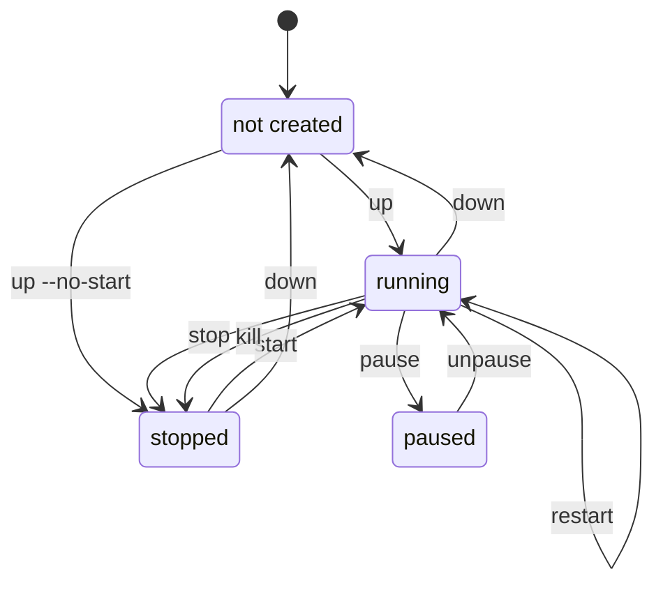

# CLI Reference

## Instance Lifecycle

Which command leaves you where:



`down` removes the instances and the per-project image copies but keeps volumes
and the shared image cache. `down --volumes` also deletes the volumes;
`down --project` removes the whole Incus project.

## Global Options

Every option below (and every command-specific one on the pages that follow) can
also be set via an environment variable - see
[Environment Variables](/environment-variables) for the full list.

| Option                      | Description                                                                                                                        |
| --------------------------- | ---------------------------------------------------------------------------------------------------------------------------------- |
| `-f`, `--file`              | Compose files (repeatable)                                                                                                         |
| `-p`, `--project-name`      | Project name                                                                                                                       |
| `-P`, `--project-directory` | Working directory                                                                                                                  |
| `--profile`                 | Compose profiles (repeatable)                                                                                                      |
| `--env-file`                | Environment files (repeatable)                                                                                                     |
| `-E`, `--os-env`            | Include OS env vars                                                                                                                |
| `--remote`                  | Incus remote                                                                                                                       |
| `--ansi`                    | Color output: never/always/auto                                                                                                    |
| `--image-cache`             | Incus project used as image cache (default: `incus-compose-cache`); set `""` to disable caching and pull straight into the project |
| `--storage-pool`            | Default storage pool for volumes (default: `detect` for auto-detection)                                                            |
| `--workers`                 | Number of concurrent workers (default: `4`)                                                                                        |
| `--debug`                   | Debug logging                                                                                                                      |

Supports the [no-color.org](https://no-color.org/) convention.

### Disabling the Cache

Set `--image-cache ""` to skip the cache project and pull images straight into
each project instead. This trades the shared cache (and its rate-limit/re-pull
savings) for one fewer copy per image - useful if you don't want a persistent
cache project on the server at all.

## Linked services

`up` and `down` follow `depends_on` by default: naming a service pulls in the
services it links to (its dependencies on `up`, its dependents on `down`). Use
`--no-deps` to act on exactly the named services. On `up`, `--no-deps` also
skips waiting on `depends_on: { condition: service_healthy }` for the
out-of-scope dependencies, so the named service starts without them.

`start`, `stop`, `restart`, `logs`, and `ps` act on exactly the named services
by default, matching `docker compose start`/`stop`. The `--with-deps` flag is an
incus-compose extension that opts those commands into following `depends_on` the
same way `up`/`down` do.

## Commands

`incus-compose --help` splits its commands into two categories, and these pages
follow that split.

**compose** - the `docker compose` verbs:

| Page                                 | Commands                                              |
| ------------------------------------ | ----------------------------------------------------- |
| [up and down](up-and-down/)          | `up`, `down`                                          |
| [Lifecycle](lifecycle/)              | `start`, `stop`, `kill`, `restart`, `pause`/`unpause` |
| [Images](images/)                    | `build`, `pull`                                       |
| [Inspecting](inspect/)               | `ps`, `config`, `logs`, `top`, `events`, `port`       |
| [exec, run and cp](exec-run-and-cp/) | `exec`, `run`, `cp`                                   |

**extensions** - no `docker compose` counterpart, or better than the one there
is:

| Page                      | Commands                                                            |
| ------------------------- | ------------------------------------------------------------------- |
| [Extensions](extensions/) | `backup`, `list`, `port-forward`, `incus`, `healthd`, `self-update` |

`version` prints the incus-compose version and belongs to neither:

```
incus-compose version
```

## Docker Compose command parity

Most `docker compose` verbs map directly. Anything without a dedicated command
is reachable through the `incus-compose incus` passthrough, which runs any
`incus` command scoped to the current project.

| `docker compose`             | incus-compose                | Notes                                                          |
| ---------------------------- | ---------------------------- | -------------------------------------------------------------- |
| `up`                         | `up`                         |                                                                |
| `down`                       | `down`                       |                                                                |
| `start` / `stop` / `restart` | `start` / `stop` / `restart` |                                                                |
| `ps`                         | `ps`                         |                                                                |
| `logs`                       | `logs`                       |                                                                |
| `exec`                       | `exec`                       |                                                                |
| `build`                      | `build`                      |                                                                |
| `config`                     | `config`                     |                                                                |
| `pull`                       | `pull`                       |                                                                |
| `images`                     | `config --images`            | Or `incus-compose incus image list`.                           |
| `cp`                         | `cp`                         | Owned by the instance's user, not root.                        |
| `top`                        | `top`                        | Per instance, not per process. No service filter.              |
| `events`                     | `events`                     | Lifecycle events by default. No service filter.                |
| `kill`                       | `kill`                       | `SIGKILL` only; Incus delivers no other signal.                |
| `run`                        | `run`                        | The command is not PID 1; see [run](exec-run-and-cp/#run).     |
| `pause` / `unpause`          | `pause` / `unpause`          | Incus freeze/unfreeze; no timeout to give.                     |
| `port`                       | `port`                       | A stopped instance answers too.                                |
| -                            | `port-forward`               | No docker equivalent: reaches a port that was never published. |
