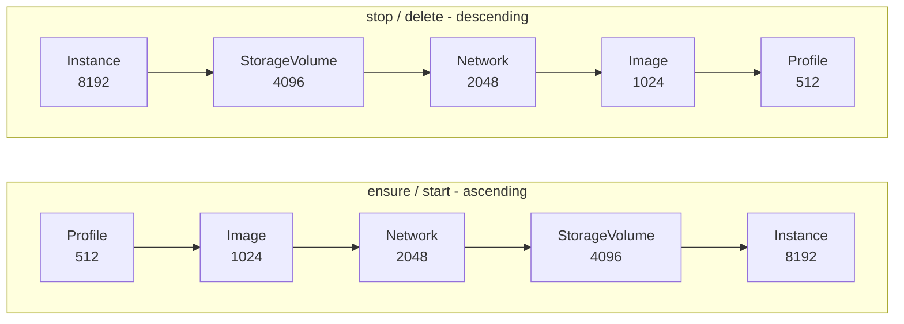

# Client

High-level Incus API wrapper with resource management and parallel execution.

## Overview

This package provides a compose-spec friendly interface for managing Incus
resources: instances, networks, volumes, profiles, and images.

## Documentation

- [Errors](/developer/client/errors) - Sentinel errors and automatic context
  enrichment
- [Hooks](/developer/client/hooks) - Hook system details
- [Image](/developer/client/image) - Image resource
- [Instance](/developer/client/instance) - Instance resource
- [Storage Volume](/developer/client/storage_volume) - SFTP access and the
  VolumeLock advisory lock

See also [Architecture Overview](/developer).

## Core Types

### GlobalClient

Entry point for Incus operations. Manages connection and projects:

```go
gc, _ := client.New(ctx, client.ClientLogger(logger))
gc.Connect()

project, _ := gc.EnsureProject("myapp", true)
```

### Client

Project-scoped client returned by `EnsureProject`. All resource operations
happen through this:

```go
profile, _ := project.Resource(client.KindProfile, "default", config)
image, _ := project.Resource(client.KindImage, "nginx:alpine", config)
instance, _ := project.Resource(client.KindInstance, "web", config)
```

### Resource

All resources implement the `Resource` interface:

```go
type Resource interface {
    Kind() Kind
    Name() string
    IncusName() string
    Priority() int
    IsEnsured() bool
}
```

Resources also implement action interfaces as needed:

- `EnsureAble` - can be created/fetched
- `DeleteAble` - can be deleted
- `StartAble` - can be started (Instance only)
- `StopAble` - can be stopped (Instance only)
- `PauseAble` / `UnpauseAble` - can be frozen and thawed (Instance only)

## Actions and Options

Use `RunAction` to execute operations:

```go
// Create if not exists
client.RunAction(resource, client.ActionEnsure, client.OptionCreate())

// Force delete
client.RunAction(resource, client.ActionDelete, client.OptionForce())

// Start/stop instances
client.RunAction(instance, client.ActionStart)
client.RunAction(instance, client.ActionStop, client.OptionForce())
```

## Stack

Batch operations with priority ordering:

```go
stack := client.NewStack(project, client.StackWorkers(4))
stack.Add(profile, image, network, instance)

// Ensure all in priority order (ascending: low to high)
err := stack.Run(client.ActionEnsure, client.OptionCreate())

// ForAction automatically determines sort order based on action
// ActionStop and ActionDelete use descending order (high to low)
err = stack.ForAction(client.ActionStop).Run(client.ActionStop)
err = stack.ForAction(client.ActionDelete).Run(client.ActionDelete, client.OptionForce())

// Manual sort order override (if needed)
stack = client.NewStack(project, client.StackSortDescending())
stack.Add(instance, network, image, profile)
err = stack.Run(client.ActionDelete, client.OptionForce())
```

**Sort Order**:

- `ForAction()` automatically determines order: `ActionEnsure`/`ActionStart` use
  ascending, `ActionStop`/`ActionDelete` use descending
- `StackSortDescending()` option explicitly sets descending order for
  `NewStack()`
- Unknown actions in `ForAction()` preserve the stack's existing sort order

## Resource Kinds

| Kind          | Priority | Config Type           |
| ------------- | -------- | --------------------- |
| Profile       | 512      | `ProfileConfig`       |
| Image         | 1024     | `ImageConfig`         |
| Network       | 2048     | `NetworkConfig`       |
| StorageVolume | 4096     | `StorageVolumeConfig` |
| Instance      | 8192     | `InstanceConfig`      |

Lower priority runs first on ensure, last on delete. `ForAction()` picks the
direction:



Resources of the same priority run in parallel through the WorkerPool; the
priority groups themselves run one after another.
