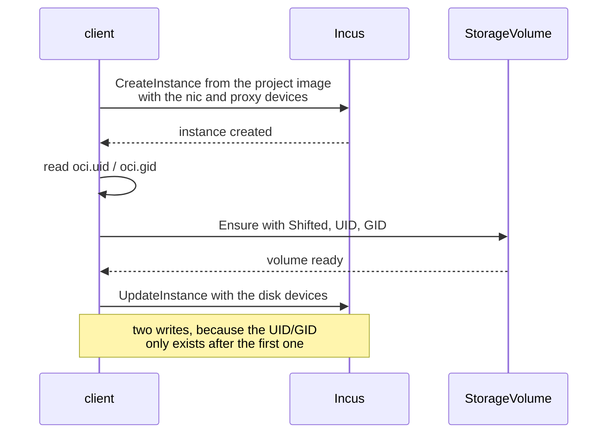
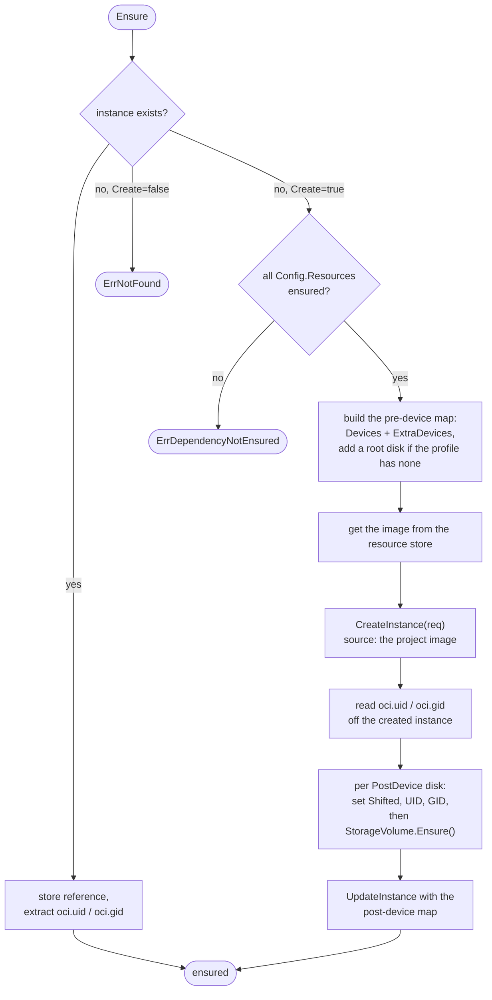

# Instance Details

Instance is the most complex resource due to device handling and UID/GID
shifting for volumes.

## InstanceConfig

```go
type InstanceConfig struct {
    Type         incusApi.InstanceType   // container or vm
    Full         bool                    // fetch full instance details
    Image        string                  // image name (required)
    Resources    []Resource              // dependencies that must be ensured
    Devices      []InstanceDevice        // pre-creation devices
    PostDevices  []InstanceDevice        // post-creation devices (need UID/GID)
    Config       map[string]string       // instance config
    ExtraDevices map[string]map[string]string  // raw Incus devices
}
```

## Device Types

Devices are configuration structs attached to instances:

```go
const (
    InstanceDeviceTypeProxy = "proxy"
    InstanceDeviceTypeDisk  = "disk"
    InstanceDeviceTypeNic   = "nic"
)

type InstanceDevice struct {
    Name   string
    Config InstanceDeviceConfig
}

type InstanceDeviceConfig struct {
    DeviceType  string
    Network     Resource                  // for nic
    Proxy       InstanceDeviceProxyConfig // for proxy
    Disk        InstanceDeviceDiskConfig  // for disk
    Extensions  map[string]string         // raw keys: whole config for custom devices, overrides for typed
}
```

### Proxy Devices

Port forwarding:

```go
InstanceDeviceProxyConfig{
    ListenType:  "tcp",
    ListenAddr:  "0.0.0.0",
    ListenPort:  8080,
    ConnectType: "tcp",
    ConnectAddr: "127.0.0.1",
    ConnectPort: 80,
    Nat:         true,
}
```

### Disk Devices

Storage volumes or bind mounts:

```go
// Named volume
InstanceDeviceDiskConfig{
    StorageVolumeConfig: &StorageVolumeConfig{...},
    Source:              "myvolume",
    Path:                "/data",
    Shift:               true,
}

// Bind mount (StorageVolumeConfig is nil)
InstanceDeviceDiskConfig{
    Source:   "/host/path",
    Path:     "/container/path",
    ReadOnly: true,
    Shift:    true,
}
```

### NIC Devices

Network attachment:

```go
InstanceDeviceConfig{
    DeviceType: InstanceDeviceTypeNic,
    Network:    network,  // reference to Network resource
}
```

## Pre-Devices vs Post-Devices

### Pre-Devices (Devices)

Attached at instance creation:

- Networks (nic)
- Proxies (port forwarding)

### Post-Devices (PostDevices)

Attached after instance creation:

- Storage volumes (need UID/GID for shifting)
- Bind mounts

Post-devices require UID/GID from the created instance to configure proper
ownership, which is why an instance is written twice:



## Instance.Ensure() Flow



## Image Volumes

An image's declared `VOLUME` paths arrive in `ImageState.Volumes`, and on
creation the instance gives each one a volume of its own, unless a device
already covers that path. So the compose file wins wherever it says anything,
and `NoAutoVolumes` turns the whole thing off.

```
for each path the image declares
  a device at, above or below it?   -> leave it alone
  otherwise                         -> volume auto-<service>-<path>, mounted at it
```

The volume is created with `Prefetch` set to that path, so it starts from what
the image ships there; see
[Storage Volume](/developer/client/storage_volume#prefetch). The `auto-` prefix
is what keeps it from colliding with a declared volume's name.

Nothing is nested: a declared path below an existing device, or above one, is
skipped rather than mounted inside it. Docker mounts it anyway.

The device is named `imgvol-<path>`, which is what finds these volumes again on
an instance this process never created - `Ensure` registers them from the
instance's own devices, and `Delete` with `OptionVolumes` takes them down with
it. Replicas of a service share one volume, so every delete but the last reports
it still in use, which is ignored.

## UID/GID Shifting

OCI images contain user metadata:

```
oci.uid = 1000
oci.gid = 1000
```

When creating storage volumes for the instance:

```go
volConfig.Shifted = true
volConfig.UID = inst.UID
volConfig.GID = inst.GID
```

This ensures files in the volume are owned by the correct user inside the
container.

## Bind Mount Restriction

The client layer has no opinion on bind mounts: a disk device with no
`StorageVolumeConfig` is passed to Incus as-is. The restriction lives one level
up, in `instanceVolumeDevices()` (`project/instance.go`), because it is a
question about the compose file rather than about the device:

```go
// Refuse bind without seed on remote hosts.
err := c.Global().SameHost()
```

`GlobalClient.SameHost()` returns nil for a Unix socket, and otherwise compares
the remote's resolved addresses against the local interfaces. So a pass-through
bind is allowed whenever incusd is this machine, HTTPS included, and refused
with `not on the same host` when it is not, because incusd resolves the source
path on its own filesystem, so a path from elsewhere would not be there.

A volume carrying `x-incus-compose.seed` skips the check entirely: a directory
becomes a `StorageVolume` with `HostPath` set, seeded at creation, and a single
file becomes an `InstanceFile` pushed from `start()`. Both read the source
locally and write it to the server, so neither needs the hosts to match.

## Instance Lifecycle

### Ensure

```go
err := instance.Ensure(client.OptionCreate())
```

Fetches existing or creates new. Cascades to dependencies via Resources field.

### Start

```go
err := instance.Start()
```

Calls `UpdateInstanceState` with action "start". No-op if already running.

### Stop

```go
err := instance.Stop(client.OptionForce())
```

Calls `UpdateInstanceState` with action "stop". Force bypasses graceful
shutdown.

Without `OptionForce`, Incus is asked to shut down within `OptionTimeout` and
then reports a failure, leaving the instance running. `Stop` therefore re-reads
the instance and kills it when the graceful attempt ran out of time, which is
what docker does at the same point.

### Pause and Unpause

```go
err := instance.Pause(ctx)
err = instance.Unpause(ctx)
```

Calls `UpdateInstanceState` with action "freeze" or "unfreeze", neither of which
takes a timeout or a force flag. `Frozen()` reports the result, and never holds
at the same time as `Running()`.

`Pause` refuses an instance that is not running (`ErrNotRunning`) or already
frozen (`ErrPaused`); `Unpause` refuses one that is not frozen (`ErrNotPaused`).

`Pause` also writes `user.healthcheck.stopped`, and `Unpause` clears it: a
frozen instance answers no healthcheck, so ic-healthd would otherwise read it as
one that stopped and restart out of the pause.

### Delete

```go
err := instance.Delete(client.OptionForce())
```

Deletes the instance. Clears internal state.

## Full Instance Details

When `Config.Full = true`, Ensure fetches additional data:

```go
if r.Config.Full {
    // Fetch image alias
    r.IncusImageAlias = image.IncusAlias

    // Fetch full instance with state and snapshots
    r.IncusInstanceFull, _, _ = client.GetInstanceFull(name)
}
```

Used by the `list` command to display detailed information.

## Dependency Handling

Dependencies are passed via `InstanceConfig.Resources`:

```go
instanceConfig := &InstanceConfig{
    Image:     imageName,
    Resources: []Resource{image, network1, network2},
    Devices:   devices,
}
```

Instance.Ensure() checks all Resources are ensured before creating. It does not
cascade Ensure calls - `Stack.Run()` ensures dependencies are ensured first via
priority-based ordering. Resources with lower priority values (images, networks)
are ensured before higher priority values (instances).
