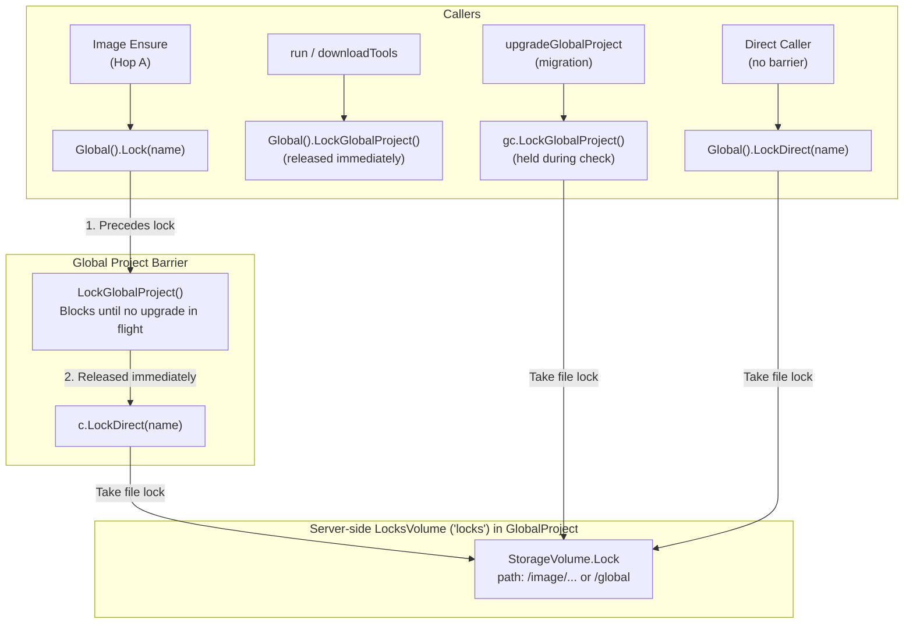

# Advisory Locking

Multiple `incus-compose` CLI invocations, test suites, and parallel workers
often run concurrently against the same Incus daemon. Advisory locking
coordinates operations that touch shared server-side state, such as pulling OCI
images into the shared cache, extracting helper binaries, or upgrading internal
global infrastructure.



## Where Locks Live

All advisory locks are stored on a dedicated Incus storage volume named `locks`
(`client.DefaultLocksVolume`, configurable via `ClientLocksVolume` or
`ClientConfig.LocksVolume`).

The volume lives in the **global project** (`client.DefaultGlobalProject`,
default `"incus-client"`, configurable via `ClientGlobalProject` or
`ClientConfig.GlobalProject`).

Locks are managed over SFTP through
[`StorageVolume.Lock`](/developer/client/storage_volume#volumelock):

- Each lock corresponds to a file on the storage volume.
- File creation uses exclusive flags (`O_CREATE | O_EXCL`).
- Names may contain slashes (e.g. `image/docker.io/library/alpine:3.20/amd64` or
  `global`); parent directories are created automatically with `MkdirAll`.
- Locks support heartbeating with `stale > 0`. The holder refreshes the file
  modification timestamp (`Chtimes`) at `stale / 2`. If a process crashes or is
  killed, another caller can safely reap the expired lock after the stale
  duration.

## Lock Architecture

Locking methods belong directly on `GlobalClient` (accessible via `gc` or
`c.Global()`) to keep global state manipulation explicit. There are no forwarding
methods on `Client`.

Locking is structured into three layers:

### 1. Direct Lock (`c.LockDirect`)

```go
func (c *GlobalClient) LockDirect(ctx context.Context, name string, stale time.Duration) (func(), error)
```

`c.LockDirect` acquires the lock directly without waiting on the global project barrier:

- Resolves the global project client via
  `c.EnsureProject(c.config.GlobalProject)`.
- **Constraint**: `c.LockDirect` is **not** allowed to create the project
  (`EnsureProjectWithCreate` is deliberately omitted). If the global project
  does not exist, it fails with `ErrNotFound`.
- Ensures the `LocksVolume` storage volume exists on the global project and
  opens an SFTP connection to it.
- Calls `StorageVolume.Lock(ctx, sc, name, stale)`.
- Returns a cleanup function that releases the lock and closes the SFTP
  connection.

### 2. Global Project Lock (`c.LockGlobalProject`)

```go
func (c *GlobalClient) LockGlobalProject(ctx context.Context) (func(), error)
```

`LockGlobalProject` serializes operations that affect the global project itself
(such as recreating `globalProject` or switching `icompose0` from a legacy
bridge to OVN):

- Acquires the lock named `"global"` with a 30-second stale timeout via
  `c.LockDirect(ctx, "global", 30*time.Second)`.
- **Blocking**: Uses `retry-go` with indefinite attempts until held or `ctx` is
  canceled. If the global project is in the middle of being deleted and
  recreated by an upgrade, `c.LockDirect` returns an error, and
  `LockGlobalProject` retries every 250ms until the new project is available and
  the `"global"` lock is acquired.

### 3. General Resource Lock (`c.Lock`)

```go
func (c *GlobalClient) Lock(ctx context.Context, name string, stale time.Duration) (func(), error)
```

`c.Lock` is the entry point for all non-global locks (such as image
serialization):

1. **Precedes with Global Barrier**: Calls `c.LockGlobalProject(ctx)`. If an
   infrastructure upgrade or migration is running, this call blocks until the
   upgrade finishes.
2. **Releases Barrier**: As soon as `LockGlobalProject` succeeds, the global
   lock is **released immediately**.
3. **Takes Target Lock**: Calls `c.LockDirect(ctx, name, stale)` to acquire the
   specific resource lock.

This invariant guarantees that no resource lock is ever taken while the global
project is in flux.

#### Why Acquire "global" First?

All advisory locks—including image locks, network locks, and custom resource
locks—are stored as files on `LocksVolume` (`locks`), which itself resides inside
the **global project** (`incus-client`).

During host upgrades (such as migrating legacy bridge networks to OVN via
`upgradeGlobalProject`), the global project itself may be deleted, reconfigured,
and recreated. If everyday locks were allowed to connect directly:

1. **Destructive Races**: A caller could establish an SFTP connection or write a
   lock file to `locks` at the exact moment `upgradeGlobalProject` deletes the
   global project, leading to broken SFTP pipes, `404 Project not found` errors,
   or corrupted lock state.
2. **Safe Convergence**: Because `upgradeGlobalProject` holds the `"global"`
   lock while evaluating and tearing down legacy infrastructure, acquiring
   `"global"` first forces every caller to wait until any in-flight upgrade has
   completed and the new global project is fully initialized.
3. **Zero Runtime Contention**: Releasing `"global"` immediately after
   acquisition ensures that this barrier is purely a gate for lifecycle
   transitions. Once the global project is stable, parallel operations (such as
   independent image downloads or DNS network updates) do not serialize against
   each other.

## Image Locking

Image operations use `c.Global().Lock` to prevent concurrent races—you cannot download
the same image twice simultaneously (Incus rejects duplicate alias creation with
an error):

```go
func (r *Image) lockStore(ctx context.Context) (func(), error) {
    if r.cache == nil {
        return func() {}, nil
    }

    return r.client.Global().Lock(ctx, "image/"+r.cacheAlias(), imageLockStale)
}
```

- **Hop A (Registry -> Cache)**: Runs inside `r.lockStore`. The first worker to
  ask for an image alias acquires `image/<alias>`, downloads it into the cache
  project, extracts OCI properties, and releases the lock. Competing workers
  block on the lock and hit the cache once acquired.
- **Hop B (Cache -> Target Project)**: Runs outside the lock so independent
  compose projects can copy from cache concurrently without blocking each other.
- **Concurrent Adoption Fallback**: If two callers target the _same_ destination
  project simultaneously (such as `runTools` ensuring `ic-sleep` into
  `globalProject`), a lost create race returning `"Alias already exists"`
  triggers an immediate re-read (`r.get(ctx)`), adopting the winner's copy
  rather than failing.

## Infrastructure Upgrades (`upgradeGlobalProject`)

When an Incus host upgrades from pre-7.5 (where OVN was not supported or
features were disabled) to 7.5+ with OVN, legacy bridge networks in `default`
and non-OVN global projects must be migrated:

1. **Fast Path Pre-Check**: `isLegacyGlobal` checks if legacy resources exist.
   On clean or already-upgraded systems, it returns `false` without acquiring
   any lock.
2. **Locking**: If legacy state is detected, `gc.LockGlobalProject(ctx)` is
   called to hold the `"global"` lock.
3. **Re-Verification**: Once held, `isLegacyGlobal` is checked again. If another
   concurrent process completed the upgrade while this process waited for the
   lock, it releases the lock and returns immediately.
4. **Teardown & Recreation**: The lock is released before deleting the legacy
   project (since the locks volume resides inside it). The legacy project,
   dangling bridge, and certs are deleted.
5. **Re-Entry**: The function recurses. On the second pass, `isLegacyGlobal` is
   false, and the caller proceeds to recreate the global project with
   `features.networks="true"` and OVN.
