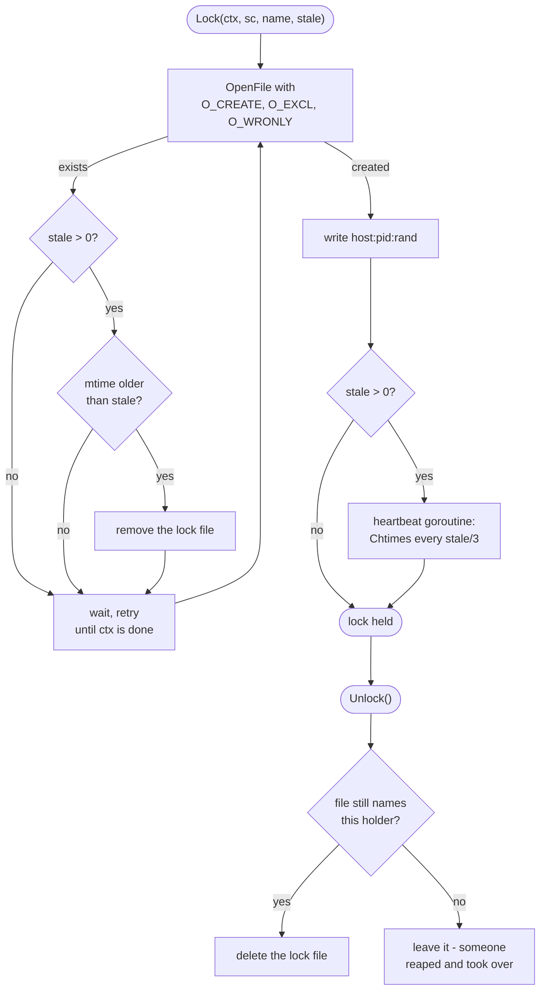

# Storage Volume

Beyond the standard Ensure/Start/Delete lifecycle, `StorageVolume` exposes raw
SFTP access to the volume's contents and an advisory file lock built on it.

## SFTP

```go
func (r *StorageVolume) SFTP(ctx context.Context) (*sftp.Client, error)
```

Returns a new SFTP connection to the volume (`ErrNotEnsured` if the volume
hasn't been ensured yet). The caller closes it.

It is also how `StorageVolumeConfig.HostPath` seeds a volume on first creation:
the directory is walked and written file by file over one connection.

**No `ReadFile`/`WriteFile` wrapper.** The full `github.com/pkg/sftp` client is
exposed - `OpenFile`, `Stat`, `Rename`, `ReadDir`, `PosixRename` - rather than a
two-method wrapper that would keep growing and hide the primitives.
`PosixRename` gives write-temp-then-rename for atomic document updates (e.g. a
manifest file), so a reader never sees a partial write; it's an OpenSSH protocol
extension, but client and server both run `github.com/pkg/sftp`, so it's always
available here.

## Prefetch

`StorageVolumeConfig.Prefetch` names a path in `ImageResource`, and a volume
created with it starts from what the image holds there. It sits beside
`HostPath`, which is the same idea with a local directory as the source.

An image has no file API, so the bytes come from an instance:

```
create the volume
  copy that path's tree in over two SFTP connections
```

The source is `Image.SFTP` - a stopped instance of the image, which mounts no
disk devices, so nothing has to be attached or detached and it never touches the
volume it fills. It belongs to the image, not to this copy: several volumes off
one image share it, and `Client.Done` removes it. See
[Image - Reading the image](/developer/client/image#reading-the-image).

Ownership is replayed as the endpoint reports it: container-native ids, which a
`security.shifted` volume then shows unchanged inside the instance. The volume's
root takes the source directory's own mode and owner.

Plain files and directories are copied. Symlinks, devices, sockets and fifos are
skipped and named in a warning. Nothing is deduplicated, so hardlinks arrive as
copies - SFTP reports no link count to notice them by.

A failure drops the volume and fails the ensure. Failing hard is deliberate,
since a half filled volume where data was expected starts an application that
looks fine and is not.

There is no total to report progress against - the size of a path inside an
image is only knowable by walking it, which is the copy itself - so the copy
reports what it has moved so far and the renderer draws a spinner.

## VolumeLock

```go
func (r *StorageVolume) Lock(ctx context.Context, sc *sftp.Client, name string, stale time.Duration) (*VolumeLock, error)
func (l *VolumeLock) Unlock() error
```

`Lock` acquires the named advisory lock on the volume, blocking until it is held
or `ctx` is done. `sc` is caller-owned: the caller opens it (via `SFTP()`) and
must keep it open for the whole critical section - `Lock` uses it for the
acquire, and when `stale > 0` the background heartbeat keeps using it too.
`Unlock` never closes it.

`stale` selects one of two modes:

| `stale` | Behavior                                                                                                                                 | Fits                                                                                                                                                        |
| ------- | ---------------------------------------------------------------------------------------------------------------------------------------- | ----------------------------------------------------------------------------------------------------------------------------------------------------------- |
| `0`     | Never taken over; holder never refreshes it                                                                                              | Infrequent, operator-driven locks. A crashed holder leaves a stuck lock - a visible failure naming the file to remove, instead of a silent correctness bug. |
| `> 0`   | A background goroutine refreshes the lock's mtime every `stale/3`; another caller's `Lock` reaps it once its mtime is older than `stale` | Frequent, unattended locks where a crashed holder must not block everyone else forever.                                                                     |



### Why `O_EXCL`, not read-compare-write

Incus' own volume-file endpoint only supports `overwrite`/`append` and has no
ETag, so there is no "create only if absent" - the naive lock is write
timestamp, sleep, re-read, compare, which is a timing-based approximation, not a
real exclusion.

`GetStoragePoolVolumeFileSFTP` gives real POSIX semantics instead:

```go
f, err := sc.OpenFile(lockPath, os.O_CREATE|os.O_EXCL|os.O_WRONLY)
// err == nil          -> the lock is ours
// file already exists -> it is theirs
```

Verified through all three hops: `pkg/sftp` maps `os.O_EXCL` to `sshFxfExcl`;
Incus serves volume SFTP with `sftp.NewServer`; that server maps `sshFxfExcl`
back to `os.O_EXCL`. It bottoms out in one `openat(O_CREAT|O_EXCL)` - the kernel
does the mutual exclusion, nothing in incus-compose has to.

### Ownership is diagnostic only

The lock file's contents (`host:pid:rand`) are never consulted to decide who
holds the lock - `O_EXCL` alone does that. They matter only at `Unlock` time:
the file is deleted **only if it still names the current holder as owner**. A
stale takeover may have replaced it with someone else's lock in the meantime;
deleting unconditionally would delete the new holder's lock instead of this one.

### Stale takeover

On an acquire failure with `stale > 0`, `Lock` stats the lock file; if its mtime
is older than `stale`, it removes the file and lets the retry loop race for it
again. Two callers reaping at the same moment is benign - both then contend on
the same `O_EXCL` create and exactly one wins. mtime comes from the server's
filesystem clock rather than each client's own clock, which retires most of the
clock-skew question.

The heartbeat, where running, is nothing more than `Chtimes` on the lock path
over the same connection passed to `Lock` - no re-read, no compare, no ownership
inference.

### Connection lifetime

Reconnecting to a volume's SFTP endpoint is cheap: the server dials an
already-running `forkfile` process over its Unix socket instead of spawning one
and re-mounting the volume (`internal/server/storage/drivers/volume.go:796`,
`FileSFTPConn`). That's why a competing `Lock` call, or unrelated volume I/O
elsewhere, can each open their own `sc` via `SFTP()` rather than needing to
share or pool one.

The other direction matters more: **holding a connection open keeps the volume
mounted for as long as you hold it**, and volume deletion doesn't wait for
that - `StopForkfile` unconditionally `SIGKILL`s the forkfile process on delete
(`internal/server/storage/backend.go:6218,6329`), regardless of whether a client
is still connected. So `sc`'s lifetime should track the work that actually needs
it (the lock's critical section), not be cached or reused across unrelated
operations.

## See Also

`client/resource_storage_volume_lock_test.go` has the call-site shapes for every
scenario above (acquire/release, blocking on `ctx`, stale takeover after a
simulated crash, a live heartbeat resisting takeover, the ownership-check safety
case) against a real Incus - they're the canonical examples, not reproduced
here.

- [Errors](/developer/client/errors) - `ErrNotEnsured` and friends
- [Client Package](/developer/client) - the wider resource model this fits into
