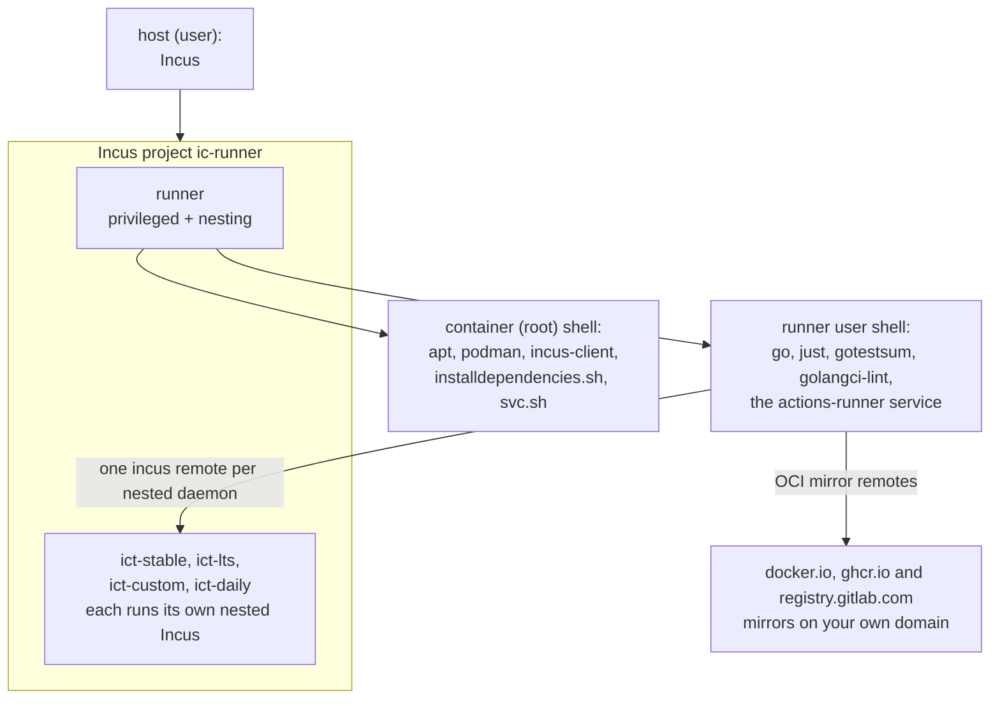

# Github Actions runner

This guide brings up a self-hosted GitHub Actions runner for `lxc/incus-compose`
inside a privileged Incus container that runs its own (nested) Incus daemon, so
the test suite can create instances, networks and volumes.

The steps move between three shells. Each section says which one it runs in:

- **Host** - your workstation/server running Incus.
- **Container (root)** - a root shell inside the `runner-local` container.
- **Runner user** - an unprivileged `runner` login shell inside the container.

Placeholders to replace as you go: `example.com` (your OCI registry mirror
domain), `<ip-from-above>` (the container's bridge IP), and the `--token`
registration token from GitHub.



## 1. Load the `openvswitch` module for ovn support - _host (user)_

```bash
sudo bash -c "echo 'openvswitch' > /etc/modules-load.d/50-openvswitch.conf"
sudo modprobe openvswitch
```

## 2. Create the runner container - _host (user)_

Sadly `security.privileged` is needed for podman builds to work.

```bash
incus project create ic-runner
INCUS_PROJECT=ic-runner incus profile device add default root disk path=/ pool=default
INCUS_PROJECT=ic-runner incus profile device add default eth0 nic network=incusbr0

incus --project=ic-runner launch images:debian/trixie runner -c security.nesting=true -c security.privileged=true
incus --project=ic-runner exec runner /bin/bash
```

The `exec` drops you into a root shell inside the container; the next steps run
there.

## 3. Install base packages - _container (root)_

```bash
apt-get install -qy sudo sudo-rs vim golang git shellcheck podman jq
ln -s /usr/sbin/sudo-rs /usr/local/sbin/sudo
ln -s /usr/share/zoneinfo/Europe/Vienna /etc/timezone
```

## 4. Install Incus from the Zabbly repository - _container (root)_

```bash
curl -fsSL https://pkgs.zabbly.com/key.asc -o /etc/apt/keyrings/zabbly.asc
sh -c 'cat <<EOF > /etc/apt/sources.list.d/zabbly-incus-stable.sources
Enabled: yes
Types: deb
URIs: https://pkgs.zabbly.com/incus/stable
Suites: $(. /etc/os-release && echo ${VERSION_CODENAME})
Components: main
Architectures: $(dpkg --print-architecture)
Signed-By: /etc/apt/keyrings/zabbly.asc

EOF'

apt-get -q update; apt-get -qy install incus-client
```

## 5. Create the `runner` user - _container (root)_

```bash
adduser --disabled-password --shell /usr/bin/bash runner
```

## 6. Install golangci-lint - _runner user_

The install script drops the binary in `~/.local/bin`. Create that directory
_before_ logging in: Debian's `~/.profile` only adds `~/.local/bin` to `PATH` if
it exists at login, so log out and back in afterwards to pick it up.

```bash
sudo -u runner bash -c 'mkdir -p ~/.local/bin; curl -sSfL https://golangci-lint.run/install.sh | sh -s -- -b ~/.local/bin'

sudo -u runner -iH
which golangci-lint
```

## 7. Install other tools and configure podman - _runner user_

```bash
go install gotest.tools/gotestsum@latest
```

```bash
echo 'if [ -d "$HOME/go/bin" ]; then PATH="$HOME/go/bin:$PATH"; fi' >> ~/.profile
```

```bash
curl --proto '=https' --tlsv1.2 -sSf https://just.systems/install.sh | bash -s -- --to ~/.local/bin
```

```bash
mkdir -p ~/.config/containers/
echo -e '[engine]\ncgroup_manager = "cgroupfs"' > ~/.config/containers/containers.conf
loginctl enable-linger runner
```

restart the container/vm.

## 8. Add OCI registry remotes - _runner user_

These point at your registry mirrors so images are additional cached.

```bash
export DOMAIN=example.com
incus remote add --protocol=oci docker.io https://docker-registry.$DOMAIN
incus remote add --protocol=oci ghcr.io https://ghcr-registry.$DOMAIN
incus remote add --protocol=oci registry.gitlab.com https://gitlab-registry.$DOMAIN
```

## 9. Enable HTTPS access to the local daemon - _runner user_

Generate a client certificate, trust it, find the bridge IP, expose the daemon
over HTTPS, and add a remote pointing at it.

```bash
incus remote generate-certificate
```

## 10. Install the nested incus containers - _host (user)_

Copy the runners client.crt first

```sh
incus --project=ic-runner file pull runner/home/runner/.config/incus/client.crt runner-client.crt
```

```sh
export INCUS_PROJECT=ic-runner

./setup-nested-incus.sh -c runner-client.crt -n ict-stable -r stable -o -f
./setup-nested-incus.sh -c runner-client.crt -n ict-custom -r stable -p local -b vmbr0 -o -f
./setup-nested-incus.sh -c runner-client.crt -n ict-lts -r lts-7.0 -o -f
./setup-nested-incus.sh -c runner-client.crt -n ict-daily -r daily -o -f
```

## 11. Register the remotes on the runner - _runner user_

```bash
for remote in "ict-stable" "ict-lts" "ict-custom" "ict-daily"; do
  incus remote rm "${remote}"
  incus remote add "${remote}" "${remote}" --accept-certificate
done
incus remote list
```

## 12. Download the GitHub Actions runner - _runner user_

```bash
mkdir actions-runner; cd actions-runner
curl -o actions-runner.tar.gz -L https://github.com/actions/runner/releases/download/v2.335.1/actions-runner-linux-x64-2.335.1.tar.gz
tar xf actions-runner.tar.gz; rm -f actions-runner.tar.gz
exit
```

## 13. Install runner dependencies - _container (root)_

The dependency installer needs root, so run it after the `exit` above.

```bash
/home/runner/actions-runner/bin/installdependencies.sh
```

## 14. Register the runner - _runner user_

Get a registration token from the repository's **Settings → Actions → Runners →
New self-hosted runner**, then register:

```bash
sudo -u runner -iH
cd actions-runner
```

Optain that one from:
https://github.com/lxc/incus-compose/settings/actions/runners/new

```bash
./config.sh --url https://github.com/lxc/incus-compose --token XXX
```

```bash
echo "HOME=/home/runner" >> ~/actions-runner/.env
echo "TEST_PROCS=12" >> ~/actions-runner/.env
```

The interactive prompts look like this (the values shown are the ones used
here):

```
--------------------------------------------------------------------------------
|        ____ _ _   _   _       _          _        _   _                      |
|       / ___(_) |_| | | |_   _| |__      / \   ___| |_(_) ___  _ __  ___      |
|      | |  _| | __| |_| | | | | '_ \    / _ \ / __| __| |/ _ \| '_ \/ __|     |
|      | |_| | | |_|  _  | |_| | |_) |  / ___ \ (__| |_| | (_) | | | \__ \     |
|       \____|_|\__|_| |_|\__,_|_.__/  /_/   \_\___|\__|_|\___/|_| |_|___/     |
|                                                                              |
|                       Self-hosted runner registration                        |
|                                                                              |
--------------------------------------------------------------------------------

# Authentication


√ Connected to GitHub

# Runner Registration

Enter the name of the runner group to add this runner to: [press Enter for Default]

Enter the name of runner: [press Enter for runner-local] server01-runner-local

This runner will have the following labels: 'self-hosted', 'Linux', 'X64'
Enter any additional labels (ex. label-1,label-2): [press Enter to skip] incus-compose-local

√ Runner successfully added

# Runner settings

Enter name of work folder: [press Enter for _work]

√ Settings Saved.
```

## 15. Run the runner as a service - _container (root)_

```bash
exit
pushd /home/runner/actions-runner
./svc.sh install runner
./svc.sh start
exit
```

The runner is now registered and starts automatically with the container.
