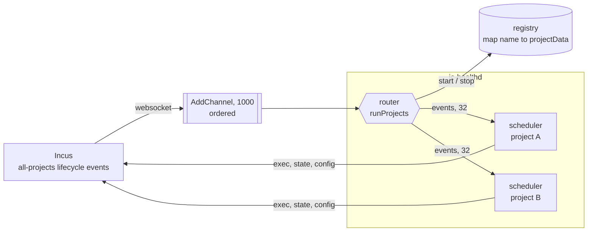
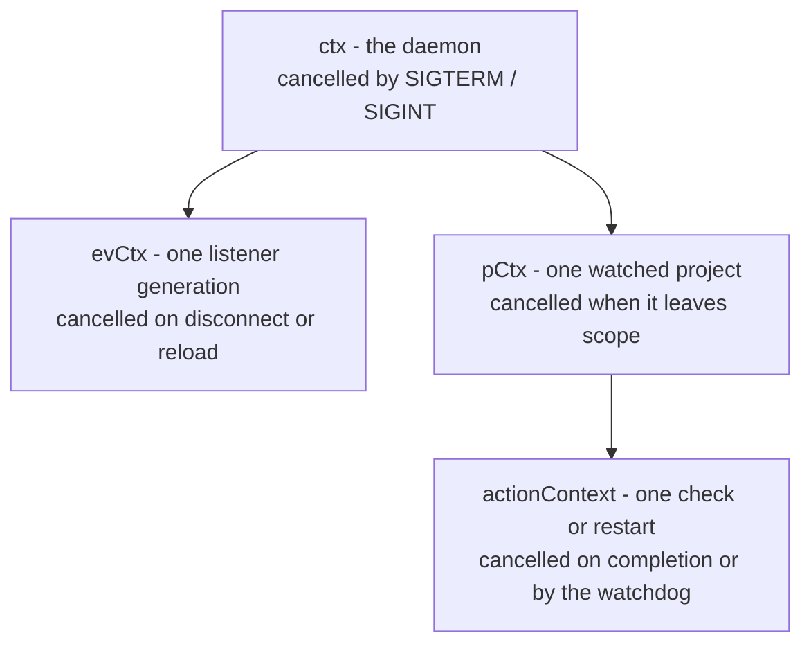
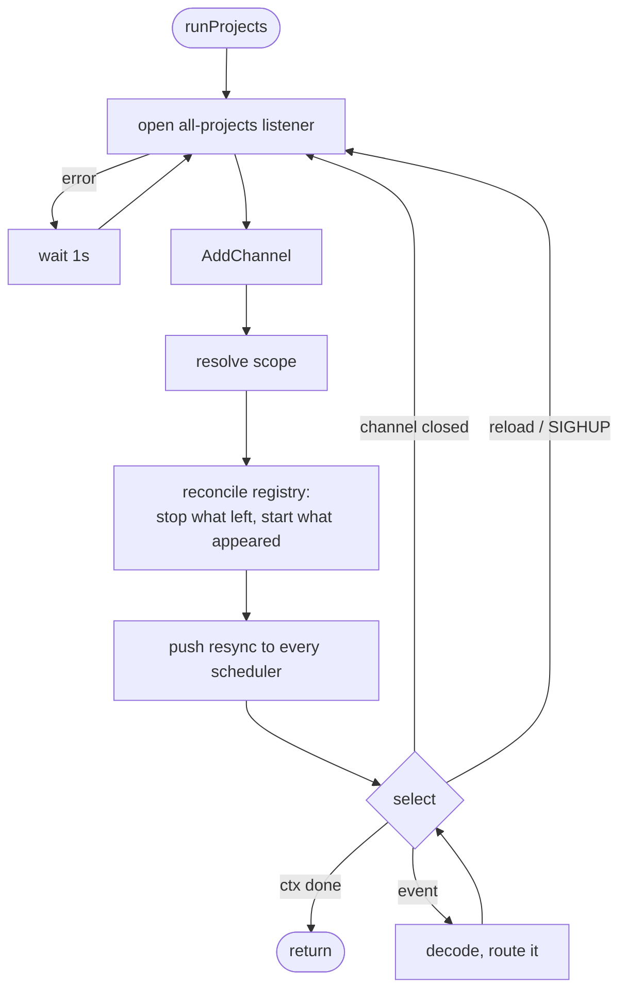
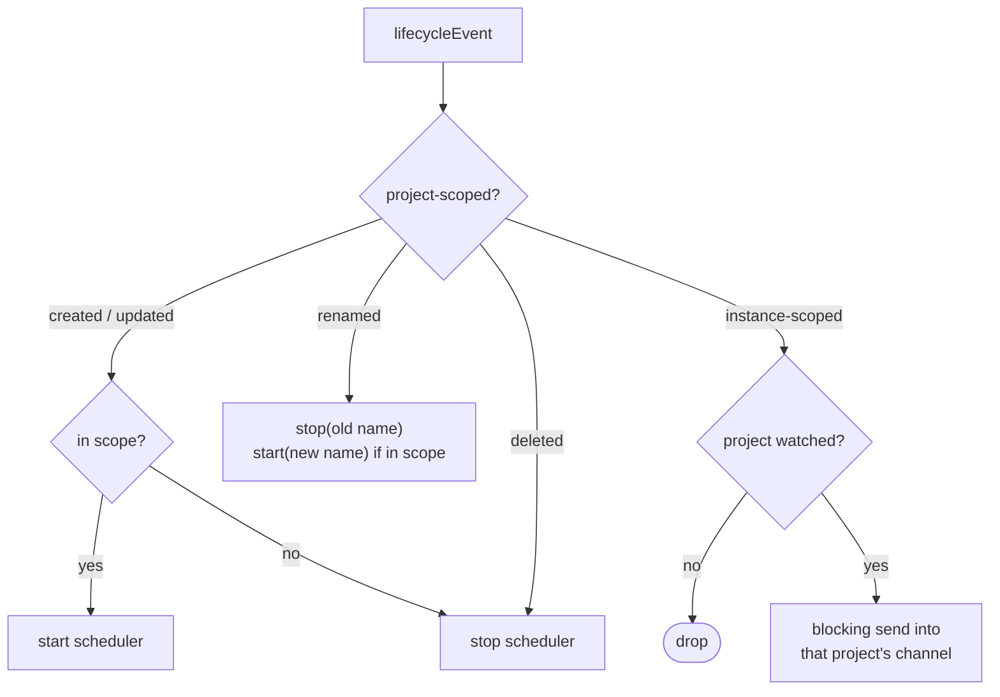
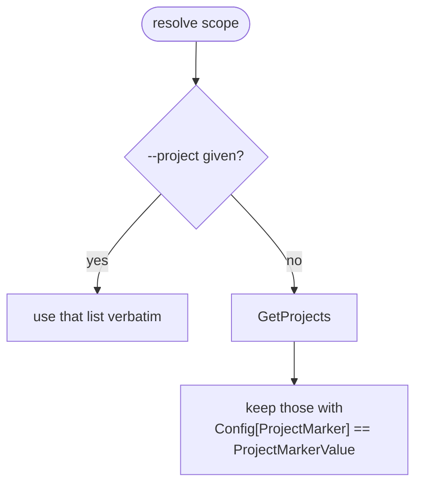
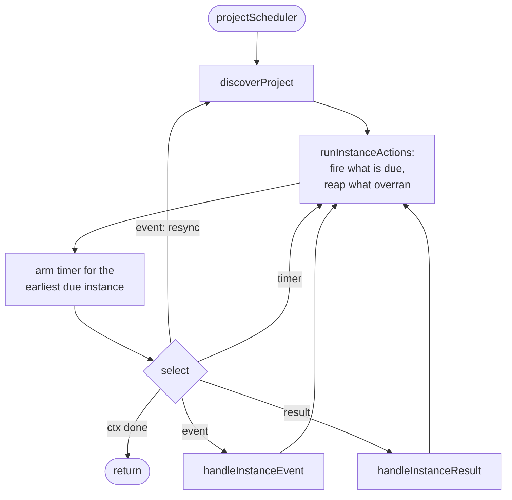
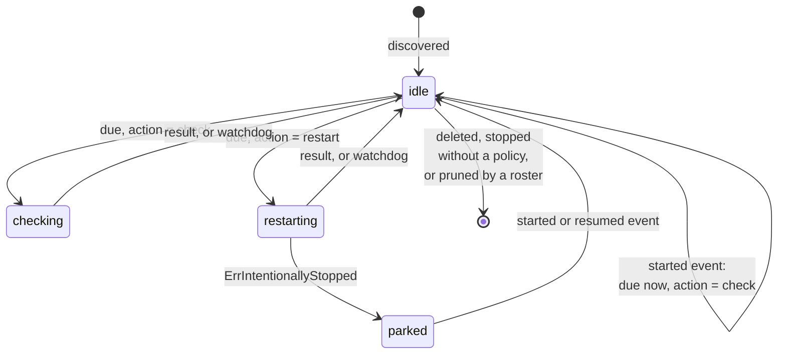
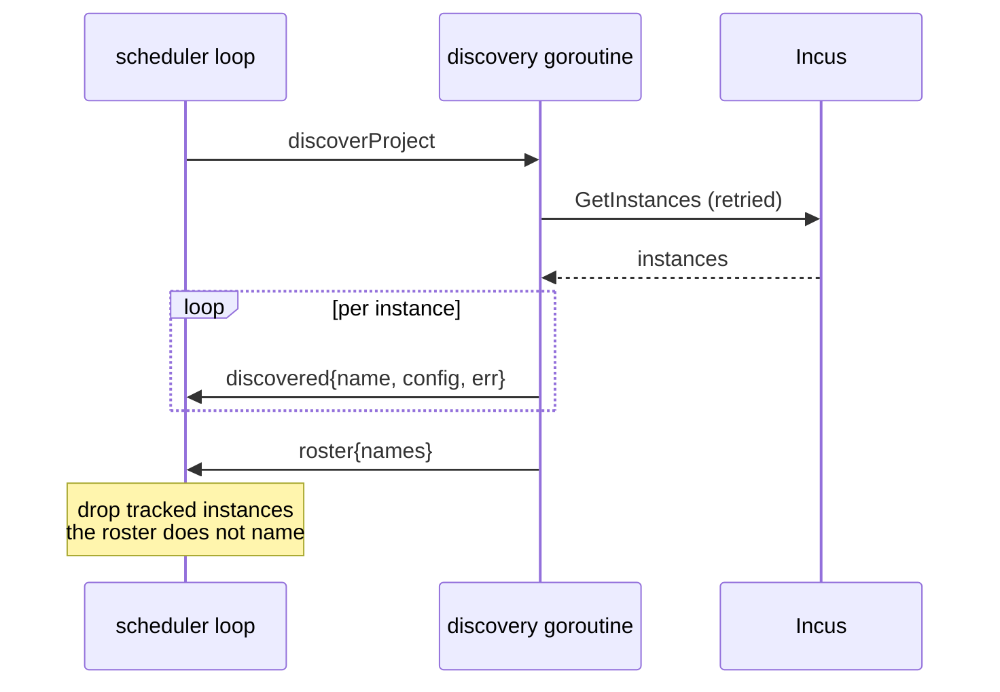
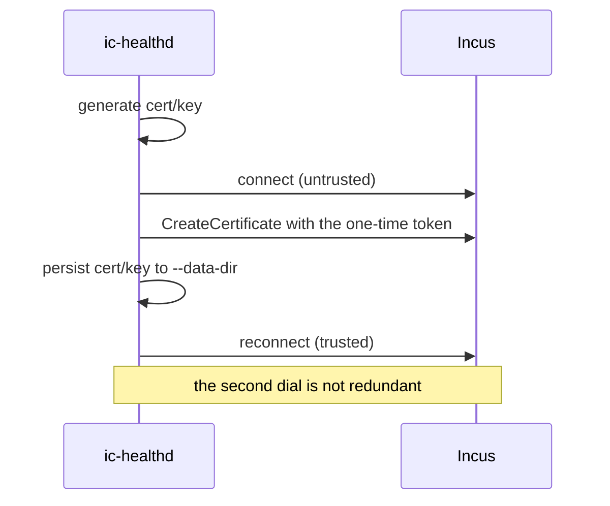

# ic-healthd Internals

How the daemon is put together. For what it does and how to configure it, see
[Health Checking](/healthd); this page is about the parts inside.

The whole daemon is three kinds of goroutine and the channels between them:

| Part                 | Count                             | Owns                                                        |
| -------------------- | --------------------------------- | ----------------------------------------------------------- |
| The listener handler | one per generation                | decoding an Incus event                                     |
| The router           | one                               | the connection, the project registry, project-scoped events |
| A scheduler          | one per watched project           | that project's instances and their timers                   |
| A worker             | `--workers` + `--restart-workers` | one check or restart, whichever project it came from        |



One websocket serves every project. That is the point of the design: a project
costs a goroutine and a map entry, not a connection and a reconnect loop.

## Why one listener

A restricted certificate may open an all-projects listener, and Incus filters it
down to the projects that certificate is allowed. The events endpoint takes a
different path when `all-projects=true` is set: it builds a permission checker
rather than checking one project up front, and the TLS driver returns a filter
over the certificate's project list. So the daemon asks for everything and
receives exactly what it may see, with no per-project bookkeeping of its own.

The same filter governs `GET /1.0/projects`, which is what makes scope
resolution safe to run against the whole server.

## Lifetimes

Three contexts nest, and knowing which is which explains most of the code:



The load-bearing detail is that **`pCtx` hangs off `ctx`, not off `evCtx`**. A
scheduler therefore survives a listener reconnect with its instances, failure
counts, backoff and last reported status intact. Only the listener and the
handler die with a generation.

## The router

`mainAction` does the things that must happen once: install signal handlers,
connect (retrying), write the daemon's own health status, and hand over to
`runProjects`. Everything after that is `runProjects`, which loops once per
listener generation.



Reconciling happens **after** the channel is added, not before. A project
created in between then queues on the channel rather than falling in the gap
between the two.

The resync push is what covers the gap that already happened: while there was no
listener, instances may have been created, changed or deleted unseen, so every
surviving scheduler is told to re-read its project rather than trust what it
holds.

### Routing one event



`instance-resumed` is routed as a start. A pause parks the instance, via the
`user.healthcheck.stopped` marker `incus-compose pause` writes, and a start
event is the only thing that un-parks one - the `instance-updated` that clearing
the marker emits refreshes an instance's config and status but leaves its state
alone. Without the resume the instance would run unwatched until the next
resync.

The registry is a plain map with no mutex, because only this goroutine touches
it. `start` and `stop` are closures over it for the same reason.

`stop` cancels the scheduler's context and deletes the entry; it deliberately
does **not** wait for the goroutine to finish. A scheduler that is wedged must
not be able to hang the router that is trying to be rid of it.

### Ordering and backpressure

Events arrive on one channel from `AddChannel`, so the router sees them in the
order Incus sent them. That is load-bearing rather than tidy: handled the other
way round, a stop and the start after it leave the daemon holding a restart for
an instance that is already running, and it force-stops it a backoff later.

Every send from there on is blocking, and nothing is dropped for lack of room.
The remaining buffers (`projectBuffer` 32, `resultBuffer` 32) only buy slack
while a loop is between selects.

The consequence is deliberate: one wedged scheduler eventually stalls routing
for everyone, and behind it the event channel fills. At 1000 pending the client
gives up on the listener and closes the channel, which the router reads as the
end of a generation and answers with a reconnect and a resync. That is a
visible, recoverable failure rather than a silent one; dropping a `stopped`
event instead would mean a crashed instance is never restarted, and nothing
would say so.

A routed send selects on three things, so it cannot outlive its target:

```go
select {
case p.events <- ev.Instance:
case <-p.done:   // the scheduler has gone
case <-ctx.Done():
}
```

### Scope



Scope is resolved once per generation, so a reconnect or a SIGHUP also re-reads
it. In between, single project events keep it current - and because a project
event carries no config, `created` and `updated` re-read that one project rather
than resolving the whole scope again.

`--project-marker` is a `KEY=VALUE` pair, defaulting to
`user.healthcheck.scope=global`; a bare key means `KEY=true`. incus-compose
stamps the scope on a project in `healthdUp`, after removing any sidecar the
project owned, so no project is ever in two daemons' scope at once.

That the match is on a _value_ and not merely on a key present is what makes the
upgrade safe: a project scoped to its own sidecar carries `project` and a
project from before the key existed carries nothing, so neither matches
`global`. For the operator's view of the same thing, see
[Choosing what to watch](#choosing-what-to-watch).

## A scheduler

One goroutine per watched project. It owns its instances map outright: no other
goroutine reads or writes it, which is why the handlers can be plain functions
over the map with no locking.



`handleInstanceEvent` and `handleInstanceResult` must never block: anything that
talks to Incus is started on its own goroutine and reports back through the
results channel. The loop's job is to stay responsive, so a blocking send into
it always drains.

### Worker pools

Checks and restarts run on two `ants` pools shared by every scheduler, so the
caps are fleet-wide rather than per project. They are separate because a restart
holds its worker for up to `restartTimeout`, and a handful of slow ones must not
be able to starve the checks.

Both are non-blocking: a full pool refuses the action instead of queueing it,
and `runInstanceActions` leaves the instance idle and re-dues it
`poolRetryDelay` later. Queueing would be worse than refusing on both counts - a
submit that blocks stalls the loop, and hence routing and the websocket read
(see [Backpressure](#backpressure)), while a task waiting for a worker burns the
deadline the watchdog reaps it by, which for a check counts as a failed probe.

The state, the deadline and the context are set only once the pool accepts, so a
refused action is indistinguishable from one that was never due.

### Instance state



`instanceState` is a single value rather than a set of booleans, so the
combinations that cannot happen also cannot be represented. An idle instance
carries `action`, which says what fires when `due` arrives; a check and a
restart are mutually exclusive, since an instance awaiting a restart is stopped
and checking a stopped instance is pointless.

A **started event**, which a resume counts as, puts an idle or parked instance
back into the shape a fresh start leaves it in (`instanceStarted`): due for a
check at once, failure run cleared, start period re-armed. That is also what
discards a restart the stop before it had queued - an instance somebody else
already started has nothing left to restart, and firing it anyway would
force-stop a running instance one backoff later. An instance with an action in
flight is left alone; its result says what happens next.

### Telling results apart

Each in-flight action gets a fresh context, and the result carries it back. The
loop compares that against the context it still holds:

```go
if res.ctx != inst.actionContext {
    // The watchdog gave up on this one and something else has the slot now.
    return
}
```

This matters because cancelling an abandoned action unblocks both its send and
the `ctx.Done()` arm of the same select, so roughly half of all abandoned
actions still deliver a result. Identity is what makes those harmless.

The watchdog itself lives in `runInstanceActions`: an action past its deadline
is cancelled and its slot freed. A check that overran counts as a failed probe,
matching docker; a restart that overran counts as a failed restart and widens
the backoff.

### Discovery and the roster



The roster is sent last so it only prunes what the pass really did not see. It
exists because schedulers are now long-lived: before, a reconnect rebuilt the
map from scratch and stale entries could not accumulate. Now nothing else would
ever remove an instance that vanished while the daemon was disconnected.

Discovery runs on its own goroutine because the loop calls it from inside the
select, on `resync`.

## Running the daemon directly

`incus-compose up` creates the sidecar and injects the configuration below as
environment variables. You can also run `ic-healthd run` yourself - as a binary
or a separately managed container - and attach projects to it with
`up --external-healthd` (see
[Health Checking - Using Your Own healthd](/healthd#using-your-own-healthd)).

Every flag has a matching env var:

| Flag                | Env var                                 | Default                         | Description                                                                 |
| ------------------- | --------------------------------------- | ------------------------------- | --------------------------------------------------------------------------- |
| `--incus`           | `INCUS_COMPOSE_HEALTHD_INCUS`           | -                               | Incus API URL to connect to                                                 |
| `--token`           | `INCUS_COMPOSE_HEALTHD_TOKEN`           | -                               | Trust token used to register the client cert                                |
| `--project`         | `INCUS_COMPOSE_HEALTHD_PROJECTS`        | -                               | Projects to manage; empty means every marked project                        |
| `--project-marker`  | `INCUS_COMPOSE_HEALTHD_PROJECT_MARKER`  | `user.healthcheck.scope=global` | Project config `KEY=VALUE` that opts a project in when `--project` is empty |
| `--own-project`     | `INCUS_COMPOSE_HEALTHD_OWN_PROJECT`     | -                               | Project the daemon's own container runs in                                  |
| `--own-name`        | `INCUS_COMPOSE_HEALTHD_OWN_NAME`        | -                               | The daemon's own instance name; empty means it skips itself                 |
| `--data-dir`        | `INCUS_COMPOSE_HEALTHD_DATA_DIR`        | `/var/lib/ic-healthd`           | Persistent directory for the generated cert/key                             |
| `--secrets-dir`     | `INCUS_COMPOSE_HEALTHD_SECRETS_DIR`     | `/secrets`                      | Directory holding the one-time registration token file                      |
| `--workers`         | `INCUS_COMPOSE_HEALTHD_WORKERS`         | `128`                           | Health checks running at once, over every watched project                   |
| `--restart-workers` | `INCUS_COMPOSE_HEALTHD_RESTART_WORKERS` | `32`                            | Restarts running at once, over every watched project                        |
| `--debug`           | `INCUS_COMPOSE_HEALTHD_DEBUG`           | `false`                         | Verbose logging                                                             |
| `--trace`           | `INCUS_COMPOSE_HEALTHD_TRACE`           | `false`                         | Per-event logging, which implies `--debug`                                  |

`--own-project` and `--own-name` are how the daemon writes its own health
status; leaving `--own-name` empty means it skips itself.

### Choosing what to watch

There are two ways to say it, and they do not mix:

- **An explicit list.** `--project a --project b` (or
  `INCUS_COMPOSE_HEALTHD_PROJECTS=a,b`) watches exactly those, marker ignored.
- **The marker.** With no `--project`, every project the daemon can see carrying
  `user.healthcheck.scope: "global"` in its _project_ config. incus-compose
  stamps that on the projects it hands to the shared daemon, so a daemon started
  this way picks those up and leaves everything else - project-scoped projects,
  projects from before the key existed, and anything not incus-compose's -
  alone. `--project-marker` selects a different pair, e.g.
  `--project-marker user.mine=yes`; a bare key means `KEY=true`.

**The trust token is what bounds "can see".** A token restricted to two projects
gives a daemon that watches at most those two, whatever its flags say - Incus
filters both the project list and the event stream by what the certificate is
allowed. An unrestricted token means every project on the server.

```bash
# every marked project the token allows
incus config trust add healthd --restricted --projects=blog,shop
ic-healthd run

# exactly these two, marker or not
ic-healthd run --project blog --project shop
```

Projects created, renamed or deleted while the daemon runs are picked up from
the event stream; no reload is needed.

### Local binary in the sidecar

```bash
incus-compose up --healthd-binary ./bin/ic-healthd
```

Uses `images:alpine/edge` instead of the published OCI image and pushes the
local binary into the container before start. Useful when iterating on the
daemon but still wanting `up` to manage its lifecycle.

### Standalone on the host

The fastest edit-run-reload loop when hacking on the daemon: run `ic-healthd` on
the host and attach a project to it with `--external-healthd`.

> The daemon registers over the Incus HTTPS API, so the default remote must
> expose an HTTPS address (not just the local unix socket).

1. Build and start the daemon; the token is minted inline and passed via
   `INCUS_COMPOSE_HEALTHD_TOKEN`:

   ```bash
   # The Incus project to watch (its Incus name).
   export INCUS_COMPOSE_HEALTHD_PROJECTS=many-dependencies

   mkdir -p ./work/{secrets,data}
   rm -f ./work/data/*

   # HTTPS address of the default remote.
   export INCUS_COMPOSE_HEALTHD_INCUS=$(default=$(incus remote get-default); incus remote list --format=json | jq -r '."'$default'" .Addrs[0]')
   # A restricted, project-scoped trust token.
   export INCUS_COMPOSE_HEALTHD_TOKEN="$(incus -q config trust add manual_healthd --projects=$INCUS_COMPOSE_HEALTHD_PROJECTS --restricted)"

   just build-healthd
   ./bin/ic-healthd run --debug --secrets-dir=./work/secrets/ --data-dir=./work/data/
   ```

   On first run it consumes the token and writes the cert/key to `./work/data`,
   reusing them afterwards (delete `./work/data/*` to re-register).

2. Note the PID from the startup log (or use `pidof ic-healthd`):

   ```
   time=2026-07-04T15:47:24.177+02:00 level=INFO msg=Version version=v1.0.0-beta.20-29-g57f305c-dirty pid=446206
   ```

3. In another terminal, bring the project up against the running daemon.
   `--external-healthd` makes incus-compose use healthd features without
   creating or looking up a sidecar of its own:

   ```bash
   just run -P examples/many-dependencies/ up --external-healthd
   ```

4. Config key changes (and instance create/start/stop/delete) take effect on
   their own via the Incus event stream - no reload needed. Force a full manual
   resync if you ever want one, by sending SIGHUP:

   ```bash
   kill -HUP <pid-from-step-2>
   ```

## Upstream behaviour worth knowing

Three things about Incus shape this code and would otherwise look like mistakes.

**Only empty projects can be renamed.** `projectIsEmpty` rejects a rename when
anything but the default profile is in the project, so a rename can never lose
watched instances. That is why the router handles it by simply stopping the old
name and starting the new one.

**A rename does not refresh incusd's certificate cache.**
`certificates_projects` is keyed by project ID, so the database follows a
rename, but the in-memory cache the authorizer reads still holds the old name
until something else refreshes it. A daemon on a restricted token can therefore
get 403s on the renamed project for a while. Combined with the point above, the
blast radius is small enough to log and carry on.

**A project event names nothing.** `ProjectAction.Event` sets neither `Name` nor
`Project` on the lifecycle payload, so the new name arrives only in the
envelope's `Project` field and the old one only in `Context["old_name"]`.

**`project-updated` is sent before the change is applied.** `api_project.go`
calls `SendLifecycle` and only then `projectChange`, and the event carries a nil
`Context`, so there is no config on it to read either. A daemon that reacts by
reading the project back therefore races the write, and a read that wins sees
the old config - which for scope resolution means answering "not mine" for a
project that just opted in.

Losing that race used to be permanent: instance events for an unwatched project
are dropped, and scope was only re-resolved per listener generation. So a
negative from `inScope` is no longer believed on the first look - the project
goes into a small recheck set that is re-read a few times a second later
(`scopeRecheckDelay`, `scopeRecheckTries`). The deadline is a `time.Time` and
the timer is the loop's own, deliberately: a `time.AfterFunc` would touch the
registry from a second goroutine, which is exactly what the router's design
avoids.

## Registration



The Incus client reads `/1.0` once at dial time and caches it, and the
unauthenticated `/1.0` advertises far fewer API extensions. A connection made
before the certificate was trusted therefore refuses extension-gated calls such
as `GetProjects` for the life of the process. Redialling after registration is
what makes a first run behave like every later one.

The token is consumed on that first run and never needed again. In the normal
flow incus-compose supplies it via `INCUS_COMPOSE_HEALTHD_TOKEN`; running the
daemon by hand, pass `--token` or drop a token file in `--secrets-dir`. Deleting
the contents of `--data-dir` forces a fresh registration.

The token also carries the scope: Incus takes the certificate's name and project
restriction from the token, not from what the daemon asks for. A restricted
token is what bounds a daemon, whatever its flags say.

## See Also

- [Health Checking](/healthd) - configuration, keys, and the management commands
- [Architecture](/developer) - how the sidecar fits the resource model
- [Client Package](/developer/client) - the client the daemon does not use;
  ic-healthd talks to `incus.InstanceServer` directly
