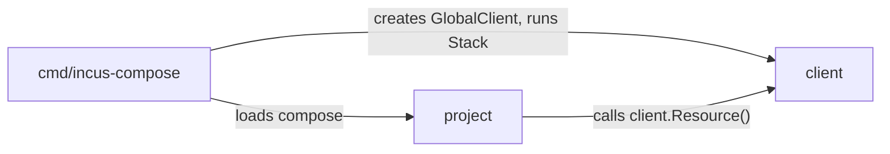
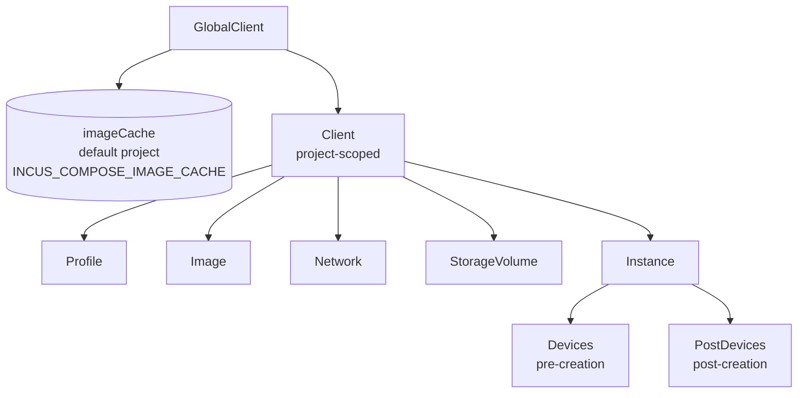
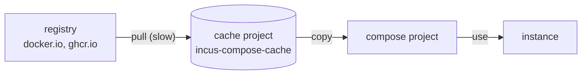

# Developer

Internals of incus-compose: how it is put together, and how to work on it. The
design is **resource-first**:

- **Unified Resource Interface** - Images, instances, networks, profiles, and
  volumes are all first-class resources
- **Two-Phase Pattern** - Configuration (resource creation) then execution
  (ensure/start/stop/delete)
- **Priority-Based Ordering** - Dependencies managed via numeric priorities, no
  complex graph resolution
- **Stack Execution** - Batch operations with parallel image downloads
- **Hook System** - Before/after action interception for logging and validation

## Package Structure

```
incus-compose/
├── cmd/incus-compose/  # CLI entry point
├── client/             # Incus client with resources, stack, pool
└── project/            # Compose-spec to Incus translation
```

### Package Responsibilities

**cmd/incus-compose/**

- CLI and flag parsing
- Wires together client and project
- Commands: up, down, ps, config

**client/**

- High-level Incus API wrapper
- Resources: Profile, Image, Network, StorageVolume, Instance
- Stack for task collection and ordering
- WorkerPool for parallel execution
- [Hooks](/developer/client/hooks) for action interception

**project/**

- Loads Docker Compose files via compose-go
- Translates compose services to Incus resources
- Configures client resources based on compose definitions
- Handles environment variables and dependencies

### Package Dependencies



The CLI creates a GlobalClient and loads the compose project. Then project takes
over: it reads the compose definitions and configures resources on the client.
The client owns the resources, but project drives what gets created.

This means project is not a passive loader. It actively builds the resource
graph by calling into client. The Stack returned by project contains all
resources ready for execution.

## Resource Hierarchy



## Image Caching (3-Stage Flow)

Images go through three stages:

1. **Remote** - OCI registry (docker.io, ghcr.io)
2. **Cache** - Incus `incus-compose-cache` project (configurable via
   `INCUS_COMPOSE_IMAGE_CACHE`)
3. **Project** - per-project copy used by the instance



Benefits:

- First pull is slow (network), subsequent runs are fast (local cache)
- No registry rate limits after initial download
- Cache persists across `down`/`up` cycles
- Project deletion does not affect the cache

## Two-Phase Resource Pattern

1. **Configuration phase** - Resource created in memory

   ```go
   image, _ := client.Resource(KindImage, "docker.io/alpine", &ImageConfig{})
   image.Config.Source = imageServer  // configure
   ```

2. **Execution phase** - Resource created on Incus
   ```go
   image.Ensure(OptionCreate())  // blocks, creates on server
   ```

## Stack, WorkerPool, and Hooks

See [Client Package](/developer/client) for Stack, WorkerPool, resource
ordering, and hook details.

## Name Sanitization

### Projects

`My_Project!` -> `my-project`

### Instances

Valid DNS names, max 63 chars, long names hashed to 32 hex chars.

### Networks

Linux interface limit (13 chars), uses hash for long names: `backend` ->
`app-backend` or `ic-a1b2c3d4e5`

## Error Handling

See [Errors](/developer/client/errors) for sentinel errors and context
enrichment.

## Connection Modes

The CLI dials a remote of the Incus CLI configuration: `--remote`, else
`INCUS_REMOTE`, else the configured default.

```bash
incus remote add ci https://192.168.1.100:8443
incus-compose --remote ci up
```

`client.New` also takes a connection built elsewhere. `DialRemote` is the same
path the CLI takes; anything reachable through `iclient` works.

```go
conn, err := client.DialRemote("", "ci")
gc := client.New(ctx, client.ClientProvideConnection(conn))
```

The connection is a `*iclient.Connection`, our fork of the Incus client. The
upstream one shares event-listener state between everything holding it, so a
single connection cannot be driven from several goroutines - which is exactly
what the [WorkerPool](/developer/client) does. One connection serves every
project: each call names the project it acts on, so `EnsureProject` hands back a
`Client` that carries a project name, not a connection of its own. See
[iclient](/developer/iclient).

## Environment Variables

- OS environment variables NOT included by default
- `.env` files can use OS variables for interpolation
- Use `--os-env` flag for Docker Compose compatibility

## Extensions

`x-incus` passes any Incus config key through to the instance, network or volume
it sits on; `x-incus-compose` covers what incus-compose implements itself. Both
are documented in [Extras](/extras).

## Quick Reference

### Common Commands

```bash
incus-compose up                   # Start services
incus-compose up --no-start        # Create without starting
incus-compose up --recreate        # Recreate existing containers
incus-compose down                 # Stop and remove
incus-compose down --volumes       # Also remove volumes
incus-compose list                 # List running containers
incus-compose config --quiet       # Validate compose file
incus-compose config               # Show resolved configuration
incus-compose config --services    # List service names
incus-compose config --networks    # List network names
incus-compose config --volumes     # List volume names
incus-compose config --environment # Show interpolation environment
```

### Common Patterns

```yaml
# Basic service
services:
  web:
    image: docker.io/nginx:alpine
    ports:
      - "8080:80"

# With dependencies
services:
  db:
    image: docker.io/postgres:16-alpine
  app:
    image: docker.io/myapp:latest
    depends_on:
      - db

# With named volume
services:
  app:
    image: docker.io/myapp:latest
    volumes:
      - data:/var/lib/app
      - ./config:/etc/app:ro
volumes:
  data:

# With environment file
services:
  app:
    image: docker.io/myapp:latest
    environment:
      DATABASE_URL: ${DATABASE_URL}
    env_file:
      - .env
```

## Documentation

See the [docs index](/developer) for all user and contributor docs. Closely
related:

- [Client Package](/developer/client) - Resources, Stack, WorkerPool
- [iclient](/developer/iclient) - the Incus client everything talks through
- [ievent](/developer/ievent) - the event chain ic-dns and ic-healthd are built
  on
- [ic-dns](/dns) - DNS for your instances, the first ievent consumer
- [Testing](/developer/testing) - Testing patterns and fixtures
- [Health Checking](/healthd) - ic-healthd sidecar
- [Health Checking](/healthd) - configuration, the sidecar, and running the
  daemon directly
- [Progress](/developer/progress) - Live operation progress and the terminal
  renderer

## Need Help?

- **Bugs/Features**: Open an issue on
  [GitHub](https://github.com/lxc/incus-compose/issues)
- **Questions**: Check the docs above or open a discussion
