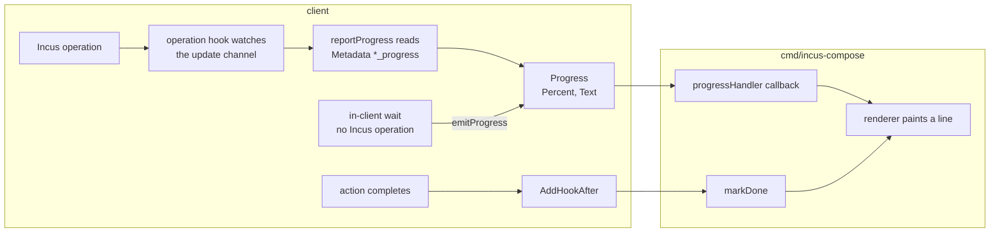
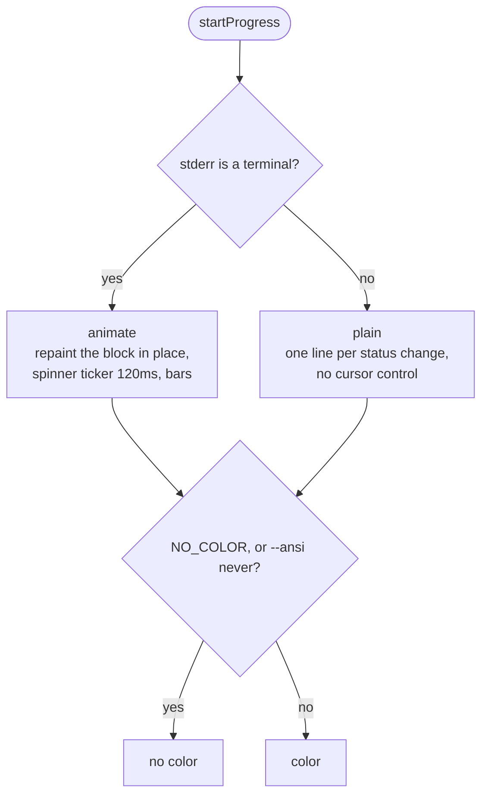

# Progress

Live progress reporting for long-running Incus operations (image pulls, instance
lifecycle). The client emits progress events; a renderer turns them into
terminal output.

## Data Flow



Two distinct signals feed a line, and they arrive on different paths:

- **Progress events** report mid-operation state via the handler callback.
- **Completion** is _not_ a progress event. It arrives as an after-hook, so the
  renderer also registers `AddHookAfter` to mark a line done. This is what lets
  quick actions (start, stop, delete) that never emit progress still report.

## Client Side

### SetProgressHandler

Register a callback for live operation progress; pass `nil` to disable.
Operations run in parallel, so the handler may be called concurrently and must
be safe for concurrent use.

```go
gc.SetProgressHandler(func(action client.Action, r client.Resource, _ client.Options, p client.Progress) {
    // render p for r
})
```

The handler is wired in through the operation hook: an Incus operation reports
as a channel of updates, and the hook forwards each one past `reportProgress` on
its way to the wait. That reads the operation Metadata for a key ending in
`_progress`, parses a `NN%` out of it, and invokes the handler. With no handler
registered the channel is passed straight through, so nothing is copied.

Not every wait is an Incus operation. In-client waits that block without an
operation (e.g. an instance blocking on a dependency's health) call
`emitProgress` to push a synthetic `Progress{Percent: -1, Text: ...}` straight
to the handler, so the line shows a spinner with status instead of stalling
silently. It lands on the acting resource's current line (same action key), so
the wait and the operation that follows share one line.

### Progress

```go
type Progress struct {
    Percent int    // 0-100, or -1 when the operation reports no percentage
    Text    string // raw status text from Incus, empty when none
}
```

Two sources, two shapes:

- **Native images** report a real percentage (`"rootfs: 42% (3.10MB/s)"`):
  `Percent` is set and `Text` carries the transfer speed.
- **OCI image pulls** emit only status text
  (`"Retrieving OCI image from registry"`): `Percent` is -1 because the registry
  download runs as an opaque skopeo subprocess with no byte or percentage
  feedback. Render these with a spinner, not a bar.

## Renderer (Reference Consumer)

`cmd/incus-compose/progress.go` is the canonical consumer. `startProgress`
attaches it and returns a finish func:

```go
finish := startProgress(globalClient, client, os.Stderr)
defer finish(success)
```

Attaching does three things: registers the renderer as the progress handler,
registers an `AddHookAfter` to mark lines done, and (in animate mode) reroutes
log output above the live block. The finish func clears the handler, flushes the
final frame, and restores log routing.

### Two Modes

Selected once, from whether stderr is a real terminal:

- **Animate** (terminal) - repaints the whole block in place each frame: a
  spinner ticker (120ms), progress bars, color, and cursor-up/clear sequences.
- **Plain** (piped output) - emits one line per distinct status change, no
  cursor control. Piped output and `NO_COLOR` both degrade to this cleanly.

Color is gated on `noColor`; cursor movement is gated on `animate` - so the two
concerns degrade independently:



### Line Identity and Ordering

Lines are keyed by `action + "/" + IncusName()`, so a resource that goes through
several actions (restart = stop then start) gets one line per action. Batches
run in priority order, so images report done before instances.

### Log Interleaving

While a live block is on screen, slog output would be overwritten by the next
repaint. To avoid that, log records are routed through a `swapWriter` to a
`bypassWriter` that prints whole lines _above_ the block (erase block, write,
repaint below). Partial lines are buffered until their newline arrives so a torn
write cannot split the block. Plain mode has no in-place block, so it skips
this.

### Concurrency

Operations run in parallel, so `handle`, `markDone`, and the bypass writer all
guard shared state with a single mutex. The spinner ticker takes the same lock
before each repaint.

### Constraints

- **ASCII only** - the spinner is `- \ | /`; braille frames would violate the
  no-non-ASCII rule and misrender in narrow terminals.
- **Truncate to width** - every line is cut to the terminal width. A wrapped
  line spans two rows and breaks the cursor-up repositioning, leaving stale
  copies of the block behind.
- **Clean final frame** - on success every line is marked done so the last frame
  reads cleanly; on failure the last observed state is left in place.

## See Also

- [Hooks](/developer/client/hooks) - the after-hook that drives completion
- [Image](/developer/client/image) - image pull progress (native vs OCI)
