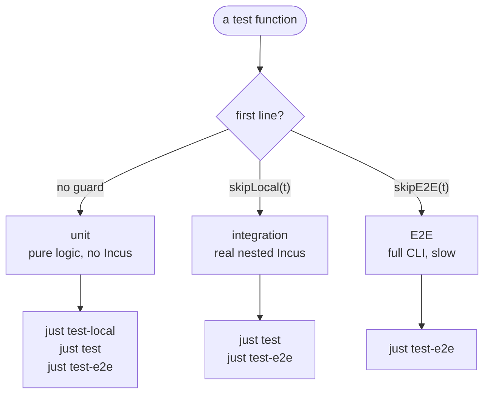

# Testing Guide

This guide covers testing patterns, fixtures, and best practices for
incus-compose.

## Prerequisites

- **gotestsum** - required to run tests via
  [just](https://github.com/casey/just/releases); install with
  `go install gotest.tools/gotestsum@latest`
- **just** - must be a recent version; the one shipped with Debian Trixie is too
  old and will not work
- **jq** - the purge commands require `jq` to be installed.

## Running Tests

Use `just --list` to see all available commands. Below is the complete
reference:

**Run with**:

```bash
just test
```

### Image Cache

Tests use a dedicated cache project (`incus-compose-tests-cache`) separate from
the CLI's image cache (`incus-compose-cache` unless `--image-cache` is set).
This keeps test images isolated and avoids polluting the user's cache.

The test cache is configured via `ClientProvideConnection` in test setup,
pointing to a test-specific project.

### Environment Setup

The nested Incus environment is configured via `.env` file, which starts as a
copy of `.env.sample`:

- `INCUS_REMOTE` - The remote to use, one of `incus remote list`. Use a nested
  one unless you want the networks every test creates on your own machine.
  `just build` deploys `ic-healthd` and `ic-sleep` here.
- `INCUS_COMPOSE_HEALTHD_IMAGE`, `INCUS_COMPOSE_SLEEP_IMAGE` - written by
  `just build`; the tags the dev binary is stamped with.
- `TEST_PROCS` (default 2) - number of tests to run in parallel.
- `INCUS_COMPOSE_WORKERS` (default 4) - number of resources to create in
  parallel per test.

A few more are read by the test helpers themselves rather than by the CLI, and
are meant for a single run rather than `.env`:

| Variable                      | Effect                                                            |
| ----------------------------- | ----------------------------------------------------------------- |
| `INCUS_COMPOSE_TEST_DEBUG`    | Log every command a test shells out to, with its cwd and env      |
| `INCUS_COMPOSE_TEST_TRACE`    | The same, plus the command's own stdout and stderr as it runs     |
| `INCUS_COMPOSE_TEST_KEEP`     | Read by `testlib.KeepTestData`, for a test that cleans up its own |
| `INCUS_COMPOSE_TEST_COVERDIR` | Where the instrumented CLI writes counters; `just test` sets it   |

There's also `just test-e2e` which includes slow (long-running) tests.

### Test Commands

Every one of these takes the package pattern **first** and `go test` flags after
it. That order is load-bearing: `just test-local -count=1` reads `-count=1` as
the pattern and fails with `no Go files`, which does not look like an argument
mistake. Write `just test-local ./... -count=1`.

| Command                                    | Description                                               |
| ------------------------------------------ | --------------------------------------------------------- |
| `just test [pattern] [flags]`              | Unit + integration against nested Incus. What CI runs     |
| `just test ./client/... -run TestName -v`  | The same, narrowed                                        |
| `just test-local [pattern] [flags]`        | Unit only, no Incus needed                                |
| `just test-e2e [pattern] [flags]`          | Adds the slow full-CLI tests                              |
| `just test-examples [flags]`               | Brings up every project under `examples/`                 |
| `just test-all [flags]`                    | Everything, in every module, without gotestsum            |
| `just test-race [pattern] [flags]`         | The race detector without coverage                        |
| `just test-log [-p REGEX] [-t NAME] [-f]`  | Plain text of the newest run's log; see below             |
| `just cover [profile or covdata dir]`      | Per-package and total coverage; see [Coverage](#coverage) |
| `just update-snapshots [pattern]`          | Rewrite snapshots from what the code produces now         |
| `just update-e2e-snapshots [pattern]`      | The same, for the E2E tier                                |
| `just update-examples-snapshots [pattern]` | The same, for `examples/`                                 |

Each run writes `work/logs/<date>.json` (the gotestsum log),
`work/logs/<date>-cover.out` (the profile) and `work/covdata/<date>/` (the raw
counters). Nothing prunes them.

### Reading a run

`just test-log` renders the newest `work/logs/*.json` as plain text. It follows
on a terminal until Ctrl-C, and reads once when piped, so
`just test-log -p FAIL | head` answers instead of hanging:

```bash
just test-log                        # everything the run printed
just test-log -p 'FAIL|Error:'       # only matching lines, extended regex
just test-log -t TestE2EDownNoDeps   # only one test's output, matched by prefix
just test-log -f | tee run.log       # follow even though piped
```

The newest log is picked at startup, so a run launched after this is not the one
being followed.

### Development Commands

| Command                          | Description                                                           |
| -------------------------------- | --------------------------------------------------------------------- |
| `just build`                     | Install a dev binary, stamped with the healthd image's version        |
| `just run <args>`                | `go run ./cmd/incus-compose`, against the `.env` remote               |
| `just incus <args>`              | Run `incus` against the nested dev environment                        |
| `just build-healthd`             | Build `bin/ic-healthd` only                                           |
| `just build-healthd-image [tag]` | Build the sidecar image and point `.env` at the new tag               |
| `just update-healthd [args]`     | The above, then replace the shared daemon with it                     |
| `just run-healthd [compose]`     | Bring a project up against a locally built daemon binary, and tail it |
| `just release-healthd-image`     | Build and push the sidecar image to ghcr.io                           |

`just build` depends on `update-healthd`, so it rebuilds the sidecar image and
recreates the shared daemon. A change under `cmd/ic-healthd/**`, `shared/` or
`iclient/` reaches the sidecar no other way.

### Code Quality

| Command            | Description                                                |
| ------------------ | ---------------------------------------------------------- |
| `just lint [path]` | golangci-lint, over everything or one package              |
| `just fix [path]`  | The same with `--fix`                                      |
| `just boundary`    | Check that the core packages import nothing that uses them |
| `just tidy`        | `go mod tidy` in every module                              |
| `just pre-commit`  | Run before committing: `tidy`, `boundary`, `lint`          |
| `just push`        | `pre-commit`, then push                                    |
| `just modules`     | Every module directory, one per line                       |

The path argument on `lint` and `fix` is worth using: golangci-lint caches per
invocation scope, and a whole-tree run from one worktree can hand a stale answer
to the next.

### Setup & Maintenance

| Command                          | Description                                                 |
| -------------------------------- | ----------------------------------------------------------- |
| `just dev-install`               | Create the nested Incus dev environment                     |
| `just cleanup`                   | Purge projects and networks, then restart the Incus service |
| `just purge-projects`            | Delete every project but `default` and the caches           |
| `just purge-networks`            | Delete every managed network with no users                  |
| `just purge-images`              | Delete every image                                          |
| `just purge-certs`               | Delete every trusted certificate but your own               |
| `just purge-tokens`              | Delete every outstanding trust token                        |
| `just fleet <topology> <action>` | Build or tear down a standing stress fleet                  |

After a run that failed partway, purge and then `just update-healthd` - the
purge deletes the project the shared daemon lives in.

## Test Organization

Tests live alongside the code they test:

```
client/
  ├── client.go
  ├── client_test.go      # Tests for client.go
  ├── resource_image.go
  └── resource_image_test.go   # Tests for resource_image.go
project/
  ├── project.go
  └── project_test.go     # Tests for project.go
internal/
  └── testlib/            # what every package's tests share
```

`internal/testlib` holds the tier guards, the paths, the CLI runner and the
snapshot normalizers. It is under `internal/` because it has no stability
promise - a signature there changes whenever a test needs it to, with no
changelog entry.

It may import the standard library and external modules, and nothing of ours
except `shared`. `client`, `iclient` and `project` test in-package, so a helper
there that reached for one of them would be an import cycle for exactly the
tests that need it most. A helper that does need our own types belongs in the
package it serves.

### TestMain

Every test package that wants the shared logger uses one line:

```go
func TestMain(m *testing.M) {
	os.Exit(testlib.Main(m))
}
```

`Main` sets the logger up, runs the tests, and removes whatever the CLI runner
below built.

## Unit, integration and E2E

Tests are not split by directory or build tag. Which tier a test belongs to is
decided by the skip helper it calls on its first line. Every test therefore
compiles in every run, so a change that breaks one fails the build instead of
going unnoticed behind a tag:

| Tier        | Guard          | Needs Incus | Runs with                                  |
| ----------- | -------------- | ----------- | ------------------------------------------ |
| unit        | none           | no          | every command, including `just test-local` |
| integration | `skipLocal(t)` | yes         | `just test`, `just test-e2e`               |
| E2E         | `skipE2E(t)`   | yes         | `just test-e2e`                            |



- **Unit** tests exercise pure logic - name parsing and sanitizing, config
  translation, argument building, `buildArgs`, snapshot rendering. No guard, so
  they run everywhere and must stay fast.
- **Integration** tests call `skipLocal(t)` and drive a real nested Incus. Most
  resource tests live here: they create a throwaway project, act on it, and let
  `t.Cleanup` tear it down. `INCUS_COMPOSE_TEST_LOCAL=1` (set by
  `just test-local`) skips them, which is why a green `just test-local` proves
  much less than a green `just test`.
- **E2E** tests call `skipE2E(t)` and are the slow, full-CLI ones. They are
  skipped unless `INCUS_COMPOSE_TEST_E2E=1` (set by `just test-e2e`), so they
  stay out of the normal loop.

There is no mocking of `incus.InstanceServer`. A fake encodes a guess about what
Incus returns - which `StatusCode` is populated, whether a stopped instance's
`State` is nil or empty, whether `lo` is present - and a test that passes
against the guess proves nothing about the daemon. Anything that needs Incus
talks to the real nested one; that is the point of the integration tier.

**Examples**: `client/resource_image_test.go` mixes all three - parsing tests
with no guard, ensure/lock tests behind `skipLocal`.

**Run with**:

```bash
just test-local   # unit only
just test         # unit + integration
just test-e2e     # unit + integration + E2E
```

### The one mock

There is a single mock, `mockResource` in `client/resource_test.go`. It exists
to test ordering logic (`groupByPriority`) without touching a server, and it
implements `Resource` only:

```go
func newMockResource(name string, kind Kind, priority int, ensured bool) *mockResource
```

Use it rather than writing another; anything needing more than a name, kind and
priority belongs in the integration tier against real Incus. A second mock is a
maintainer's call - ask first.

`internal/testlib` is not an exception either. It builds Incus API _values_ for
tests whose question is "did my map end up right" - the model, the queue, the
patches. It is not for testing distillation against how the daemon actually
behaves; that stays in the tier that has one.

Test the production function, not a copy of it in the test file. A test that
reimplements the logic it checks proves nothing either.

## Driving the CLI

A test that wants the CLI runs `testlib.RunCompose`, which runs it as a real
subprocess. There is one of these; do not write a second.

```go
stdout, err := testlib.RunCompose(ctx, t, t.Name(), "", nil,
    "-f", testlib.Fixture(t, "simple", "compose.yaml"), "up", "--detach")
```

| Argument  | Means                                                                   |
| --------- | ----------------------------------------------------------------------- |
| `project` | Passed through `ProjectName`, so `t.Name()` works                       |
| `dir`     | `--project-directory`; empty leaves the flag off, for a caller using -f |
| `env`     | Extra environment for the child. Non-empty also implies `--os-env`      |
| `args...` | Everything after the global flags                                       |

Stdout comes back as a string. Stderr is carried on the error, so a command that
failed says why wherever its error is reported and one that worked says nothing.

**It is a subprocess on purpose.** In-process the CLI's package globals are
shared by every parallel test in `cmd/incus-compose`, and `main`, `os.Args`
parsing and the `os.Exit` paths are never exercised at all. The binary is built
once per test process, under a `sync.Once`, into a directory `testlib.Main`
removes at the end - so it is one build and then an `exec` per call, not a link
per call.

The build inherits the run's own settings: `-race` when the test binary has it
(with `GORACE=halt_on_error=1` on the child, because a race report leaves the
exit code at 0 on its own), and `-cover` when `INCUS_COMPOSE_TEST_COVERDIR` is
set.

### Paths

Nothing addresses a fixture relatively. `RunCompose` runs from the checkout
root, not from the package directory, so `../../test/fixtures/...` would resolve
somewhere else:

| Helper                         | Returns                             |
| ------------------------------ | ----------------------------------- |
| `testlib.RepoRoot(t)`          | The checkout, asked of `go list -m` |
| `testlib.FixtureRoot(t)`       | `test/fixtures`                     |
| `testlib.Fixture(t, parts...)` | A path inside it                    |

## Coverage

`just test` produces a profile at `work/logs/<date>-cover.out` and prints the
report at the end of the run, pass or fail. `just cover` prints it again:

```bash
just cover                          # the newest run
just cover work/logs/X-cover.out    # a profile you name
just cover work/covdata/X           # a covdata directory, converted first
```

```
PACKAGE                                          STMTS   COVERED   PERCENT
github.com/lxc/incus-compose/client               3024      2368     78.3%
github.com/lxc/incus-compose/iclient               931       779     83.7%
...
TESTED                                            7931      5892     74.3%
TOTAL                                             7932      5893     74.3%
```

Statement counts are in the table because a percentage alone does not say where
the gap is - `client` is 3024 statements against `shared`'s 66.

`TOTAL` is every package in the profile; `TESTED` drops the ones with no test
files of their own, which is the set a plain `-coverprofile` run measures. They
differ by a statement or two here, so `TOTAL` is comparable to an older
baseline.

**Why covdata and not `-coverprofile`.** The CLI is a subprocess, so its work
lands in no test binary's profile. Instead it is built `-cover -coverpkg ./...`
and points `GOCOVERDIR` at the same directory `go test` writes to (via
`-args -test.gocoverdir`), and one `go tool covdata textfmt` merges both into
the profile. `-coverpkg` is the load-bearing half: without it the binary counts
`package main` and nothing it drives through `client/` and `project/`.

That is also why a run measures more than it used to. A plain `go test` without
`-coverpkg` only instruments the package under test, so a `cmd/incus-compose`
test driving `client/` code counted for nothing.

## Prove the test red before you trust it green

A test written against a fix you just made passes for two possible reasons: the
fix works, or the test never checked anything. Those are indistinguishable until
you make it fail.

So before a fix is done, break it back and watch the test go red:

```bash
# disable the fix (an `if false &&` on the guard is enough), then:
just test ./client/ -run TestTheThing -count=1
```

Two things this catches regularly:

- **Assertions that cannot fail.** A `require.Error` passes on _any_ error,
  including "builder not found" when you meant to prove "the builder ran".
  Assert on something only the real path produces.
- **Setups that never reproduce the condition.** A concurrency test whose
  workers resolve to different names never contends, and passes whether or not
  the fix exists. If the test still passes with the fix disabled, the test is
  wrong, not the fix.

Always pass `-count=1` when re-running: Go caches successful results and a
cached `0.000s` "pass" tells you nothing about the code you just changed. For
anything concurrent, use `-count=5` or more - a race that reproduces one run in
three will otherwise look fixed.

## Test the failures too

Green-path coverage only shows the feature works when everything is available.
Most of what users hit is the other half, and error behaviour is exactly what
regresses silently:

- **Every guard needs a test.** `pull never` with nothing stored, `--no-build`
  with a missing image, no source and no cache configured. Each guard is a
  branch, and an untested branch is a branch that stops working.
- **Assert the error, not just that one happened.**
  `require.ErrorIs(err, ErrNotFound)` pins the contract; `require.Error(err)`
  accepts a typo in a URL. Sentinel errors exist so callers can branch on them -
  test them the way a caller would.
- **Assert what did _not_ happen.** Often the real contract is an absence: the
  cache was not repopulated, the builder was not invoked, the other lock was not
  released. A pointing-at-nothing build context or a nulled-out source turns "it
  didn't go there" into something you can assert.

## Style

- Table-driven with `t.Run` subtests is the house style, not flat top-level
  functions.
- `testify` - `require` for what the rest of the test depends on, `assert` for
  the claims themselves.
- Name the case, not the mechanism: "a stopped instance loses its addresses"
  beats "case 3".
- Do not reach into another goroutine's state from the test goroutine. If a
  plugin's state belongs to its `Run`, stop it first and assert afterwards -
  `-race` will find you otherwise, which is how it should be.

## Test Fixtures

Located in `test/fixtures/`. Each fixture is a minimal compose scenario, named
for the one thing it exercises - `simple`, `wordpress`, `with-secrets`,
`with-restart`, `with-bind-mounts`, and forty-odd others. `ls test/fixtures/` is
the list, and the name is the description.

Address one with `testlib.Fixture`, never a relative path:

```go
compose := testlib.Fixture(t, "wordpress", "compose.yaml")
```

### Fixture Guidelines

**Snapshot portability**: Normalize absolute paths before snapshotting:

```go
output = strings.ReplaceAll(output, fixturePath, "$FIXTURE_PATH")
```

**Self-contained fixtures**: Define env vars like `$USER` or `$HOME` in `.env`
to avoid OS dependencies:

```env
USER=testuser
HOME=/home/testuser
```

**Pure YAML**: Compose files should be pure YAML without comments:

```yaml
services:
  web:
    image: images:alpine/edge
    ports:
      - "8080:80"
```

### Snapshot Tests

Snapshots live in `test/snapshots/` and are named by test function and case.

**Update snapshots**:

```bash
just update-snapshots
```

**Snapshot naming**: `TestFunctionName_TestCase.yaml`

### Common Workflows

```bash
# Run a single test verbosely
just test -v -run TestInstanceSecretSuite

# Run tests for a specific package
just test ./client/...

# Quick validation before commit
just pre-commit

# Test a compose file
just run -f test/fixtures/simple/compose.yaml config
```

## Best Practices

1. **Test isolation** - Each test gets fresh resources via `SetupTest()`
2. **Error aggregation** - Use `errors.Join()` for batch operation errors
3. **Priority testing** - Verify creation/deletion order respects priorities
4. **Fixture reuse** - Share fixtures across tests but keep them minimal
5. **Snapshot hygiene** - Review snapshot diffs carefully during updates

## See Also

- [Contributing](https://github.com/lxc/incus-compose/blob/main/CONTRIBUTING.md) -
  coding, style, and workflow rules
- [Architecture](/developer) - the design these tests exercise
- [Client Package](/developer/client) - Stack and resource internals
