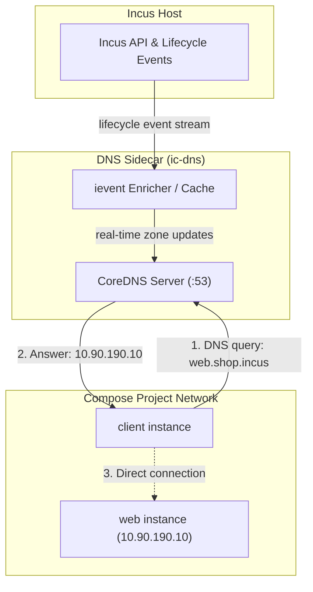
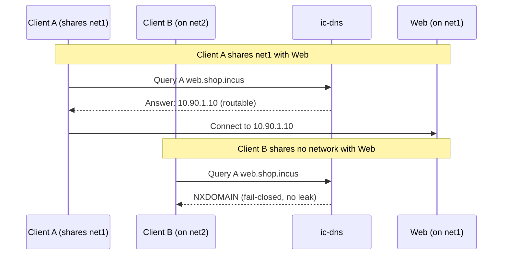
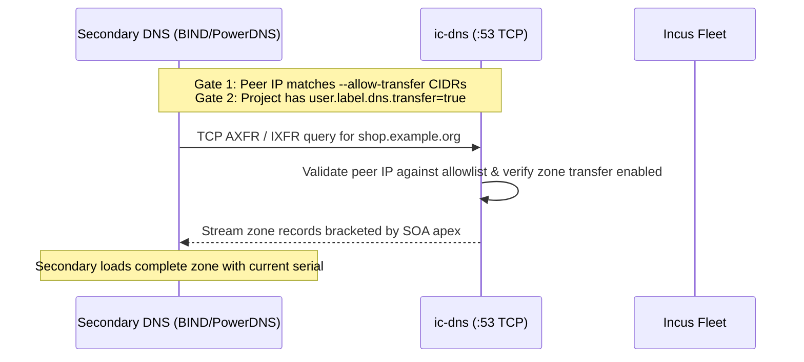

# DNS (ic-dns)

`incus-compose` provides automatic, real-time DNS resolution for your compose
fleet through the `ic-dns` sidecar. Sourced directly from the Incus API and kept
synchronized by its event stream, it delivers split-horizon DNS with one zone
per project — without manual zone files or server reloads.

> **Enabled by default.** When you run `incus-compose up`, the tool
> automatically brings up `ic-dns`, assigns the project zone
> (`<project>.incus`), and sets `oci.dns.nameservers` and `oci.dns.search` on
> every instance. All services and containers can resolve each other out of the
> box.



---

## Quick Start & Management (`incus-compose dns *`)

Manage the `ic-dns` sidecar directly using the `incus-compose dns` command
group:

| Command                                   | Description                                                        |
| ----------------------------------------- | ------------------------------------------------------------------ |
| [`incus-compose dns status`](#dns-status) | Print the status, IP addresses, readiness, and metrics of `ic-dns` |
| [`incus-compose dns logs`](#dns-logs)     | Stream or inspect the `ic-dns` sidecar container logs              |
| [`incus-compose dns up`](#dns-up)         | Create or recreate the `ic-dns` sidecar container                  |
| [`incus-compose dns down`](#dns-down)     | Stop and remove the `ic-dns` sidecar container                     |

### Common CLI Operations

Check if the DNS sidecar is running and ready:

```bash
incus-compose dns status
```

```text
Status: ready
IPv4: 10.90.190.53
IPv6: fd42::53
```

Include Prometheus metrics in the status report:

```bash
incus-compose dns status --metrics
```

Stream live queries and events from the daemon:

```bash
incus-compose dns logs --follow
```

Explicitly spin up or recreate the daemon (e.g. after updating an image or
config):

```bash
incus-compose dns up
```

Recreate the daemon with trace-level logging:

```bash
incus-compose --trace dns up
```

Stop and tear down the sidecar:

```bash
incus-compose dns down
```

Opt out of DNS during stack deployment:

```bash
incus-compose up --no-dns
```

---

## Compose Configuration (`x-incus-compose.dns`)

Configure DNS behavior directly in your `compose.yaml` using the top-level
`x-incus-compose.dns` extension:

```yaml
x-incus-compose:
  dns:
    disabled: false
    scope: global
    zone: shop.example.org
    network: custom-net
    ipv4_address: 10.0.0.2
    ipv6_address: fd42::2
    no_metrics: false
    allow_transfer:
      - 192.168.1.0/24
      - 10.0.0.53/32

services:
  web:
    image: docker.io/nginx:alpine
    networks:
      default:
        aliases:
          - api.shop.example.org

  client:
    image: docker.io/busybox:glibc
    command: ["sleep", "infinity"]
```

### Options Reference

| Key              | Type            | Default           | Description                                                                                                                                                                           |
| ---------------- | --------------- | ----------------- | ------------------------------------------------------------------------------------------------------------------------------------------------------------------------------------- |
| `disabled`       | boolean         | `false`           | Disable DNS sidecar creation and DNS configuration for the project. Equivalent to `--no-dns` on `incus-compose up`.                                                                   |
| `scope`          | string          | `global`          | Sidecar lifecycle scope: `global` (one shared daemon in the `incus-compose` project) or `project` (a dedicated sidecar scoped to this project).                                       |
| `zone`           | string          | `<project>.incus` | Custom DNS zone domain for the project, replacing the default `<project>.<suffix>`.                                                                                                   |
| `network`        | string          | project network   | Network attachment for the DNS sidecar.                                                                                                                                               |
| `ipv4_address`   | string          | auto              | Static IPv4 address assigned to the DNS sidecar instance.                                                                                                                             |
| `ipv6_address`   | string          | auto              | Static IPv6 address assigned to the DNS sidecar instance.                                                                                                                             |
| `no_metrics`     | boolean         | `false`           | Disable the HTTP Prometheus `/metrics` endpoint on the sidecar.                                                                                                                       |
| `allow_transfer` | list of strings | `[]`              | CIDR prefix(es) permitted to perform zone transfers (AXFR/IXFR). Configures `--allow-transfer` on the sidecar and automatically stamps `user.label.dns.transfer=true` on the project. |
| `transfer`       | boolean         | `false`           | Explicitly opt the project zone into transfers (`user.label.dns.transfer=true`) without configuring sidecar CIDRs (useful when sharing a global sidecar).                             |

---

## Names An Instance Answers To

| Name                                   | When                                                              | Description                                |
| -------------------------------------- | ----------------------------------------------------------------- | ------------------------------------------ |
| `<instance>.<zone>`                    | always                                                            | Individual instance name                   |
| `<service>.<zone>`                     | `user.label.incus-compose.service`, else `user.label.dns.service` | Resolves to all replicas of that service   |
| `<alias>.<zone>`, or any absolute name | `user.label.dns.aliases`, or compose `aliases`                    | CNAME pointing to `<instance>.<zone>`      |
| `in-addr.arpa` / `ip6.arpa`            | every address inside its own network's prefixes                   | Reverse lookup returning the instance FQDN |

`<zone>` defaults to `<project>.<suffix>`, where `--suffix` is `incus` unless
changed.

A service name resolves to every replica carrying it, enabling round-robin load
distribution across scaled instances. A PTR record always resolves to the unique
instance name rather than the service name.

---

## Why Answers Differ Per Querier (Split-Horizon)

An Incus fleet is not one flat network. A project has its own bridges or OVN
networks, an instance sits on some of them, and two instances that share no
network cannot reach each other. A single static answer for a name would either
hand out an unreachable IP address or leak the existence of hosts across project
boundaries.

- **Queriers resolve what they share**: An instance is answered only with
  addresses on networks it shares with the target host.
- **Fail-closed security**: If a querier sits on no known network or attempts to
  query a host it cannot reach, `ic-dns` returns `NXDOMAIN` rather than `NODATA`
  or timing out. Response codes leak nothing about other existing
  infrastructure.



### How The Querier Is Identified

1. **[EDNS0 Client Subnet (RFC 7871)](https://datatracker.ietf.org/doc/html/rfc7871)**,
   when the query carries one. Incus's internal dnsmasq forwards queries with
   `add-subnet=32,128`.
2. **The query's source address**, when no subnet is present (such as when an
   instance's `resolv.conf` targets `ic-dns` directly).

---

## Labels That Configure DNS

DNS behavior can also be controlled at the Incus project and instance level
using `user.label.dns.*` keys:

| Key        | Set on   | Meaning                                                                                            |
| ---------- | -------- | -------------------------------------------------------------------------------------------------- |
| `scope`    | project  | Opts the project in (`global` or `project`)                                                        |
| `zone`     | project  | The full zone name, replacing `<project>.<suffix>`                                                 |
| `ns`       | project  | Comma-separated NS names for the zone                                                              |
| `transfer` | project  | Opts the zone into AXFR and IXFR zone transfers (see [Zone Transfers](#zone-transfers-axfr--ixfr)) |
| `service`  | instance | An extra service name every replica carrying it answers to                                         |
| `aliases`  | instance | Comma-separated extra names, each created as a CNAME                                               |

```bash
incus project set shop user.label.dns.scope=global
incus project set shop user.label.dns.zone=shop.example.org
incus project set shop user.label.dns.transfer=true
incus config set web user.label.dns.service=api --project shop
incus config set web user.label.dns.aliases=alias1,me.example.com. --project shop
```

### Naming Your Own NS Servers

```bash
incus project set shop user.label.dns.ns=ns1.example.org.,ns2.example.org.
```

A trailing dot denotes an absolute domain name; without a trailing dot, names
are relative to the zone.

### Aliases Add Extra Names

A name ending in a dot is absolute; anything else is relative to the instance's
zone. For example, `web` in project `shop` with
`user.label.dns.aliases=alias1,me.example.com.` answers to `alias1.shop.incus.`
and `me.example.com.`, both as a CNAME onto `web.shop.incus.`.

---

## Which Projects Are Served

`ic-dns` discovers eligible projects in this order:

1. `--project` names them explicitly on the CLI / environment.
2. Otherwise, projects carrying `--project-marker` (default:
   `user.label.dns.scope=global`) are opted in.
3. If neither is specified, all projects visible to the certificate are served.

---

## Zone Transfers (AXFR / IXFR)

`ic-dns` supports authoritative zone transfers via standard DNS protocols
(**AXFR** for full transfer, **IXFR** for incremental transfer). This allows
external secondary nameservers (such as BIND9, PowerDNS, Knot DNS, or public
secondary DNS providers) to replicate and serve the project zone.



### The Two-Gate Security Model

Zone transfers are strictly opt-in and protected by two independent gates:

1. **Listener Gate (`--allow-transfer`)**: The daemon must be started with
   `--allow-transfer` (or `INCUS_COMPOSE_DNS_ALLOW_TRANSFER`) specifying the
   CIDR prefixes of allowed secondary nameservers (e.g.
   `192.168.1.0/24,10.0.0.53/32`). An empty list allows nobody and refuses all
   transfer requests.
2. **Zone Gate (`user.label.dns.transfer`)**: The Incus project owning the zone
   must be explicitly opted in:
   ```bash
   incus project set shop user.label.dns.transfer=true
   ```

Both gates must evaluate to true. If either gate is closed, transfer requests
are refused (`REFUSED`).

When using `x-incus-compose.dns`, specifying `allow_transfer` automatically
satisfies both gates: it starts the daemon with `--allow-transfer` and labels
the Incus project with `user.label.dns.transfer=true`. When using a shared
global DNS sidecar, individual projects can opt into transfers by specifying
`transfer: true` in `x-incus-compose.dns`.

### Transfer Characteristics

- **TCP only**: Zone transfers require a stream of DNS messages. Transfer
  requests arriving over UDP are rejected immediately.
- **Full, unfiltered zone**: Standard client queries are split-horizon filtered
  per network to enforce security isolation. In contrast, zone transfers
  transmit the **complete, unfiltered zone view** so secondary nameservers
  maintain accurate and consistent records under the zone serial.
- **Incremental Transfers (IXFR)**: Requests are answered directly from the
  current in-memory zone snapshot. If the requesting secondary's serial is older
  than the current serial, the full zone is sent.
- **Apex queries only**: Transfers must target the exact zone apex (e.g.,
  `shop.example.org`). Requests for individual subdomains or invented shadowing
  zones (such as absolute external aliases) are refused.

---

## Detailed Management CLI Reference

### dns status

```bash
incus-compose dns status [options]
```

| Option      | Description                                     | Default | Environment Variable               |
| ----------- | ----------------------------------------------- | ------- | ---------------------------------- |
| `--format`  | Output format: `text` or `json`                 | `text`  | `INCUS_COMPOSE_DNS_STATUS_FORMAT`  |
| `--port`    | HTTP port to query on the sidecar               | `9153`  | `INCUS_COMPOSE_DNS_HTTP_PORT`      |
| `--metrics` | Include Prometheus metrics in the status report | `false` | `INCUS_COMPOSE_DNS_STATUS_METRICS` |

#### Output Formats

Default text format:

```text
Status: ready
IPv4: 10.90.190.53
IPv6: fd42::53
```

JSON format (`--format json`):

```json
{
  "status": "ready",
  "ipv4": "10.90.190.53",
  "ipv6": "fd42::53"
}
```

### dns logs

```bash
incus-compose dns logs [--follow]
```

Streams or prints logs directly from the `ic-dns` sidecar instance.

### dns up

```bash
incus-compose dns up [options]
```

Spins up or recreates the `ic-dns` sidecar instance, mounting necessary volumes
and establishing certificates.

| Option             | Description                                                    | Default | Environment Variable               |
| ------------------ | -------------------------------------------------------------- | ------- | ---------------------------------- |
| `--allow-transfer` | CIDR(s) that may ask for a zone transfer (empty allows nobody) |         | `INCUS_COMPOSE_DNS_ALLOW_TRANSFER` |

### dns down

```bash
incus-compose dns down [--force]
```

Stops and deletes the `ic-dns` sidecar instance. When multiple projects share a
global `ic-dns`, `--force` confirms removal without an interactive prompt.

---

## Further Reading

- [[developer/dns|Developer Guide: DNS Architecture & Daemon Internals]]: Deep
  dive into the ievent pipeline, CoreDNS plugin implementation, standalone
  daemon flags, and HTTP monitoring endpoints.
- [[cli-reference/extensions/index#dns|CLI Reference]]: Complete command-line
  manual for `incus-compose dns`.
