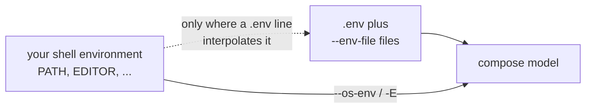
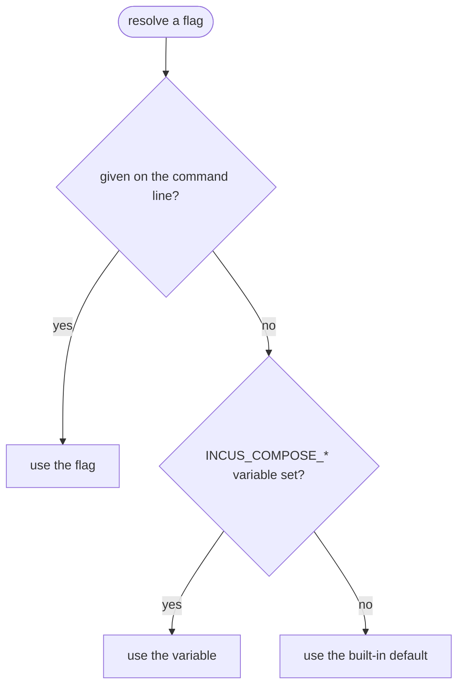

# Environment Variables

incus-compose handles environment variables differently than docker-compose for
security and reproducibility reasons.

## How It Works

### Default Behavior

By default, incus-compose loads environment variables from:

1. `.env` file in the compose file's directory
2. Files specified with `--env-file`

These `.env` files **can reference OS environment variables** for interpolation:

```env
# .env
DB_PASSWORD=secret123
HOME_DIR=${HOME}
CURRENT_USER=${USER}
```

Only variables explicitly defined in `.env` files are passed to your compose
project. Your shell's environment (like `PATH`, `EDITOR`, etc.) is **not**
automatically included.

Values are not treated literally: a `$` inside a value is itself interpolated
(`PASSWORD=abc$def` becomes `abc`, since `$def` resolves to nothing), and a
single-quoted value has no way to represent a literal `'`. Only double-quoting
with backslash-escaping (`\\`, `\"`, `\$`) round-trips a value containing any of
these characters.



### Why This Matters

- **Security**: Sensitive environment variables from your shell don't
  accidentally leak into containers
- **Reproducibility**: The same compose file behaves the same way on different
  machines
- **Explicitness**: You always know exactly which variables are available

## The `--os-env` / `-E` Flag

If you need full docker-compose compatibility, use the `--os-env` flag:

```bash
incus-compose --os-env up
incus-compose -E up
```

This includes all OS environment variables directly, matching docker-compose
behavior.

`--os-env` resolves before `.env`/`--env-file` in the merge order: when a key is
set by both, the shell's value wins and the `.env` value for that key is dropped
rather than overriding it.

## Examples

### Using .env files (recommended)

```env
# .env
DATABASE_URL=postgres://localhost/mydb
API_KEY=your-api-key
USER=${USER}
```

```yaml
# compose.yaml
services:
  app:
    environment:
      DATABASE_URL: ${DATABASE_URL}
      API_KEY: ${API_KEY}
      DEPLOYED_BY: ${USER}
```

```bash
incus-compose up
```

### Using --os-env for compatibility

```bash
export DATABASE_URL=postgres://localhost/mydb
incus-compose --os-env up
```

## Quick Reference

| Method     | Variables Available                         | Use Case                                    |
| ---------- | ------------------------------------------- | ------------------------------------------- |
| Default    | `.env` files only (can interpolate OS vars) | Production, CI/CD                           |
| `--os-env` | All OS environment variables                | Quick testing, docker-compose compatibility |

## CLI Configuration

Every global flag can be set via an environment variable. Flags given on the
command line take precedence over environment variables.



Every command-specific flag can be set too, scoped per command as
`INCUS_COMPOSE_<COMMAND>_<FLAG>` - e.g. `--timeout` on `up` is
`INCUS_COMPOSE_UP_TIMEOUT`, `--timeout` on `down` is
`INCUS_COMPOSE_DOWN_TIMEOUT`. Each command gets its own variable even when the
flag name is shared, so setting one never leaks into another command. Each
command's page in the [CLI Reference](/cli-reference) lists its own variables,
or run `incus-compose <command> --help` - every flag's env var is shown inline
as `[$VAR_NAME]`.

Nine flags are the deliberate exception and have **no** environment variable,
because a forgotten shell variable would silently make every future invocation
destructive or a no-op instead of just changing cosmetic output:

| Flag         | Command          | Why                                                           |
| ------------ | ---------------- | ------------------------------------------------------------- |
| `--recreate` | `up`             | Would silently recreate containers on every `up`              |
| `--project`  | `down`           | Would silently delete the whole project                       |
| `--volumes`  | `down`           | Would silently delete volumes                                 |
| `--dry-run`  | `exec`           | Would silently no-op every `exec`, breaking scripts           |
| `--dry-run`  | `cp`             | Would silently no-op every copy                               |
| `--dry-run`  | `port-forward`   | Would silently no-op every forward                            |
| `--signal`   | `kill`           | Takes only `SIGKILL`, which is already the default            |
| `--yes`      | `backup restore` | Would silently skip the confirmation on a destructive restore |
| `--dry-run`  | `backup restore` | Would silently no-op every restore                            |

### Project and Files

| Variable                          | Flag                        | Description                                                  |
| --------------------------------- | --------------------------- | ------------------------------------------------------------ |
| `INCUS_COMPOSE_FILE`              | `--file`, `-f`              | Compose configuration files (comma-separated for multiple)   |
| `INCUS_COMPOSE_PROJECT_NAME`      | `--project-name`, `-p`      | Project name                                                 |
| `INCUS_COMPOSE_PROJECT_DIRECTORY` | `--project-directory`, `-P` | Working directory                                            |
| `INCUS_COMPOSE_ENV_FILE`          | `--env-file`                | Alternative environment files (comma-separated for multiple) |
| `INCUS_COMPOSE_PROFILES`          | `--profile`                 | Profiles to enable (comma-separated for multiple)            |
| `INCUS_COMPOSE_OS_ENV`            | `--os-env`, `-E`            | Include OS environment variables for interpolation           |

### Incus Connection

| Variable                     | Flag             | Description                                                                                                                                                                                                         |
| ---------------------------- | ---------------- | ------------------------------------------------------------------------------------------------------------------------------------------------------------------------------------------------------------------- |
| `INCUS_REMOTE`               | `--remote`       | Incus remote name from CLI config (e.g., `local`, `myserver`)                                                                                                                                                       |
| `INCUS_COMPOSE_IMAGE_CACHE`  | `--image-cache`  | Incus project used as image cache (`INCUS_COMPOSE_IMAGE_CACHE`, default: `incus-compose-cache`); set `""` to disable caching and pull straight into the project, see [CLI Reference](/cli-reference#global-options) |
| `INCUS_COMPOSE_STORAGE_POOL` | `--storage-pool` | Default storage pool (default: `detect`)                                                                                                                                                                            |

### Display and Debugging

| Variable                | Flag        | Description                                                      |
| ----------------------- | ----------- | ---------------------------------------------------------------- |
| `INCUS_COMPOSE_ANSI`    | `--ansi`    | Control ANSI output: `never`, `always`, `auto` (default: `auto`) |
| `INCUS_COMPOSE_DEBUG`   | `--debug`   | Enable debug logging (`true`/`1`)                                |
| `INCUS_COMPOSE_TRACE`   | `--trace`   | Per-event logging, which implies `--debug`; read by ic-healthd   |
| `INCUS_COMPOSE_WORKERS` | `--workers` | Number of concurrent workers (default: `4`)                      |
| `NO_COLOR`              | --          | Disable color output ([no-color.org](https://no-color.org/))     |

`--builder` and `--healthd-*` are command flags (`up`, `build`, `pull`,
`healthd up`, `healthd down`), not global ones - see
[up and down](/cli-reference/up-and-down#environment-variables),
[Images](/cli-reference/images#environment-variables) and
[Extensions](/cli-reference/extensions#environment-variables) for their
per-command variable names.

The ic-healthd daemon reads a further set of `INCUS_COMPOSE_HEALTHD_*` variables
of its own, which incus-compose injects into the sidecar - see
[The ic-healthd daemon](#the-ic-healthd-daemon) below.

### Examples

```bash
# Use a configured Incus remote
export INCUS_REMOTE=myserver
incus-compose up

# Set project defaults in your shell profile
export INCUS_COMPOSE_FILE=compose.yaml,compose.prod.yaml
export INCUS_COMPOSE_PROJECT_NAME=myapp
incus-compose up

# Debug with extra workers
INCUS_COMPOSE_DEBUG=1 INCUS_COMPOSE_WORKERS=20 incus-compose up
```

## The ic-healthd daemon

These are read by the `ic-healthd` binary itself, not by incus-compose. In the
normal flow incus-compose sets them on the sidecar and you never touch them;
they matter when you run the daemon yourself (see
[Running the daemon directly](/healthd#running-the-daemon-directly)).

| Variable                               | Flag               | Default                         | Description                                                    |
| -------------------------------------- | ------------------ | ------------------------------- | -------------------------------------------------------------- |
| `INCUS_COMPOSE_HEALTHD_INCUS`          | `--incus`          | -                               | Incus API URL the daemon connects to                           |
| `INCUS_COMPOSE_HEALTHD_TOKEN`          | `--token`          | -                               | One-time trust token used to register its cert                 |
| `INCUS_COMPOSE_HEALTHD_PROJECTS`       | `--project`        | -                               | Projects to watch, comma-separated; see below                  |
| `INCUS_COMPOSE_HEALTHD_PROJECT_MARKER` | `--project-marker` | `user.healthcheck.scope=global` | Project config `KEY=VALUE` consulted when `_PROJECTS` is unset |
| `INCUS_COMPOSE_HEALTHD_OWN_PROJECT`    | `--own-project`    | -                               | Project the daemon's own container runs in                     |
| `INCUS_COMPOSE_HEALTHD_OWN_NAME`       | `--own-name`       | -                               | The daemon's own instance name; empty skips itself             |
| `INCUS_COMPOSE_HEALTHD_DATA_DIR`       | `--data-dir`       | `/var/lib/ic-healthd`           | Persistent directory for the generated cert/key                |
| `INCUS_COMPOSE_HEALTHD_SECRETS_DIR`    | `--secrets-dir`    | `/secrets`                      | Directory holding the token file                               |
| `INCUS_COMPOSE_HEALTHD_DEBUG`          | `--debug`          | `false`                         | Verbose logging                                                |
| `INCUS_COMPOSE_HEALTHD_TRACE`          | `--trace`          | `false`                         | Per-event logging, which implies `--debug`                     |

`_PROJECTS` may be left unset, in which case the daemon watches every project it
can see whose config matches `_PROJECT_MARKER` - by default
`user.healthcheck.scope=global`, which is what incus-compose stamps on the
projects it hands to the shared daemon. A bare key means `KEY=true`. Set
`_PROJECTS` explicitly and it is used verbatim, marker ignored. Either way the
daemon's trust token bounds what it can see at all.

Note that `INCUS_COMPOSE_HEALTHD_INCUS` has two different readers: on `up` and
`healthd up` it tells _incus-compose_ what endpoint to configure the sidecar
with, and in the table above it is what the _daemon_ dials. They agree in the
normal flow because the former is how the latter gets set.

## See Also

- [CLI Reference](/cli-reference) - commands, flags, and their per-command
  variables
- [Compose Compatibility](/compose-compatibility/services#environment) -
  interpolation and `env_file` support
