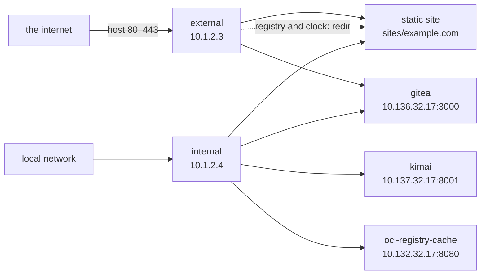

# Caddy

[Caddy](https://caddyserver.com) as a reverse-proxy front door, split in two:
`external` publishes the host's ports, `internal` answers on its own address for
the local network. They run the same image and share one certificate store.

The files for this example are on
[Github](https://github.com/lxc/incus-compose/tree/main/examples/caddy).

## The example

| Service    | Instance         | Address       | Publishes    | Config               |
| ---------- | ---------------- | ------------- | ------------ | -------------------- |
| `external` | `external_caddy` | `10.1.2.3/23` | host 80, 443 | `external/Caddyfile` |
| `internal` | `internal_caddy` | `10.1.2.4/23` | nothing      | `internal/Caddyfile` |

Both attach to the pre-existing `incusbr0`: `compose.incus.yaml` marks the
`default` network `external: true` and names it, so incus-compose never creates
or deletes it. The addresses, netmask and gateway all come from `.env`.

Both also mount `sites/` read-only, so either one can serve the static site.

### What each serves

`internal`:

| Domain                                                                                    | Backend                                                                                             |
| ----------------------------------------------------------------------------------------- | --------------------------------------------------------------------------------------------------- |
| `example.com`, `www.example.com`                                                          | static site in `sites/example.com`                                                                  |
| `git.example.com`                                                                         | [`gitea`](https://docs.incus-compose.org/examples/gitea) at `10.136.32.17:3000`                     |
| `clock.example.com`                                                                       | [`kimai`](https://docs.incus-compose.org/examples/kimai) at `10.137.32.17:8001`                     |
| `docker-registry.example.com`, `ghcr-registry.example.com`, `gitlab-registry.example.com` | [`oci-registry-cache`](https://docs.incus-compose.org/examples/oci-registry-cache)'s registry cache |

`external` serves the static site and `git.example.com` the same way, but
redirects the registry and clock domains to `https://example.com` instead of
proxying them - those backends stay reachable on the local network only.



### One certificate store

`external` runs Caddy's automatic HTTPS and keeps its store in the `data` volume
at `/data/caddy`. `internal` sets `auto_https disable_certs` and points every
site's `tls` at the certificate files in that same store, so only the
host-facing instance ever talks to the ACME provider - the internal one has no
way to answer a challenge.

That is why both services mount the one `data` volume, and why `external` names
the registry and clock domains at all: those blocks only redirect, but naming a
domain is what makes Caddy obtain a certificate for it.

The [`pdns`](https://docs.incus-compose.org/examples/pdns) example serves the
authoritative zone these domains resolve against.

## Usage

```bash
incus-compose up
```

Bring up whichever backend examples you want proxied, point DNS at them (see
[`pdns`](https://docs.incus-compose.org/examples/pdns)), and browse to the
domains above.

## Notes

- Both services set `entrypoint:` rather than `command:`. A bare `command:` is
  _appended_ to the image's entrypoint, so it cannot replace it - see
  [Entrypoint and Command](https://docs.incus-compose.org/compose-compatibility/services#entrypoint-and-command).
  The `sleep 3` in front of `caddy run` lets the network interface come up
  first.
- `restart: unless-stopped` is enforced by the
  [ic-healthd](https://docs.incus-compose.org/healthd) sidecar, not by Incus.
- `external`'s published ports carry a commented-out
  `x-incus-compose.nat: true`. Kernel-mode NAT is faster, but the port is then
  unreachable via `localhost` on the host running incus-compose.
