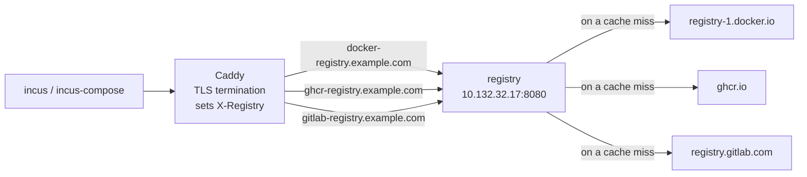

# OCI Registry Cache

This example runs a single [ociregistry](https://github.com/aceeric/ociregistry)
instance as a pull-through cache for every upstream registry at once. Incus
remotes are then reconfigured to point at that cache instead of the real
upstream endpoints, so container images are fetched once and served locally on
subsequent pulls.

One instance serves all upstreams because it resolves the upstream per request,
from the `X-Registry` header. The reverse proxy that terminates TLS sets that
header per virtual host, so each Incus remote keeps its own hostname and image
references stay unchanged: `nginx:latest` still resolves through `docker.io`.

| Incus remote          | Vhost                         | `X-Registry`          |
| --------------------- | ----------------------------- | --------------------- |
| `docker.io`           | `docker-registry.example.com` | `docker.io`           |
| `ghcr.io`             | `ghcr-registry.example.com`   | `ghcr.io`             |
| `registry.gitlab.com` | `gitlab-registry.example.com` | `registry.gitlab.com` |

Adding another upstream is a reverse proxy block and an `incus remote add`, not
another container.



The files for this example are on
[Github](https://github.com/lxc/incus-compose/tree/main/examples/oci-registry-cache).

## Setup

### 1. Expose the cache via a reverse proxy

The registry listens on its static IP inside the Incus network. A
TLS-terminating reverse proxy is required to expose it as a proper HTTPS
endpoint (Incus remotes require HTTPS), and it is also what tells the registry
which upstream a request is for.

**Caddy example** - the IP must match the one in `compose.incus.yaml`:

```Caddyfile
docker-registry.example.com {
	log {
		output file /var/log/caddy/docker-registry.example.com-access.log
	}

	reverse_proxy 10.132.32.17:8080 {
		header_up X-Registry docker.io
	}
}

ghcr-registry.example.com {
	log {
		output file /var/log/caddy/ghcr-registry.example.com-access.log
	}

	reverse_proxy 10.132.32.17:8080 {
		header_up X-Registry ghcr.io
	}
}

gitlab-registry.example.com {
	log {
		output file /var/log/caddy/gitlab-registry.example.com-access.log
	}

	reverse_proxy 10.132.32.17:8080 {
		header_up X-Registry registry.gitlab.com
	}
}
```

`header_up` must be set on every vhost. Without it the registry falls back to
reading the upstream from the leftmost path segment, and a plain
`docker.io/library/nginx` reference has no such segment left once the remote has
consumed it.

### 2. Set the Docker Hub credentials

Anonymous pulls from Docker Hub are rate-limited per source IP, and a cache
concentrates every pull behind one address. `.env` carries two variables for
that:

```sh
export DOCKERIO_USER="your-docker-hub-account"
export DOCKERIO_TOKEN="dckr_pat_..."
```

`DOCKERIO_TOKEN` is a
[personal access token](https://app.docker.com/settings/personal-access-tokens),
not your password; read-only scope is enough. Leave both empty to keep pulling
anonymously - an empty `auth` block is the same as no block at all.

The two values are interpolated into the server's `config.yaml`, which
`compose.yaml` declares inline as a `config` rather than shipping as a file:

```yaml
configs:
  ociregistry:
    content: |
      registries:
        - name: docker.io
          auth:
            user: ${DOCKERIO_USER:-}
            password: ${DOCKERIO_TOKEN:-}
```

`name` must match what the reverse proxy sends in `X-Registry`, since that is
the string the server looks the upstream configuration up by. Add an entry per
upstream that needs credentials; the ones that don't need none.

> The token reaches the instance as a file at `/etc/ociregistry/config.yaml`,
> mode `0400`, and not as an instance environment variable - so it stays out of
> `incus config show`. It is still rendered by `incus-compose config`, like any
> interpolated value.

### 3. Start the cache

```sh
cd registry
incus-compose up
```

### 4. Point Incus remotes at the local cache

Point the Incus remotes at your new endpoints. Any subsequent `incus image copy`
or container launch will hit the local cache first, and so will incus-compose: a
configured remote overrides its built-in address for that registry.

Drop the `remote remove` line for any name you have not added before — these
three are built into incus-compose but are not in the Incus configuration until
you put them there.

```sh
incus remote remove docker.io
incus remote add --protocol oci docker.io https://docker-registry.example.com

incus remote remove ghcr.io
incus remote add --protocol oci ghcr.io https://ghcr-registry.example.com

incus remote remove registry.gitlab.com
incus remote add --protocol oci registry.gitlab.com https://gitlab-registry.example.com
```

## Notes

- The server has no revalidation TTL: a tag other than `latest` is served from
  cache forever once pulled. Eviction is what bounds this. The config enables
  the background pruner with `type: accessed` and `duration: 7d`, so an image
  nobody has pulled for 7 days is dropped and refetched on the next request. Set
  `alwaysPullLatest: true` if you move `latest` and want it revalidated on every
  pull.
- The image is `gcr.io/distroless/static:nonroot` — no shell and no `wget` — so
  there is no healthcheck. incus-compose runs healthcheck commands inside the
  instance, and this image has nothing to run. The server can expose a `/health`
  endpoint on its own port via the `health` config key if you want to probe it
  from outside.
- The server holds its index in memory behind a mutex, so only one instance can
  serve a given cache directory. Don't run replicas against one volume.
- Repository paths are limited to four segments, e.g.
  `ghcr.io/lxc/incus-compose/ic-healthd`. Using `X-Registry` keeps the upstream
  out of the path, so all four are available for the repository name.
- Cache storage is backed by a named Incus volume (`cache`) and survives
  container restarts. The config is owned by uid/gid `65532` to match the
  image's `nonroot` user.

## Reference

- [ociregistry](https://github.com/aceeric/ociregistry)
- [Configuration reference](https://aceeric.github.io/ociregistry/configuring-the-server/)
- [Authentication](https://aceeric.github.io/ociregistry/auth/)
- [Limitations](https://aceeric.github.io/ociregistry/limitations/)
