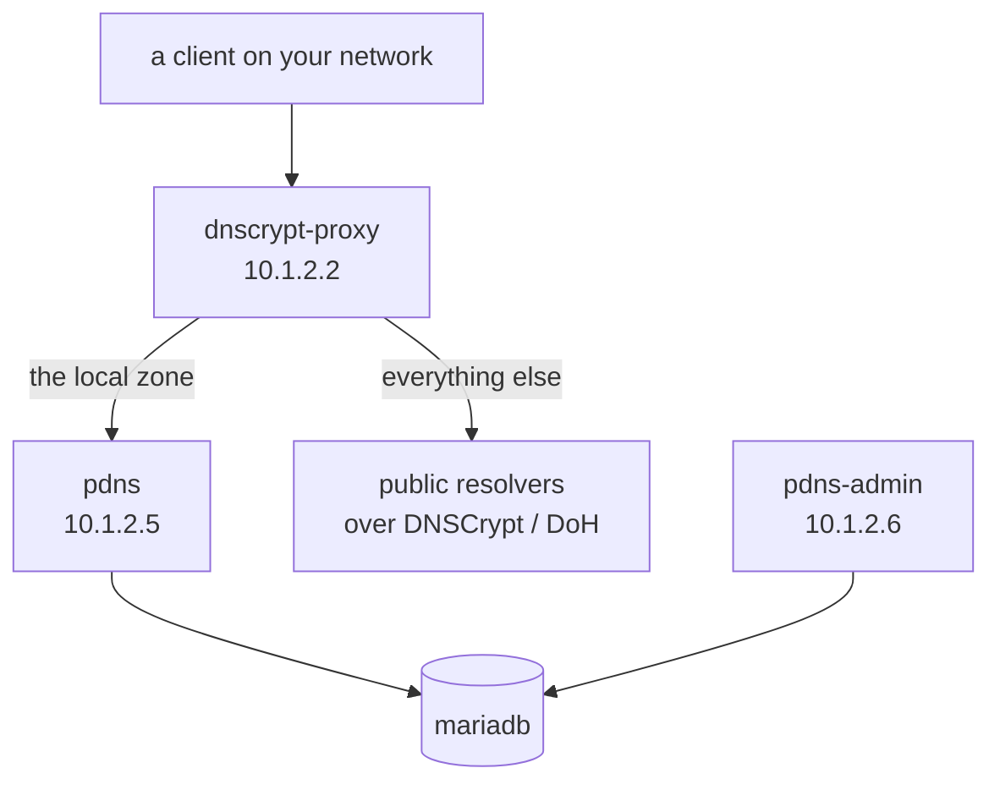

# pdns

A split-horizon home resolver.

[dnscrypt-proxy](https://dnscrypt.info/) is the client-facing resolver: it
forwards the local zone (and reverse lookups) to `pdns`, and sends everything
else out over DNSCrypt/DoH to public resolvers.

[PowerDNS](https://www.powerdns.com/) is the authoritative server for that local
zone, backed by MariaDB here.

[PowerDNS-Admin](https://github.com/PowerDNS-Admin/PowerDNS-Admin) is a web
interface for managing its zones and records.

The files for this example are on
[Github](https://github.com/lxc/incus-compose/tree/main/examples/pdns).

## The example

| Service          | Role                                                    | Static IP  |
| ---------------- | ------------------------------------------------------- | ---------- |
| `mariadb`        | Backing database for `pdns` and `pdns-admin`.           | -          |
| `dnscrypt-proxy` | Resolver clients point at; forwards the zone to `pdns`. | `10.1.2.2` |
| `pdns`           | PowerDNS authoritative server for the `${ZONE}` zone.   | `10.1.2.5` |
| `pdns-admin`     | Web UI for managing `pdns` zones and records.           | `10.1.2.6` |



The three addressable services attach to the pre-existing `incusbr0`:
`compose.incus.yaml` marks the `default` network `external: true` and names it,
so incus-compose never creates or deletes it. The addresses, netmask and gateway
all come from `.env`.

`compose.incus.yaml` also clears the published ports of `pdns` and `pdns-admin`
with `ports: !reset []`. On Incus each service has an address of its own, so
nothing needs to be forwarded from the host.

Database credentials are passed as Compose `secrets` sourced from environment
variables; all values come from `.env`.

## Usage

Copy `.env.sample` to `.env` and update it for your needs, in particular the
passwords and `API_KEY` - the placeholder values are rejected by `install.sh` -
and the `*_IPV4_ADDRESS` settings for your network.

```bash
cp .env.sample .env
$EDITOR .env
./install.sh
```

`install.sh` is a one-shot setup script, not meant to be re-run: it renders
`pdns/pdns.conf` and `dnscrypt-proxy/forwarding-rules.txt` from their templates,
pulls the PowerDNS schema out of the `pdns` image, imports it into MariaDB,
creates the `pdns-admin` database, creates the DNS zone, and finally brings up
the full project.

After that, use `incus-compose down` and `incus-compose up` normally.

## Notes

- Point a client's DNS at `10.1.2.2` (`dnscrypt-proxy`).
- Open http://10.1.2.6/ for pdns-admin. Disable "Allow user sign up" under
  `/admin/setting/authentication#local` right after creating your account.
- In pdns-admin, point the PowerDNS API at `https://10.1.2.5:8081` with the
  `API_KEY` from `.env`. That endpoint is what `pdns.conf` turns on with
  `api=yes` and `webserver-port=8081`.
- The zone name is `ZONE` in `.env` (`lan` by default) and is baked into
  `dnscrypt-proxy/forwarding-rules.txt` by `install.sh`, so changing it means
  re-rendering that file.
- `pdns` starts only once `mariadb` reports healthy, and `dnscrypt-proxy` and
  `pdns-admin` only once `pdns` does. Those `depends_on: service_healthy` waits
  and the `restart: unless-stopped` policies are enforced by the
  [ic-healthd](https://docs.incus-compose.org/healthd) sidecar.
- `pdns/pdns.conf` and `dnscrypt-proxy/forwarding-rules.txt` are generated from
  their `.template` files by `install.sh` and are gitignored, along with `.env`
  and `work/`.
