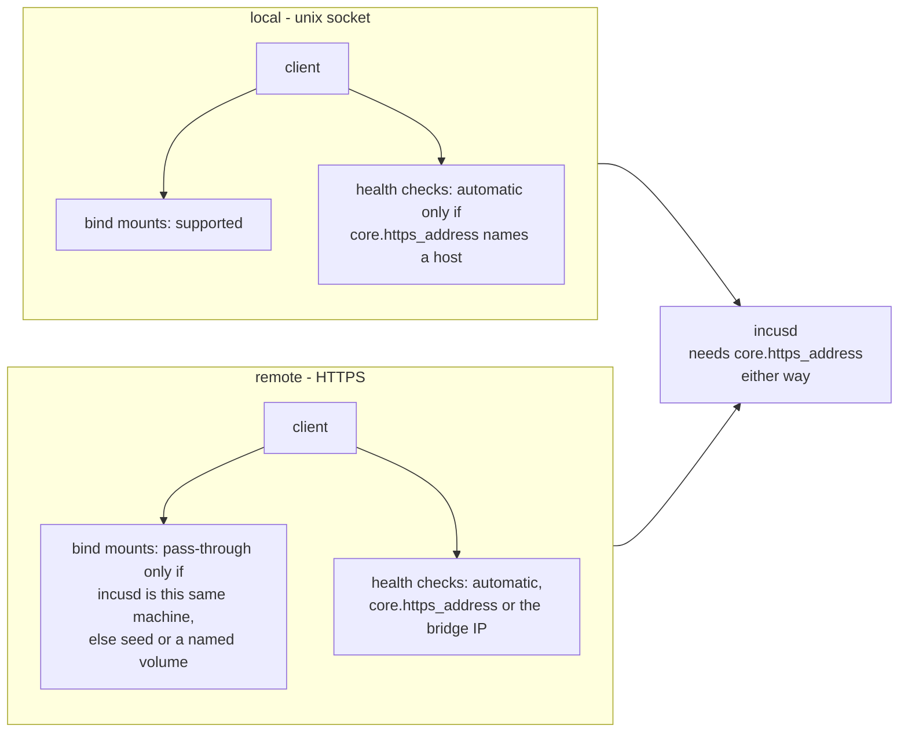
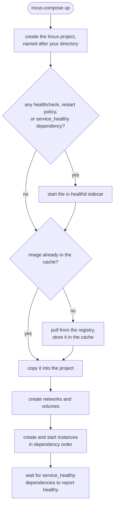

# Getting Started

incus-compose lets you run your existing `compose.yaml` files directly on Incus
without Docker.

## Prerequisites

- Incus 7.0.2 (LTS, unreleased) or 7.5+ (unreleased) installed and running.
  Older daemons are refused when a command connects: they lack the API
  extensions incus-compose relies on
- Access to an Incus server (local or remote)
- `podman` or `docker` for image building (see [Builds](/builds))

### Incus must listen on the network (required)

incus-compose requires the Incus server to listen on the network. Set
`core.https_address`:

```bash
incus config set core.https_address=:8443
```

This is **not optional**, even for a local Incus reached over the Unix socket.
incus-compose caches images in a separate Incus project and copies each one into
your project on `up`. That cross-project copy uses Incus pull mode, which needs
the server to be reachable over the network: the same daemon pulls the image
from itself. Without `core.https_address` set, `up` fails with
`The source server isn't listening on the network`, and health checks are
silently skipped.

Only the server setting matters here; the client connection itself can stay on
the Unix socket. See
[Local vs Remote Incus](/getting-started#local-vs-remote-incus) for the handful
of behaviours that do depend on how you connect.

### HTTPS Remote (for remote servers and health checks)

Connect the client over HTTPS when Incus runs on another host, or when you use
health checks: the `ic-healthd` sidecar reaches Incus over HTTPS. By default
healthd uses the project's own network and reaches Incus over that bridge; use
`--healthd-network` / `--healthd-incus` if your setup differs, see
[Network Configuration](/healthd#network-configuration).

1. Generate a cert and add it to the trust store as admin cert

```bash
# Generate and trust a certificate
incus remote generate-certificate
incus config trust add-certificate ~/.config/incus/client.crt
```

2. Add it as remote and set it as default remote

```bash
incus remote add local-https <a-ip-of-your-host>

# Switch to local-https as default remote
incus remote switch local-https
```

3. Test your new remote

```bash
incus list --all-projects
```

#### Listen on a specific IP Address

If you don't want to listen on all interfaces, set the
`INCUS_COMPOSE_HEALTHD_INCUS` environment variable or call up with
`--healthd-incus`; see [Network Configuration](/healthd#network-configuration).

## Local vs Remote Incus

> **The Incus server must have `core.https_address` set in all cases**, even for
> a local Unix-socket client. Image caching copies images between Incus projects
> using pull mode, which requires the server to be reachable over the network.
> Without it, `up` fails with
> `The source server isn't listening on the network`. See
> [Getting Started](/getting-started#incus-must-listen-on-the-network-required).

With that in place, a few behaviors still depend on whether incus-compose talks
to a local Incus over the Unix socket or to a remote daemon over HTTPS:

| Feature       | Local (Unix socket)                                                     | Remote (HTTPS)                                                    |
| ------------- | ----------------------------------------------------------------------- | ----------------------------------------------------------------- |
| Bind mounts   | Supported                                                               | Pass-through only when incusd is the same machine; otherwise seed |
| Health checks | Auto when `core.https_address` names a host, else set `--healthd-incus` | Auto                                                              |



The line for bind mounts is not the transport, it is which machine holds the
files. A pass-through bind is a disk device whose source **incusd** opens on its
own filesystem, so the path has to be on the server. Over HTTPS to the machine
you are sitting at (a `local-https` remote, say), that is still true and bind
mounts work normally.

Talking to a server somewhere else, incus-compose refuses a pass-through bind
with `not on the same host` rather than handing incusd a path it will not find.
The check compares the remote's address against your own interfaces, so it also
refuses a different machine that happens to have the same directory layout, even
though incusd could have resolved it.

Copy the files across with [`x-incus-compose.seed`](/extras#volume-seeding) and
none of this applies: that is what the option is for.

For health checks, ic-healthd reaches Incus over HTTPS. When
`core.https_address` names a host (`10.0.0.5:8443`) that address is used,
however you connected. Only a bare `:8443` falls back to the bridge IP plus the
port incus-compose connected on, which a Unix socket does not have, so there the
endpoint must be set explicitly. See
[Network Configuration](/healthd#network-configuration).

## Installation

### Install script (recommended)

The install script downloads the matching release for your OS/developer and
verifies it against the published SHA-256 checksums.

```bash
# Into a user-writable directory on your PATH (no sudo and self-update working)
curl -sSfL https://raw.githubusercontent.com/lxc/incus-compose/main/install.sh | sh -s -- -b ~/.local/bin

# Or System-wide into /usr/local/bin
curl -sSfL https://raw.githubusercontent.com/lxc/incus-compose/main/install.sh | sudo sh -s -- -b /usr/local/bin
```

Pass a release tag as the final argument to pin a version, e.g.
`... | sudo sh -s -- -b /usr/local/bin 1.0.0-beta15`. Without a tag the latest
release is installed.

### Binary

Download a prebuilt archive from the
[Releases Page](https://github.com/lxc/incus-compose/releases).

On Windows and MacOS, incus-compose runs as a client that drives a remote Incus
host over HTTPS - see [Installing on Windows](/getting-started/windows).

### Source

```bash
# Build from source
git clone https://github.com/lxc/incus-compose
cd incus-compose
cp .env.sample .env
just build

# Or install directly
go install github.com/lxc/incus-compose/cmd/incus-compose@latest
```

> Source builds use `ic-healthd:latest` by default which might be out-of-sync
> use
> `-ldflags="-X github.com/lxc/incus-compose/cmd/incus-compose/version.Version=v1.3.2"`
> to pin a healthd version.

## Quick Start

### 1. Create a compose.yaml

```yaml
services:
  web:
    image: docker.io/nginx:alpine
    ports:
      - "8080:80"
    volumes:
      - ./html:/usr/share/nginx/html:ro

  app:
    image: docker.io/node:20-alpine
    working_dir: /app
    volumes:
      - ./app:/app
    command: node server.js
    depends_on:
      - web
```

### 2. Start your services

```bash
incus-compose up
```

This will:

- Create an Incus project named after your directory
- Pull images if needed
- Create networks and volumes
- Start containers in dependency order



If your compose file uses health checks, incus-compose manages the `ic-healthd`
sidecar automatically. It is transparent during normal use, but it is also a
core component: all `healthcheck`, `restart:` and `depends_on: service_healthy`
behavior is enforced by this sidecar, not by Incus. A working healthd is also
required to bring up a project that has `service_healthy` dependencies - `up`
waits for healthd to report them healthy, so a broken healthd makes `up` hang
and fail (unless you pass `--no-healthd`). If health, restart, or startup
behavior ever looks wrong, debug healthd first - see [Health Checking](/healthd)
and [Debugging ic-healthd](/healthd#debugging-ic-healthd).

### 3. Check status

```bash
incus-compose list
```

### 4. View logs

```bash
# View logs from all services
incus-compose logs

# Follow logs in real-time
incus-compose logs -f

# View logs from specific services
incus-compose logs web app
```

### 5. Stop and remove

```bash
# Stop and remove containers
incus-compose down

# Also remove images used by the services
incus-compose down --images

# Remove the whole project, including volumes and images
incus-compose down --project
```

## compose.incus.yaml Override

`compose.incus.yaml` is loaded automatically when it exists next to the selected
`compose.yaml`. This lets you keep an upstream or Docker-focused Compose file
unchanged while adding Incus-specific settings in a separate file.

Typical uses:

- Remove Docker-only port publishing with `ports: !reset []`
- Add explicit health checks for `ic-healthd`
- Set [static service IPs](/compose-compatibility/networks#static-ip-assignment)
  on Incus networks
- Pass raw Incus network or instance options via `x-incus`

Example `compose.incus.yaml`:

```yaml
services:
  web:
    ports: !reset []
    healthcheck:
      test: ["CMD", "wget", "-q", "--spider", "http://localhost"]
    networks:
      default:
        ipv4_address: 10.131.32.17/24

networks:
  default:
    x-incus:
      ipv4.nat: "true"
      ipv4.address: 10.131.32.1/24
```

The file follows normal
[Compose merge rules](https://docs.docker.com/reference/compose-file/merge). For
example, `!reset []` clears a list from the base file. See
[Compose Compatibility](/extras#the-incus-override-file) for details.

## Common Workflows

### Multi-service application

```yaml
services:
  db:
    image: docker.io/postgres:16-alpine
    environment:
      POSTGRES_PASSWORD: dev123
    volumes:
      - pgdata:/var/lib/postgresql/data

  api:
    image: docker.io/myapp/api:latest
    depends_on:
      - db
    environment:
      DATABASE_URL: postgres://postgres:dev123@db/myapp

  web:
    image: docker.io/myapp/frontend:latest
    depends_on:
      - api
    ports:
      - "3000:80"

volumes:
  pgdata:
```

Services start in dependency order:


### Using environment files

```env
# .env
DB_PASSWORD=secret123
API_PORT=3000
```

```yaml
services:
  api:
    image: docker.io/myapp/api:latest
    environment:
      DATABASE_PASSWORD: ${DB_PASSWORD}
    ports:
      - "${API_PORT}:3000"
```

Only variables defined in `.env` are available (not your shell environment).

## Key Differences from Docker Compose

### Real IP Addresses

Incus gives each container a real IP on your network:

```bash
$ incus-compose list
KIND      NAME                    INCUSNAME                       IMAGE                           STATUS   ADDRESSES
image     docker.io/nginx:alpine  docker.io/library/nginx:alpine                                  Exists
network   default                 ic-ynmt73wxwq                                                   Exists
instance  web-1                   web-1                           docker.io/library/nginx:alpine  Running  10.149.206.30
```

You can access containers directly: `curl http://10.149.206.30`

### Port Publishing

Published ports use Incus proxy devices (not iptables NAT):

```yaml
ports:
  - "8080:80" # Host 8080 → Container 80
```

### Volumes

Named volumes are Incus custom storage volumes with automatic UID/GID shifting:

```yaml
volumes:
  data:/app/data  # Named volume with proper permissions
  ./local:/app    # Bind mount (incusd must be on this machine)
```

A bind mount is passed through to incusd, which opens the path on its own
filesystem, so it works when the server is this machine, over the Unix socket or
over HTTPS. Against a server elsewhere, either use a named volume or set
[`x-incus-compose.seed: true`](/extras#volume-seeding) to copy the files across.

### Networks

Each network becomes an Incus bridge network with deterministic naming:

```yaml
networks:
  frontend:
  backend:
```

Long network names are hashed to fit Linux interface limits (13 chars for
dhclient compatibility).

## Project Isolation

Each compose project gets its own Incus project:

```bash
$ incus-compose -p myapp up
# Creates Incus project "myapp"

$ incus-compose -p testing up
# Separate Incus project "testing"
```

Projects are isolated: separate networks, volumes, and instances.

## Image Caching

Images are cached in either the `incus-compose-cache` project or the project you
set via the `INCUS_COMPOSE_IMAGE_CACHE` env:

```bash
$ incus project list
+---------------------------+--------+----------+-----------------+-----------------+----------+---------------+------------------------------------------+---------+
|           NAME            | IMAGES | PROFILES | STORAGE VOLUMES | STORAGE BUCKETS | NETWORKS | NETWORK ZONES |               DESCRIPTION                | USED BY |
+---------------------------+--------+----------+-----------------+-----------------+----------+---------------+------------------------------------------+---------+
| default (current)         | YES    | YES      | YES             | YES             | YES      | YES           | Default Incus project                    | 14      |
+---------------------------+--------+----------+-----------------+-----------------+----------+---------------+------------------------------------------+---------+
| immich                    | YES    | YES      | YES             | YES             | NO       | NO            | incus-compose: immich                    | 7       |
+---------------------------+--------+----------+-----------------+-----------------+----------+---------------+------------------------------------------+---------+
```

This means:

- First run pulls from registry (slow)
- Subsequent runs copy from local cache (fast)
- No Docker Hub rate limits after initial pull
- `incus-compose down` only removes project images, cache persists

For a technical background about images see
[architecture/client/image.md](/developer/client/image)

The cache project is created automatically on first use.

## Next Steps

- [Terminology](/terminology) - Compose vs Incus vs incus-compose terms
- [CLI Reference](/cli-reference)
- [Builds](/builds)
- [Compose Compatibility](/compose-compatibility) - What features are supported
- [Health Checking](/healthd) - Healthchecks and restart policies
- [Environment Variables](/environment-variables) - How env vars work
- [Air-gapped](/air-gapped) - Pull once connected, run disconnected
- [Why Incus?](/why-incus) - Benefits over Docker
