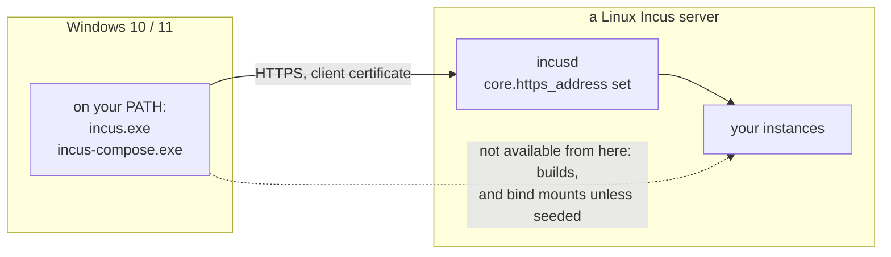

# Installing on Windows

Incus itself is a Linux daemon - it does not run on Windows. On Windows you run
the `incus` client and `incus-compose` as **clients** that drive a remote Incus
server over HTTPS. No Docker and no WSL required.



_Since 1.0.0: Windows has been tested with version 1.0.0, MacOS by the lack of
one not yet_

## Prerequisites

- Windows 10/11, `x86_64` or `arm64`.
- A reachable Incus server (Linux) with `core.https_address` set. This is
  required even beyond remote access - see
  [Getting Started - Incus must listen on the network](/getting-started#incus-must-listen-on-the-network-required).
- Admin access to that server to trust your client certificate.

## 1. Create a bin directory and add it to your PATH

Create `%LOCALAPPDATA%\bin` and add it to your user `PATH` (Settings -> "Edit
environment variables for your account" -> `Path` -> New). Open a **new**
terminal afterwards so the change takes effect.


## 2. Install the incus client

Download `bin.windows.incus.{x86_64|arm64}.exe` from the Incus
[Releases](https://github.com/lxc/incus/releases) page into `%LOCALAPPDATA%\bin`
and rename it to `incus.exe`.

## 3. Install incus-compose

Download `incus-compose_1.0.0_windows_{amd64|arm64}.tar.gz` from the
incus-compose [Releases](https://github.com/lxc/incus-compose/releases) page,
extract it, and copy `incus-compose.exe` into `%LOCALAPPDATA%\bin`.


Verify both are on your PATH in a new PowerShell terminal:

```powershell
incus version
incus-compose version
```

## 4. Generate a client certificate

Make sure your clock is correct (TLS verification fails on a skewed clock), then
generate a client certificate:

```powershell
incus remote generate-certificate
```

## 5. Generate a token on the server and use it

On the server:

```bash
incus config trust add <clientname>
```

On the client:

```powershell
incus remote add <servername> <serverip>
```

## 6. Make it the default and test it

Make it your default remote:

```powershell
incus remote switch <servername>
```

Test the connection:

```powershell
incus list --all-projects
```


## incus-compose in action


## Notes and limitations

- **Remote-only.** The Incus server is never this machine, so a plain
  pass-through bind mount is refused - incusd would look for the source path on
  the Linux server, where it isn't. Add
  [`x-incus-compose.seed: true`](/extras#volume-seeding) to the volume entry and
  the files are copied across instead, which works from here and is what the
  option exists for. A named volume is the other answer, for data that lives on
  the server anyway. Health checks work automatically over HTTPS. See
  [Local vs Remote Incus](/getting-started#local-vs-remote-incus).
- **Builds** need a local `podman` or `docker` which are not available on
  Windows.

Have fun with incus and incus-compose on Windows!

## See Also

- [Getting Started](/getting-started)
- [CLI Reference](/cli-reference)
- [Compose Compatibility](/compose-compatibility)
