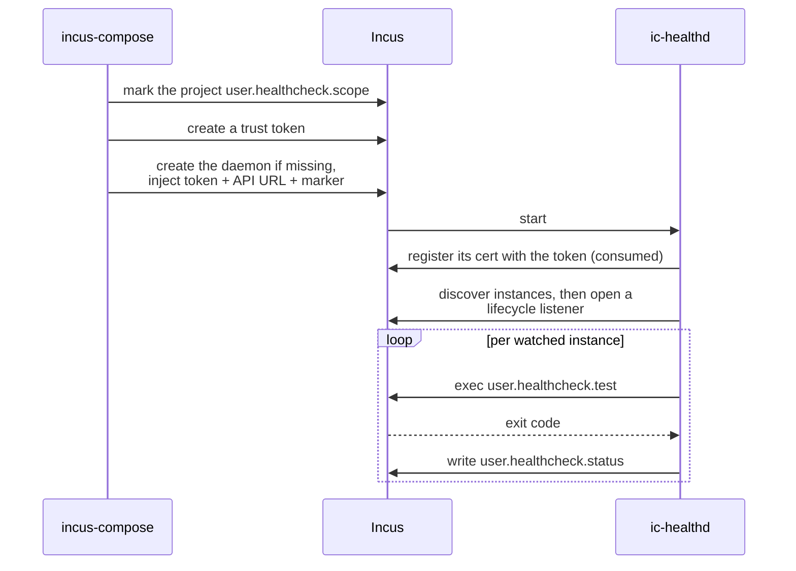
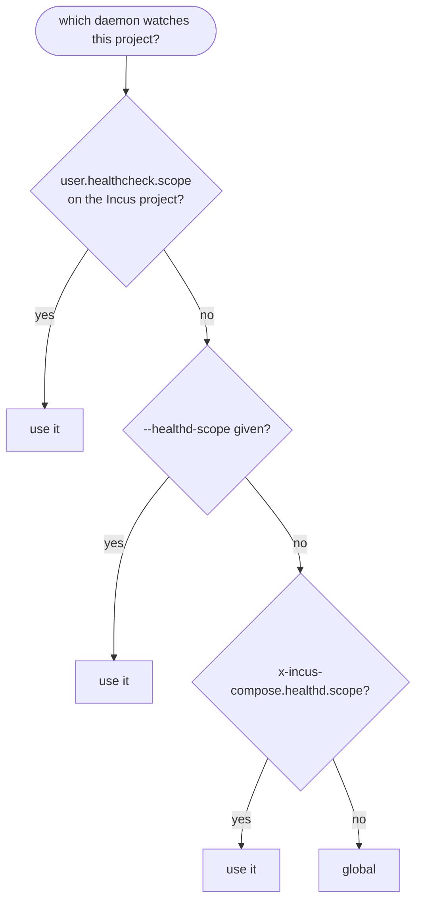
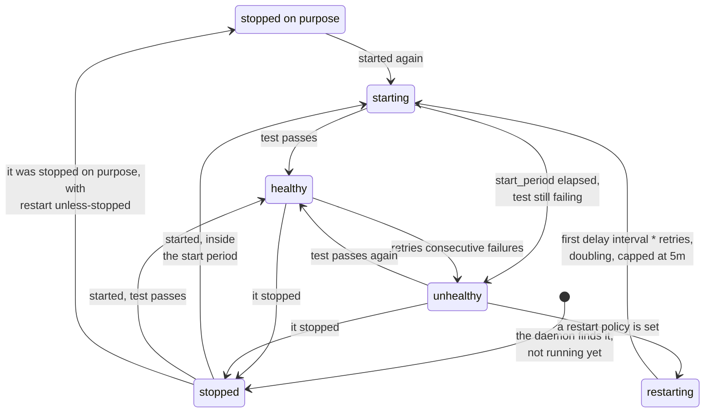
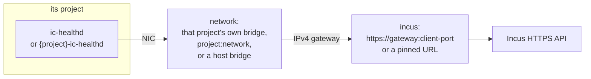

# Health Checking (ic-healthd)

incus-compose implements health checks via a sidecar container called
`ic-healthd`. Incus has no native healthcheck support, so ic-healthd fills that
role.

> **ic-healthd is a core component.** Every `healthcheck`, every restart policy
> (`restart: always | on-failure | unless-stopped`), and every
> `depends_on: { condition: service_healthy }` is enforced by this sidecar, not
> by Incus. If healthd is misconfigured, stopped, or crashing:
>
> - instances are not restarted, and
> - **the project may fail to come up at all**: `incus-compose up` waits for
>   `service_healthy` dependencies to be reported healthy by healthd. If that
>   status never arrives, `up` blocks until `--dependency-timeout` (default 5m;
>   `0` waits forever) and then fails.
>
> Opt out of healthd entirely with `incus-compose up --no-healthd` (this also
> drops the dependency wait); `--no-deps` skips the wait too. When health,
> restart, or startup-ordering behavior looks wrong, debug healthd first (see
> [Debugging ic-healthd](#debugging-ic-healthd)).

## How It Works

`incus-compose up` makes sure a healthd is watching the project when any service
declares a `healthcheck`, has a restart policy other than `no`, or is depended
on with `condition: service_healthy`. By default that is one daemon shared by
the whole server; see [Scope](#scope-one-daemon-or-one-per-project). It:

1. Marks the Incus project `user.healthcheck.scope`, which is how the daemon
   finds it.
2. Creates the `ic-healthd` container if it is not already there, with an Incus
   trust token.
3. ic-healthd authenticates once (token consumed) and persists the resulting
   cert.
4. ic-healthd discovers which instances to watch by reading the Incus API - see
   [Health Checking Is Opt-In](#health-checking-is-opt-in) for what makes an
   instance eligible - then opens an Incus lifecycle event listener and reacts
   to project and instance create/update/delete/start/stop events from then on -
   no polling, no reload needed for config or instance-set changes to take
   effect.
5. ic-healthd runs the health loop per watched instance and writes the result to
   `user.healthcheck.status`.



The daemon is running before the regular services start, so `service_healthy`
dependencies can be evaluated. A project-scoped sidecar is removed by
`incus-compose down`; the shared daemon is never touched by it.

## Config Storage

Health check config and runtime state live in the instance's `user.*` config
keys. There is no separate config file. ic-healthd reacts to
`incus config set`/instance create/delete changes as they happen via the Incus
event stream; `incus-compose healthd reload` remains available to force a full
manual resync.

See the Docker healthcheck docs for the value semantics:
https://docs.docker.com/reference/dockerfile#healthcheck

```
user.incus-compose.managed       true
user.healthcheck.enabled         true
user.healthcheck.test            '["CMD","wget","-q","--spider","http://localhost"]'
user.healthcheck.start_period    10s
user.healthcheck.start_interval  2s
user.healthcheck.interval        10s
user.healthcheck.timeout         5s
user.healthcheck.retries         3
user.healthcheck.status          unknown | stopped | starting | healthy | unhealthy
user.healthcheck.restart         always | on-failure | unless-stopped
user.healthcheck.ignore          true
```

These keys are visible in `incus config show <instance>`.

`user.healthcheck.status` is the only key ic-healthd writes, and **nothing else
writes it**. All the others are set by incus-compose at instance creation time
and treated as read-only by the daemon.

That split is what makes the status trustworthy: an instance reports what the
daemon last saw, never what another process assumed. So a fresh instance carries
no status at all until the daemon reports one, and `list` shows it as `Unknown`
for that moment. The exception is `up --no-healthd`, where nothing will ever
report: those instances are created with `unknown` and keep it.

`user.healthcheck.stopped` is the one signal that goes the other way.
`incus-compose stop` sets it to say a stop was deliberate; the daemon reads it
and leaves `unless-stopped` instances alone, and writes the `stopped` status
itself from the event it sees anyway.

`incus-compose pause` sets the same marker, because a frozen instance answers no
healthcheck and would otherwise read as one that needs restarting. See
[Pausing a watched service](#pausing-a-watched-service).

## Health Checking Is Opt-In

ic-healthd watches an instance only when it carries
`user.healthcheck.enabled: "true"`. A `healthcheck:` block or a restart policy
alone is no longer enough - the instance has to say it wants watching.

incus-compose writes the key automatically for every service that declares a
`healthcheck:` or a restart policy other than `no`, so you do not normally set
it by hand.

> **Upgrading from a release before this?** Instances created by an earlier
> version do not carry the key, so they are not watched: their healthchecks do
> not run and their restart policies are not enforced. Run `incus-compose up`
> once per project to fix it. `up` adds config keys an instance is missing
> without recreating anything, so no `--recreate` and no downtime is needed.
> ic-healthd logs a warning for every instance it finds with a healthcheck but
> no opt-in, so you can see what is affected with `incus-compose healthd logs`.

`user.incus-compose.managed: "true"` is a separate key, written on the project
and on every instance incus-compose creates. It records who created the thing,
which matters for other incus-compose features; ic-healthd does not read it and
it has no effect on whether an instance is watched.

### Opting a service out

Set `user.healthcheck.enabled: "false"` via `x-incus`. The service keeps its
`healthcheck:` block - it simply is not watched:

```yaml
services:
  sidecar-tool:
    image: docker.io/example/tool:latest
    x-incus:
      user.healthcheck.enabled: "false"
```

`user.healthcheck.ignore: "true"` also excludes an instance, from discovery and
from every event handler. incus-compose sets it on the ic-healthd sidecar so it
does not watch itself. For a normal service prefer `enabled: "false"` - it says
the same thing in the same namespace as the rest of the healthcheck config.

## Scope: One Daemon Or One Per Project

One ic-healthd watches any number of projects from a single Incus event
listener, so by default there is exactly one on the server:

| Scope              | Where it runs                                              | Watches                                              |
| ------------------ | ---------------------------------------------------------- | ---------------------------------------------------- |
| `global` (default) | instance `ic-healthd` in the Incus `incus-compose` project | every project marked `user.healthcheck.scope=global` |
| `project`          | instance `{project}-ic-healthd` in the project             | that one project                                     |

The shared daemon gets a project, a bridge (`icompose0`) and a root disk of its
own, so nothing about how your `default` project is set up can break it. Both
are created on the first `healthd up` and neither is removed by `healthd down`.

`up` writes the choice to the Incus project as `user.healthcheck.scope`, and
that stored value then beats both the flag and the compose file:



So a project keeps the scope it was brought up with. Changing your mind later
means changing that key and running `up` again:

```bash
incus project set my-project user.healthcheck.scope=project
incus-compose up
```

`up` never leaves both daemons on one project: switching to `global` removes the
project's own sidecar _before_ marking the project, and switching to `project`
marks it first so the shared daemon lets go before the sidecar appears.

### Choosing project scope

```yaml
x-incus-compose:
  healthd:
    scope: project
```

or `incus-compose up --healthd-scope project` the first time. Reasons to:

- **Least privilege.** A project-scoped sidecar gets an Incus certificate
  restricted to its own project. The shared one cannot be restricted - it has to
  reach projects that do not exist yet - so it is registered unrestricted. See
  [Security](#security).
- **Isolation.** A wedged or stopped daemon takes down health checking for its
  own project only.

The cost is one container, one certificate and one event listener per project,
and the sidecar's `limits.*` counting against that project's quota (see
[Sizing the sidecar](#sizing-the-sidecar)).

### Upgrading from per-project sidecars

Projects last brought up by a version before this carry no
`user.healthcheck.scope` at all, and the shared daemon only watches projects
that positively carry `global`. They are therefore invisible to it and keep
running on their own sidecar, with no window where both watch them.

Run `incus-compose up` per project when you want it moved. That removes the old
sidecar, revokes its certificate and hands the project to the shared daemon.

## Defaults

When keys are missing, ic-healthd falls back to:

| Key            | Default       |
| -------------- | ------------- |
| start_period   | 0s (disabled) |
| start_interval | 5s            |
| interval       | 30s           |
| timeout        | 30s           |
| retries        | 3             |

`retries` must be greater than 0.

After `retries` consecutive failures the instance is restarted. The first
restart waits `interval * retries`; the delay doubles on every further restart,
capped at 5 minutes.



This is `user.healthcheck.status`, the verdict you can read with
`incus config get`.

## Dockerfile HEALTHCHECK

An image's own `HEALTHCHECK` is read and used where the compose file says
nothing about health, which is what `docker compose` does. A service whose image
ships one is therefore watched, and restarted if it has a restart policy,
without a `healthcheck:` block of its own.

The compose file wins whenever it speaks:

| compose file                 | what the instance gets                    |
| ---------------------------- | ----------------------------------------- |
| no `healthcheck:`            | the image's check, or none if it has none |
| `healthcheck:` with a test   | its own check; the image's is not read    |
| `healthcheck: disable: true` | no check at all                           |

`HEALTHCHECK NONE` in the image says the same thing as `disable: true` and is
honoured.

The config is read from the registry when the image is pulled, not on every
`up`, and stored on the cached image. In an
[air-gapped environment](/air-gapped) the read is skipped with a warning rather
than failing, so an image that cannot be reached simply carries no check.

Declaring the check in the compose file is still the way to control it, and the
only way to override what the image chose:

```yaml
services:
  db:
    image: docker.io/postgres:16-alpine
    healthcheck:
      test: ["CMD", "pg_isready", "-U", "postgres"]
      interval: 10s
      timeout: 5s
      retries: 5
```

Opt a service out with `disable: true`, or with
[`user.healthcheck.enabled: "false"`](#opting-a-service-out) via `x-incus`.

Images cached before this release carry no healthcheck and are not re-read, so
an existing stack picks this up only for images pulled from now on.

## Restart Without a Test

`restart: always`, `on-failure`, or `unless-stopped` without a `healthcheck`
block is also handled. ic-healthd monitors the instance state and restarts it
when stopped, without running an exec-based test command.

With `unless-stopped`, instances stopped intentionally
(`user.healthcheck.stopped=true`, set by `incus-compose stop`) are not
restarted.

## Pausing a watched service

`incus-compose pause` freezes an instance, which stops it answering any
healthcheck. To the daemon that is indistinguishable from a service that fell
over, so without help it would restart out of the pause on the next interval.

`pause` therefore sets `user.healthcheck.stopped`, the marker `stop` already
uses, and `unpause` clears it. The daemon sees a stopped instance it was told
about, parks it, and touches nothing until it starts again.

Two consequences worth knowing:

- While paused, `user.healthcheck.status` reads `stopped`. The daemon reports
  what it can observe, and it cannot probe a frozen instance.
- Only a resume takes the instance off that shelf. Daemons before v1.3.0 do not
  treat Incus's `instance-resumed` as a start, so after `unpause` they leave the
  instance unwatched until the next resync. Update the daemon
  (`incus-compose healthd up`), or force one with
  `incus-compose healthd reload`.

_Since: v1.3.0_

## Network Configuration

ic-healthd runs in its own container and must reach the Incus HTTPS API from the
inside. Two things are configured:

- **`network`** - the Incus network (or host bridge) healthd attaches its NIC
  to.
- **`incus`** - the Incus API URL healthd connects to.



Both can be set in the compose file or overridden on the CLI. CLI flags and
environment variables take priority over the compose file.

```yaml
name: my-project
x-incus-compose:
  healthd:
    # Incus API endpoint healthd connects to.
    # Default: `core.https_address` when it names a host, else the host address
    # on `network` below with the port incus-compose itself connected on.
    incus: https://<ip-of-the-projects-bridge>:8443
    # `<project>:<network>` for a managed network, or a plain bridge name.
    # We assume the current project if you leave the first part empty.
    # Default: the bridge of the project the daemon runs in.
    network: :default
```

| Flag                | Environment variable            | Compose key                       |
| ------------------- | ------------------------------- | --------------------------------- |
| `--healthd-incus`   | `INCUS_COMPOSE_HEALTHD_INCUS`   | `x-incus-compose.healthd.incus`   |
| `--healthd-network` | `INCUS_COMPOSE_HEALTHD_NETWORK` | `x-incus-compose.healthd.network` |

`incus-compose healthd up` takes the same two options as `--incus` and
`--network`.

### `network`

- **Empty (default)** - a bridge of the project the daemon runs in, created if
  needed: `icompose0` for the shared daemon, the project's own `default` network
  for a project-scoped one. Either way healthd can come up before the rest of
  the project.
- **`<project>:<network>`** - a managed Incus network, optionally in another
  project. A network the compose file declares is created before the sidecar
  attaches to it; anything else must already exist.
- **A value without `:`** - a host bridge name (e.g. `incusbr0`, or a bridge
  Incus does not manage such as `br0`). It must already exist.

The bridge's IPv4 gateway is used as the default Incus endpoint, so healthd can
reach Incus over it. A bridge Incus does not manage carries no gateway in its
config, so pair one with an explicit `incus` below.

### `incus`

- **Empty (default)** - resolved in this order:

  1. **`core.https_address`, if it names a host.** `10.0.0.5:8443` is used as
     `https://10.0.0.5:8443` and nothing below is consulted. A bare `:8443`
     names no host, so it falls through.
  2. **The bridge gateway of `network`, with the port incus-compose connected
     on.** This is the case `core.https_address = :8443` lands in: Incus listens
     on all interfaces, so the bridge IP reaches it.

  Step 2 needs a HTTPS connection - over a unix socket there is no port to
  reuse, so set `--healthd-incus` explicitly. It also needs a managed bridge; on
  one Incus does not manage there is no gateway to read and `healthd up` fails
  naming the network rather than guessing an endpoint the sidecar cannot reach.

- **An explicit URL** - used verbatim, e.g. `https://10.0.0.1:8443`. Combine
  with `network` to pin both the bridge and the endpoint.

### Combinations

`empty` below means the fallback, i.e. `core.https_address` names no host.

| `network`                  | `incus` | Behavior                                  |
| -------------------------- | ------- | ----------------------------------------- |
| default                    | empty   | Own bridge IP + client port (the default) |
| default                    | URL     | Own bridge for the NIC, pinned endpoint   |
| bridge / `project:network` | empty   | Different bridge, auto-detected IP        |
| bridge / `project:network` | URL     | Different bridge, pinned endpoint         |

## Security

Whichever daemon watches a project can exec into its instances and start, stop
and restart them. What differs is how far that reaches.

**A project-scoped sidecar** gets a restricted certificate:

- Can exec commands into instances in the project.
- Can manage instance state (start/stop/restart) within the project.
- Cannot access other projects or perform global operations.

**The shared daemon is registered unrestricted**, deliberately. A restricted
certificate carries a fixed list of projects, and the whole point of the shared
daemon is to pick up projects created after it was registered. Practically it
means a compromised `ic-healthd` container is a compromised Incus server.

It is one container, running one binary, on an image you control via
`--healthd-image`, reachable only over the bridge you point it at. If that is
not a trade you want to make, use `scope: project` (see
[Choosing project scope](#choosing-project-scope)) - every project then gets a
daemon bounded to itself, at the cost of one container each.

## Management Commands

The `healthd` command group manages the sidecar directly without touching
services. Each follows the project's scope, so in a `global`-scope project they
act on the shared daemon in the `incus-compose` project:

| Subcommand        | Description                                               |
| ----------------- | --------------------------------------------------------- |
| `logs [--follow]` | Stream the ic-healthd container log                       |
| `reload`          | Send SIGHUP to force a full manual resync (rarely needed) |
| `restart`         | Restart the ic-healthd container                          |
| `status`          | Print the shared daemon's health status key               |
| `up`              | Create the sidecar, or replace one running an older image |
| `down [--force]`  | Stop and remove the sidecar                               |

`healthd up` accepts `--image`, `--binary`, `--incus`, `--network`, `--scope`,
`--pull` and `--timeout`. Inside a project it refuses with an error when no
service there requires healthd (no healthcheck, no restart policy, no
`service_healthy` dependency).

_Since: v1.3.0_: `healthd status`.

### Outside a project

All of them also run with no compose file in sight, where they act on the shared
daemon. That is how you put one on a server before any project exists, and how
you look at it afterwards:

```bash
incus-compose healthd up      # create the shared daemon
incus-compose healthd logs    # watch it
```

`healthd up` this way marks no project and so watches nothing by itself -
projects opt in on their own `up`. The others fail with
`no ic-healthd is running` rather than guessing at a project.

`healthd down` on the shared daemon stops health checking for _every_ project
using it, so it lists the other projects and asks first. `--force` skips the
question, and is required when there is no terminal to ask on (CI, scripts).
`incus-compose down` never touches the shared daemon at all.

### Changing the daemon's settings

Everything the daemon is configured with - debug logging, `workers`,
`restart-workers`, `x-incus`, `incus` - is injected as environment on the
container when it is _created_, and a running daemon is never reconfigured in
place. None of it is compared against what the daemon runs either: `up` replaces
a sidecar only for a newer image (see [Sidecar Image](#sidecar-image)), so
changing any of these is a manual recreate:

```bash
# verbose logging on
incus-compose healthd down --force
incus-compose --debug healthd up

# and back off again
incus-compose healthd down --force
incus-compose healthd up
```

`--debug` is the global incus-compose flag and is inherited by healthd
operations; the others come from `x-incus-compose.healthd` (see
[Sizing the sidecar](#sizing-the-sidecar)).

`--trace` is a level below it, for the lines the daemon emits per Incus event
and per check. They are what you want when a project is not being watched and
you need to see the events arriving, and what you do not want otherwise - on a
busy server they bury everything else. It implies `--debug`:

```bash
incus-compose healthd down --force
incus-compose --trace healthd up
incus-compose healthd logs --follow
```

> With `scope: global` this restarts the daemon every other project is using, so
> health checking pauses server-wide for a few seconds. `--force` is what says
> you meant it; drop it to be told which projects are affected and asked first.

## Disabling the Sidecar

```bash
incus-compose up --no-healthd
```

## Using Your Own healthd

You can run the daemon yourself instead of letting `up` create a sidecar, and
point incus-compose at it with `up --external-healthd` /
`down --external-healthd`. incus-compose then uses healthd features but does not
create or look up a sidecar of its own.

Set it permanently for a project in the compose file instead of passing the flag
every time:

```yaml
x-incus-compose:
  healthd:
    external: true
```

`--external-healthd` and the compose key combine with OR: either one is enough
to turn it on, there is no flag to force it back off for a project that sets it
in the compose file.

### Running the daemon directly

`incus-compose up` creates the sidecar and injects the configuration below as
environment variables. You can also run `ic-healthd run` yourself - as a binary
or a separately managed container - and attach projects to it with
`up --external-healthd`.

Every flag has a matching env var:

| Flag                | Env var                                 | Default                         | Description                                                                 |
| ------------------- | --------------------------------------- | ------------------------------- | --------------------------------------------------------------------------- |
| `--incus`           | `INCUS_COMPOSE_HEALTHD_INCUS`           | -                               | Incus API URL to connect to                                                 |
| `--token`           | `INCUS_COMPOSE_HEALTHD_TOKEN`           | -                               | Trust token used to register the client cert                                |
| `--project`         | `INCUS_COMPOSE_HEALTHD_PROJECTS`        | -                               | Projects to manage; empty means every marked project                        |
| `--project-marker`  | `INCUS_COMPOSE_HEALTHD_PROJECT_MARKER`  | `user.healthcheck.scope=global` | Project config `KEY=VALUE` that opts a project in when `--project` is empty |
| `--own-project`     | `INCUS_COMPOSE_HEALTHD_OWN_PROJECT`     | -                               | Project the daemon's own container runs in                                  |
| `--own-name`        | `INCUS_COMPOSE_HEALTHD_OWN_NAME`        | -                               | The daemon's own instance name; empty means it skips itself                 |
| `--data-dir`        | `INCUS_COMPOSE_HEALTHD_DATA_DIR`        | `/var/lib/ic-healthd`           | Persistent directory for the generated cert/key                             |
| `--secrets-dir`     | `INCUS_COMPOSE_HEALTHD_SECRETS_DIR`     | `/secrets`                      | Directory holding the one-time registration token file                      |
| `--workers`         | `INCUS_COMPOSE_HEALTHD_WORKERS`         | `128`                           | Health checks running at once, over every watched project                   |
| `--restart-workers` | `INCUS_COMPOSE_HEALTHD_RESTART_WORKERS` | `32`                            | Restarts running at once, over every watched project                        |
| `--debug`           | `INCUS_COMPOSE_HEALTHD_DEBUG`           | `false`                         | Verbose logging                                                             |
| `--trace`           | `INCUS_COMPOSE_HEALTHD_TRACE`           | `false`                         | Per-event logging, which implies `--debug`                                  |

`--own-project` and `--own-name` are how the daemon writes its own health
status; leaving `--own-name` empty means it skips itself.

### Choosing what to watch

There are two ways to say it, and they do not mix:

- **An explicit list.** `--project a --project b` (or
  `INCUS_COMPOSE_HEALTHD_PROJECTS=a,b`) watches exactly those, marker ignored.
- **The marker.** With no `--project`, every project the daemon can see carrying
  `user.healthcheck.scope: "global"` in its _project_ config. incus-compose
  stamps that on the projects it hands to the shared daemon, so a daemon started
  this way picks those up and leaves everything else - project-scoped projects,
  projects from before the key existed, and anything not incus-compose's -
  alone. `--project-marker` selects a different pair, e.g.
  `--project-marker user.mine=yes`; a bare key means `KEY=true`.

**The trust token is what bounds "can see".** A token restricted to two projects
gives a daemon that watches at most those two, whatever its flags say - Incus
filters both the project list and the event stream by what the certificate is
allowed. An unrestricted token means every project on the server.

```bash
# every marked project the token allows
incus config trust add healthd --restricted --projects=blog,shop
ic-healthd run

# exactly these two, marker or not
ic-healthd run --project blog --project shop
```

Projects created, renamed or deleted while the daemon runs are picked up from
the event stream; no reload is needed.

### Local binary in the sidecar

```bash
incus-compose up --healthd-binary ./bin/ic-healthd
```

Uses `images:alpine/edge` instead of the published OCI image and pushes the
local binary into the container before start. Useful when iterating on the
daemon but still wanting `up` to manage its lifecycle.

### Standalone on the host

The fastest edit-run-reload loop when hacking on the daemon: run `ic-healthd` on
the host and attach a project to it with `--external-healthd`.

> The daemon registers over the Incus HTTPS API, so the default remote must
> expose an HTTPS address (not just the local unix socket).

1. Build and start the daemon; the token is minted inline and passed via
   `INCUS_COMPOSE_HEALTHD_TOKEN`:

   ```bash
   # The Incus project to watch (its Incus name).
   export INCUS_COMPOSE_HEALTHD_PROJECTS=many-dependencies

   mkdir -p ./work/{secrets,data}
   rm -f ./work/data/*

   # HTTPS address of the default remote.
   export INCUS_COMPOSE_HEALTHD_INCUS=$(default=$(incus remote get-default); incus remote list --format=json | jq -r '."'$default'" .Addrs[0]')
   # A restricted, project-scoped trust token.
   export INCUS_COMPOSE_HEALTHD_TOKEN="$(incus -q config trust add manual_healthd --projects=$INCUS_COMPOSE_HEALTHD_PROJECTS --restricted)"

   just build-healthd
   ./bin/ic-healthd run --debug --secrets-dir=./work/secrets/ --data-dir=./work/data/
   ```

   On first run it consumes the token and writes the cert/key to `./work/data`,
   reusing them afterwards (delete `./work/data/*` to re-register).

2. Note the PID from the startup log (or use `pidof ic-healthd`):

   ```
   time=2026-07-04T15:47:24.177+02:00 level=INFO msg=Version version=v1.0.0-beta.20-29-g57f305c-dirty pid=446206
   ```

3. In another terminal, bring the project up against the running daemon.
   `--external-healthd` makes incus-compose use healthd features without
   creating or looking up a sidecar of its own:

   ```bash
   just run -P examples/many-dependencies/ up --external-healthd
   ```

4. Config key changes (and instance create/start/stop/delete) take effect on
   their own via the Incus event stream - no reload needed. Force a full manual
   resync if you ever want one, by sending SIGHUP:

   ```bash
   kill -HUP <pid-from-step-2>
   ```

## Sidecar Image

Default image: `ghcr.io/lxc/incus-compose/ic-healthd:{version}`

Override with `--healthd-image` flag or `INCUS_COMPOSE_HEALTHD_IMAGE` env var.

The container is named `ic-healthd` for the shared daemon,
`{project}-ic-healthd` for a project-scoped one, and carries two tags:
`user.healthcheck.ignore=true`, so ic-healthd skips itself during discovery and
every event handler, and `user.healthcheck.daemon=true`, which incus-compose
uses to locate the sidecar instance (`healthd logs`/`restart`/etc.) - `ignore`
is a general opt-out any instance can carry, so it can't double as the sidecar's
own identifying marker.

Both `incus-compose up` and `incus-compose healthd up` upgrade the daemon for
you: when the image you ask for is a _newer_ release than the one it is running,
the sidecar is stopped, removed and recreated from that image. The comparison is
semver and only ever moves forward, so a machine on an older incus-compose
cannot downgrade a daemon shared with everybody else. Tags that are not release
versions - moving tags like `latest`, and `git describe` builds - are not
comparable, so those replace on any difference and CI and `--healthd-binary`
keep rolling.

Updating the daemon on a server therefore needs no compose file and no project:

```bash
incus-compose self-update
incus-compose healthd up
```

**The image alias is the only thing that triggers this.** A daemon running the
image you asked for is left alone however much else differs - see
[Changing the daemon's settings](#changing-the-daemons-settings).

## Sizing the sidecar

The sidecar runs with `limits.cpu: 2` and `limits.memory: 256MiB`. Change that,
or set any other Incus instance config on it, with `x-incus`:

```yaml
x-incus-compose:
  healthd:
    workers: 256
    restart-workers: 64
    x-incus:
      limits.cpu: 4
      limits.memory: 512MiB
```

`workers` (128) and `restart-workers` (32) cap the health checks and the
restarts the daemon runs at once across every project it watches. They are
separate pools because a restart holds its worker far longer than a check does.

> **Quota.** A **project-scoped** sidecar lives in your project, so its
> `limits.cpu`/`limits.memory` are _added_ to what your services use when Incus
> checks a project-level `limits.*`. Budget for it. The shared daemon lives in
> its own project and does not count against any compose project, which is one
> more reason the default scope is `global`.

The first project to bring the shared daemon up supplies its `incus`, `workers`,
`restart-workers` and `x-incus`; a later project whose healthd block differs is
warned about and otherwise ignored, so one compose file cannot restart the
daemon everybody else is using. To apply new settings, take it down and back up:

```bash
incus-compose healthd down --force
incus-compose healthd up
```

## Debugging ic-healthd

Because healthd drives all health and restart behavior, most "container did not
restart" or "stuck `service_healthy`" problems are diagnosed from the sidecar.
Work through these in order.

### 1. Check the reported health status

Instances are named `<service>-1` (the replica index starts at 1) and live in
the Incus project named after your compose project, so pass `--project`.
ic-healthd writes its verdict to `user.healthcheck.status`
(`unknown | stopped | starting | healthy | unhealthy`):

```bash
incus config get web-1 user.healthcheck.status --project <project>
```

`starting` that never becomes `healthy` means the test never passes within the
start period; `unhealthy` means it failed `retries` times. An empty value or
`unknown` on a running instance means no daemon has reported on it at all -
check that the sidecar is running (step 4) and that the instance carries
`user.healthcheck.enabled: "true"`.

### 2. Inspect the config keys healthd reads

All inputs live in `user.healthcheck.*`. If a key is wrong, healthd behaves
wrong - it never reads the compose file directly:

```bash
incus config show web-1 --project <project> | grep -E 'user\.(healthcheck|restart)'
```

### 3. Watch the daemon logs

```bash
incus-compose healthd logs --follow
```

Enable debug logging for full per-check detail (failures, retry counts,
`inStart` transitions, restart delays). The `--debug` flag is inherited by the
sidecar at creation, so recreate it with debug on (see
[Changing the daemon's settings](#changing-the-daemons-settings)):

```bash
incus-compose healthd down --force
incus-compose --debug healthd up
incus-compose healthd logs --follow
```

### 4. Confirm the sidecar is actually running

The container is named `ic-healthd` in the Incus `incus-compose` or
`{project}-ic-healthd` for a project-scoped one. If it is missing or stopped,
nothing is being monitored:

```bash
incus-compose list        # the daemon is listed by default (since 1.0.0-rc.1)
incus-compose healthd up  # create it if missing
```

Remember: `incus-compose start` never (re)starts the sidecar - only `up` does.

### 5. Reproduce the health test by hand

healthd runs `user.healthcheck.test` via `incus exec`. Run it yourself to see
why it fails:

```bash
incus-compose exec <service> -- sh -c 'wget -q --spider http://localhost; echo exit: $?'
```

### 6. Force a manual resync

If you change `user.healthcheck.*` keys directly (instead of via `up`),
ic-healthd picks them up on its own via the Incus event stream - no action
needed. If you ever suspect it missed something (e.g. after a change made while
its event listener was disconnected and before it reconnected), force a full
resync:

```bash
incus-compose healthd reload   # sends SIGHUP
```

### `incus-compose up` hangs or times out on dependencies

If a service uses `depends_on: { condition: service_healthy }`, `up` waits for
healthd to report the dependency `healthy` before starting the dependent
service. A broken or missing healthd means that status never arrives and `up`
blocks until `--dependency-timeout` (default 5m) elapses, then fails.

1. Confirm the dependency's status with steps 1-3 above; it is likely stuck on
   `starting` or `unhealthy`.
2. If you only want to bring the project up without the wait, opt out:

   ```bash
   incus-compose up --no-healthd   # also stops managing healthchecks/restarts
   # or keep healthd but skip the wait:
   incus-compose up --no-deps
   ```

## Troubleshooting

**Sidecar has wrong config (missing `--incus`/`--project` flags)?**

This can happen when ic-healthd was created by an older version of
incus-compose. Recreate it:

```bash
incus-compose healthd down --force
incus-compose healthd up
```

**Sidecar not running after `incus-compose start`?**

`start` never creates or starts the sidecar; only `up` does. Use
`incus-compose healthd up` to start it independently.

## See Also

- [CLI Reference](/cli-reference/extensions#healthd) - healthd management
  commands
- [Compose Compatibility](/compose-compatibility) - healthcheck and restart
  policy support
- [Architecture](/developer) - how the sidecar fits the resource model
