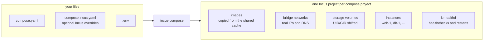

# incus-compose

A drop-in replacement for `docker compose` that runs your `compose.yaml` on
[Incus](https://linuxcontainers.org/incus/) - with the full Incus API available
as an escape hatch when you need more than the Compose spec covers.

```yaml
services:
  db:
    image: docker.io/postgres:18-alpine
    healthcheck:
      test: ["CMD", "pg_isready", "-U", "postgres"]
    deploy:
      resources:
        limits:
          cpus: "2"
          memory: 2G

  web:
    image: docker.io/nginx:alpine
    depends_on:
      db: { condition: service_healthy }
    ports:
      - "8080:80"
    deploy:
      resources:
        limits:
          cpus: "1"
          memory: 512M
```

```bash
incus-compose up
```

A plain compose file, running unchanged.



New to Incus? See [Why Incus?](/why-incus) for what the platform brings over a
classic OCI engine setup.

## Demos

- [backup in action](https://asciinema.org/a/1263992)
- [30-service dependency graph, 30 parallel workers](https://asciinema.org/a/1260145)
- [Immich - a full photo-management stack](https://asciinema.org/a/1259458)

## Features

### Drop-in

All the commands you know - parsing via compose-go with `.env` interpolation,
profiles, `depends_on`, secrets, and configs. See the
[CLI reference](/cli-reference) and the
[compatibility matrix](/compose-compatibility).

### Operable

Health checks, restart policies, and `depends_on: service_healthy` ordering via
the `ic-healthd` sidecar; scaling with `up --scale`; project isolation; live
progress for pulls and lifecycle. See [Health Checking](/healthd).

### Fast images

OCI pulls from any registry, a two-stage cache that survives `down`/`up` and
dodges rate limits, and local builds via Podman/Docker. See [Builds](/builds).

### Air-gapped ready

`pull` is the only command that needs a registry, so a project pulls on a
connected machine and runs on a disconnected one; `--pull never` makes that a
guarantee rather than a hope, and the sidecar and one-off helper images point at
your own mirror like any other. See
[Air-gapped and Proxied Installs](/air-gapped).

### Real networking

Bridge networks with static IPs, port publishing via proxy devices or kernel
NAT, volumes with UID/GID shifting, seeded bind mounts, and per-volume pool
placement. OVN networks and network ACLs require Incus 7.5+ or 7.0.2 LTS due to
networking and ACL bugfixes; earlier versions automatically fall back to bridge
networks.

### Incus-native when you want it

Every instance, network, and volume option passes straight through via
`x-incus`; `x-incus-compose` adds devices (GPU, USB, raw disk), project-wide
resource limits, and healthd tuning. See [Extras](/extras).

### Extensions

`incus-compose backup` snapshots a project's data volumes into a backup
project - create, list, verify, restore, and prune - so a stack's state survives
the project itself, and `incus-compose port-forward` forwards a local TCP port
into an instance, published or not. See
[backup](/cli-reference/extensions/backup) and
[port-forward](/cli-reference/extensions#port-forward).

## Quick Start

Requires Incus 7.0.2 (LTS, unreleased) or 7.5+ (unreleased) for full feature
support including OVN and ACLs (earlier Incus releases fall back to bridge
networking due to networking and ACL bugfixes), `buildah`, `podman` or `docker`
for image building and an Incus https remote (needed for healthchecking) with
OCI registries added. See [Getting Started](/getting-started) for the full setup
walkthrough.

## Install the latest release:

```bash
curl -sSfL https://raw.githubusercontent.com/lxc/incus-compose/main/install.sh | sh -s -- -b ~/.local/bin
```

Or grab a prebuilt archive from the
[Releases Page](https://github.com/lxc/incus-compose/releases). On Arch Linux,
install
[incus-compose-bin](https://aur.archlinux.org/packages/incus-compose-bin) (or
[incus-compose-git](https://aur.archlinux.org/packages/incus-compose-git) for
builds from `main`) from the AUR.

Then point it at your existing `compose.yaml`:

```bash
# Start services
incus-compose up -d

# View logs
incus-compose logs -f

# List running services
incus-compose list

# Stop and remove
incus-compose down
```

## Support and community

The following channels are available for questions and discussion around
incus-compose.

### Bug reports

You can file bug reports and feature requests at:
[`https://github.com/lxc/incus-compose/issues/new`](https://github.com/lxc/incus-compose/issues/new)

### Community support

Community support is handled at:
[`https://discuss.linuxcontainers.org`](https://discuss.linuxcontainers.org)

## Contributing

Fixes and new features are greatly appreciated. Make sure to read our
[contributing guidelines](https://github.com/lxc/incus-compose/blob/main/CONTRIBUTING.md)
first!
