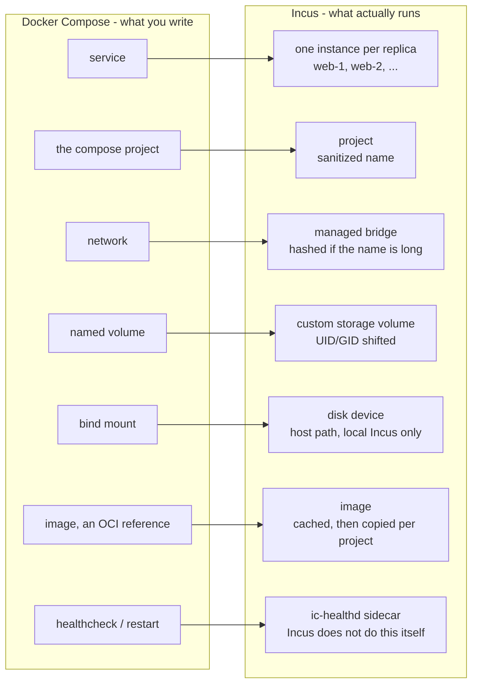

# Terminology

If you're new to incus-compose, this page helps you translate between Docker
Compose, Incus, and incus-compose terms. incus-compose sits between three
vocabularies:

- **Docker Compose** - what you write in `compose.yaml` (service, network,
  volume).
- **Incus** - what actually runs (instance, project, profile, image).
- **incus-compose** - the glue and its own concepts (the ic-healthd sidecar, the
  image cache, name sanitization).

The same word sometimes means different things in each, and the same concept
sometimes has two names. This page disambiguates them.

## Quick mapping

| Compose term          | Incus term                  | Notes                                                           |
| --------------------- | --------------------------- | --------------------------------------------------------------- |
| service               | instance(s)                 | One service becomes one or more instances (one per replica).    |
| (the compose project) | project                     | Each compose project maps to its own Incus project.             |
| network               | network (bridge)            | Compose network becomes an Incus managed bridge.                |
| named volume          | custom storage volume       | With automatic UID/GID shifting.                                |
| bind mount            | disk device (host path)     | Needs incusd on this machine, or `x-incus-compose.seed`.        |
| image (OCI ref)       | image (cached, per-project) | Pulled via an OCI remote, cached, then copied into the project. |
| healthcheck / restart | (enforced by ic-healthd)    | Incus does not run these; the sidecar does.                     |
| -                     | profile                     | Incus-only; no compose equivalent.                              |

## Core distinctions

### Service vs Instance vs Container

- **Service** - a Compose concept: one entry under `services:` in your
  `compose.yaml`. It is a _definition_, not a running thing.
- **Instance** - an Incus concept: a single running (or stopped) workload. This
  is what a service becomes. With [`deploy.replicas`](/compose-compatibility) a
  single service produces several instances named `{service}-{index}` (e.g.
  `web-1`, `web-2`). A service with no replicas still becomes one instance,
  `{service}-1`.
- **Container** - informal. An Incus instance is either a _container_ or a
  _virtual machine_. incus-compose creates containers from OCI images.
  "Container" and "instance" are often used interchangeably, but "instance" is
  the precise term.

### Project (two layers)

"Project" is overloaded:

- **Compose project** - the directory and `compose.yaml` you run against; named
  after the directory by default, overridable with `-p`.
- **Incus project** - an isolation boundary inside Incus (its own instances,
  networks, volumes). incus-compose creates one Incus project per compose
  project, using a [sanitized name](/developer#name-sanitization).

### Network

- **Compose network** - an entry under `networks:`.
- **Incus network** - a managed bridge created for it. Long names are hashed to
  fit the Linux interface limit; see
  [Network Naming](/compose-compatibility/differences#network-naming).

### Volume vs Bind mount

- **Named volume** (`data:/var/lib/app`) - becomes an Incus **custom storage
  volume** with automatic UID/GID shifting. Works locally and remotely.
- **Bind mount** (`./config:/etc/app`) - mounts a host path directly, so the
  path must be on the machine incusd runs on. With
  [`x-incus-compose.seed`](/extras#volume-seeding) the files are copied to the
  server instead, which works against any remote. See
  [Volumes](/compose-compatibility/volumes).

### Image (OCI vs native)

- **OCI image** - a standard container image (e.g. `docker.io/nginx:alpine`),
  pulled through an Incus **OCI remote**.
- **Native Incus image** - an Incus system-container/VM image. incus-compose
  works primarily with OCI images.
- Images flow Registry -> Cache -> Project; see
  [Image Caching](/getting-started#image-caching) and the
  [3-stage flow](/developer#image-caching-3-stage-flow).

## Incus terms

- **Profile** - a reusable set of instance config and devices. No Compose
  equivalent.
- **Remote** - a named Incus endpoint or registry. The common OCI registries are
  built in; anything else is added with `incus remote add --protocol oci ...`
  before images can be pulled from it.
- **Storage pool** - where volumes live. Select a non-default pool per named
  volume with [`x-incus-compose.pool`](/extras#volume-pool).
- **Operation** - an asynchronous Incus task (start, copy, etc.). The client
  waits on it; a successful start operation means the instance reached running.
- **Proxy device** - how published `ports:` are forwarded (not iptables NAT).

## incus-compose terms

- **ic-healthd / sidecar** - a small daemon incus-compose runs to enforce
  `healthcheck`, `restart:`, and `depends_on: service_healthy`. Incus does not
  do these itself. It is transparent in normal use but a core component; see
  [Health Checking](/healthd) and
  [Debugging ic-healthd](/healthd#debugging-ic-healthd).
- **Image cache** - a separate Incus project holding pulled images so repeated
  `up` + `down --project` runs are fast and avoid registry rate limits.
  Configurable via `INCUS_COMPOSE_IMAGE_CACHE`.
- **Name sanitization** - the rules that turn compose names into valid Incus
  project, instance, and network names; see
  [Name Sanitization](/developer#name-sanitization).
- **`x-incus`** - a compose extension to pass raw Incus options verbatim to
  instances, networks, and volumes; see [x-incus](/extras#x-incus).
- **`x-incus-compose`** - a compose extension for incus-compose-specific
  features (e.g. `healthd`, volume `pool`); see
  [x-incus-compose](/extras#x-incus-compose).
- **`compose.incus.yaml`** - an optional override file loaded automatically
  alongside `compose.yaml` for Incus-specific settings; see
  [Incus Override File](/extras#the-incus-override-file).

## Contributor / internal terms

These appear in the codebase and architecture docs, not in everyday use. See the
[Client Package](/developer/client) for detail.

- **Resource** - the unified interface over images, instances, networks,
  profiles, and volumes.
- **Ensure / two-phase** - resources are first configured in memory, then
  realized on the server; `Ensure` always runs before start/stop/delete. See the
  [Two-Phase Resource Pattern](/developer#two-phase-resource-pattern).
- **Stack** - the ordered collection of resources executed for an action.
- **Priority** - numeric ordering (images before networks before instances, ...)
  used instead of a dependency graph; see
  [Resource Hierarchy](/developer#resource-hierarchy).
- **WorkerPool** - bounded concurrency for batched operations (the `--workers`
  flag).
- **Hook** - before/after interception around resource actions; see
  [Hooks](/developer/client/hooks).
- **ETag** - Incus optimistic-concurrency token returned when fetching a
  resource and passed back on updates.

## See also

- [Getting Started](/getting-started)
- [Compose Compatibility](/compose-compatibility)
- [Architecture](/developer)
