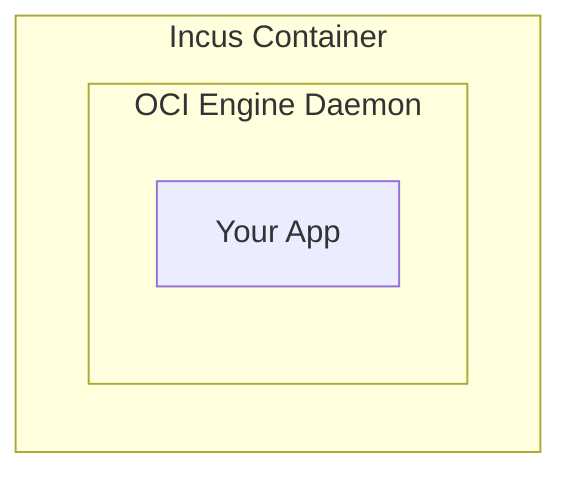
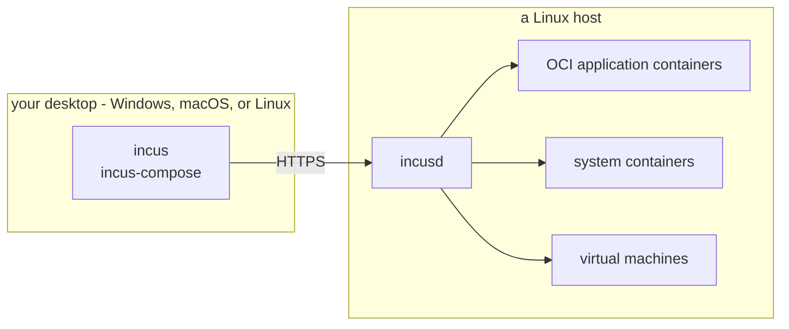

# Why Incus?

[Incus](https://linuxcontainers.org/incus/) is a single daemon with a REST API
that runs **OCI application containers, LXC system containers, and full virtual
machines** side by side. It is Apache-2.0, developed in the open under the
[Linux Containers](https://linuxcontainers.org/) umbrella.

Most compose tooling assumes a Docker-style OCI engine. `incus-compose` runs
your existing `compose.yaml` against Incus instead - we treat a compose file
that doesn't run as a bug, unless the
[compatibility matrix](/compose-compatibility) says it doesn't.

## One Package, One Daemon

A typical container-plus-VM setup accumulates an engine daemon, a container
runtime under it, a hypervisor manager beside it, network plugins, storage
drivers, and a different CLI for each. Incus ships all of it - containers and
VMs, networking, storage, images, projects, clustering - as one package and one
daemon.

## Running an OCI Engine Inside a Container

Running an OCI engine inside an Incus container is a common workaround, and it
costs something:



- Two container runtimes doing one job
- Nested namespaces add failure modes
- Privileged nested containers weaken isolation
- Layered filesystems inside layered filesystems waste storage

## Running OCI Images Natively

Incus runs OCI images directly: the app is PID 1, with no init system and no
second engine in between. `incus-compose` drives that mode.


- One layer of containerization instead of two
- Unprivileged by default, AppArmor and seccomp confined
- The same compose files you already use

When an app needs a full OS environment instead, point `image:` at a system
container image and Incus boots it with a real init:

```yaml
services:
  app:
    image: images:debian/trixie
```

## Compared to an OCI Engine

| Feature        | OCI Engines                             | Incus                                             |
| -------------- | --------------------------------------- | ------------------------------------------------- |
| Container type | Application (PID 1 = app)               | Application (PID 1 = app) or system (full init)   |
| Isolation      | Namespaces + cgroups                    | Namespaces + cgroups, unprivileged by default     |
| Security       | Daemon runs as root; rootless is opt-in | AppArmor + seccomp confinement by default         |
| Networking     | Port mapping via iptables               | Real IPs and port proxies                         |
| Storage        | Overlay filesystem                      | ZFS/Btrfs with instant snapshots (pool-dependent) |
| Image caching  | Per-engine cache                        | Global blob cache, per-project alias              |

Every container gets its own network address, so two services can both listen on
port 80 without a port-mapping puzzle. Shell into any container for debugging,
snapshot it before a risky upgrade, roll back in seconds.

Compose files reach the rest of Incus through `x-incus`: project-wide resource
limits, static IPs, GPU passthrough, and storage-pool placement. See the feature
overview on the [home page](/home) and the complete matrix in
[Compose Compatibility](/compose-compatibility).

## Client and Server Are Separate

Incus is client/server. The daemon is Linux-only, but the `incus` client (and
`incus-compose`) is a cross-platform Go binary. From a Windows or macOS desktop
you connect to a remote Linux host over HTTPS and manage OCI app containers,
system containers, and full VMs, without Docker Desktop, WSL, or a local Linux
VM.



Docker Desktop works differently: on Windows and macOS it runs a hidden Linux VM
to host the engine, so the workload runs on your laptop rather than on the
server.

See [Installing on Windows](/getting-started/windows) for the client setup.

## Scaling Out

The API is the same on one host and on many, so there is no second orchestration
layer to learn:
[Incus clustering](https://linuxcontainers.org/incus/docs/main/explanation/clustering/)
covers placement and live migration across hosts, and
[IncusOS](https://linuxcontainers.org/incus-os/) is an immutable OS
purpose-built to run it.

Those capabilities are Incus's. `incus-compose` runs on single hosts and small
clusters today and has not been exercised across a hundred-node deployment.

## Stick With OCI Engines When

- You are targeting Kubernetes deployment
- You need the absolute broadest ecosystem compatibility - base images, CI
  templates, and marketplace integrations mostly assume Docker/OCI
- You want a managed cloud container service (ECS, Cloud Run, GKE Autopilot)
  instead of operating your own hosts

One caveat either way: Incus's OCI application-container support is newer than
its system-container support and has seen less production mileage.

## See Also

- [Getting Started](/getting-started) - install and run your first project
- [Compose Compatibility](/compose-compatibility) - what works and what does not
